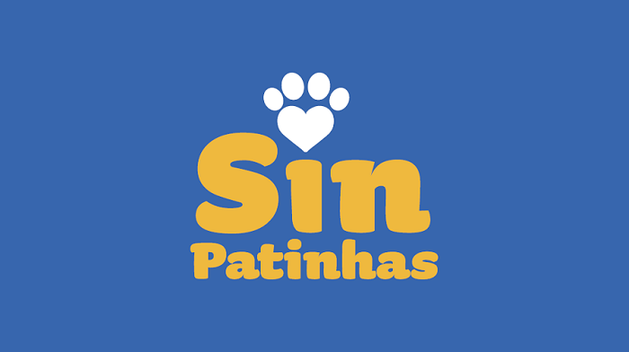

# 🐾 SinPatinhas – Sistema do Cadastro Nacional de Animais Domésticos

  

---

  📖 <a href="https://requisitos-de-software.github.io/2025.2-SinPatinhas/" target="_blank"><b>Acessar a Documentação Completa (GitHub Pages)</b></a>

---

**Disciplina:** Requisitos de Software  
**Curso:** Engenharia de Software  
**Universidade:** Faculdade de Ciências e Tecnologias em Engenharia (FCTE) - Universidade de Brasília (UnB)  
**Professor:** André Barros de Sales  
**Grupo:** 01  

---

## 📌 Sobre o Projeto

O SinPatinhas – Sistema do Cadastro Nacional de Animais Domésticos é uma ferramenta pública, gratuita e digital criada pelo Governo Federal para registrar cães e gatos em todo o território nacional.

Coordenado pelo Ministério do Meio Ambiente e Mudança do Clima, o SinPatinhas é uma das principais entregas do ProPatinhas – Programa Nacional de Proteção e Manejo Populacional Ético de Cães e Gatos. Seu objetivo é tirar os animais da invisibilidade, reunindo dados essenciais para o planejamento de políticas públicas de bem-estar animal, como castração, vacinação, microchipagem e ações de enfrentamento ao abandono e aos maus-tratos.

O SinPatinhas foi desenvolvido com base em ampla escuta social e contou com apoio técnico do Conselho Federal de Medicina Veterinária (CFMV).

---

## 👥 Integrantes

 <table> <tr> <td align="center" width="150"> <a href="https://github.com/antonioscarvalho">   <b>Antonio Carvalho</b> </a> </td> <td align="center" width="150"> <a href="https://github.com/Heloisa-Santos">   <b>Heloísa Santos</b> </a> </td> <td align="center" width="150"> <a href="https://github.com/ispratamena250">   <b>Isaac Menezes</b> </a> </td> <td align="center" width="150"> <a href="https://github.com/leticiakrpaiva">   <b>Letícia Paiva</b> </a> </td> <td align="center" width="150"> <a href="https://github.com/LuGit00">   <b>Luciano Machado</b> </a> </td> <td align="center" width="150"> <a href="https://github.com/14luke08">   <b>Mateus Negrini</b> </a> </td> <td align="center" width="150"> <a href="https://github.com/pedrog0">   <b>Pedro Gomes</b> </a> </td> </tr> </table> 

---

## 🛠️ Tecnologias e Ferramentas

Durante o desenvolvimento do **SinPatinhas**, serão utilizadas as seguintes ferramentas:

- **Versionamento e Repositório:** GitHub  
- **Documentação:** MkDocs Material + GitHub Pages  
- **Design e Prototipação:** Figma, Canva  
<<<<<<< HEAD
- **Comunicação e Reuniões:** WhatsApp, Teams  
=======
- **Comunicação e Reuniões:** WhatsApp
>>>>>>> gh-pages
- **Gravação de Reuniões:** Teams  
- **Mídia:** YouTube  
- **Editor de Código:** Visual Studio Code  

---

## 📝 Histórico de Versões

| Versão | Data       | Descrição                                   | Autor       | Revisor(es) |
|--------|------------|---------------------------------------------|-------------|-------------|
| 1.0    | 26/08/2025 | Criação do README inicial                   | Antonio Carvalho | Antonio, Heloisa, Isaac, Letícia, Luciano, Mateus, Pedro      |
| 1.1    | 07/09/2025 | Atualização com logo, GitHub Pages, integrantes e ferramentas | Letícia Paiva | Antonio, Heloisa, Isaac, Letícia, Luciano, Mateus, Pedro      |

