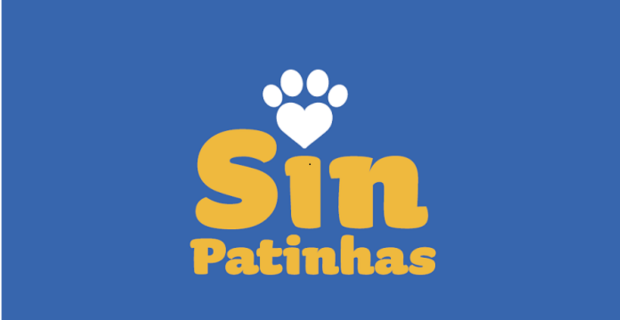

# Introdução

  
  <h1>SinPatinhas</h1>
  
Sistema do Cadastro Nacional de Animais Domésticos

O **SinPatinhas** – Sistema do Cadastro Nacional de Animais Domésticos é uma ferramenta pública, gratuita e digital criada pelo Governo Federal para registrar cães e gatos em todo o território nacional.

Coordenado pelo **Ministério do Meio Ambiente e Mudança do Clima**, o SinPatinhas é uma das principais entregas do **ProPatinhas – Programa Nacional de Proteção e Manejo Populacional Ético de Cães e Gatos**.

> “Seu objetivo é tirar os animais da invisibilidade, reunindo dados essenciais para o planejamento de políticas públicas de bem-estar animal.”

**Documentações do App e seu uso para análise e estudo:** [Lei nº 15.046/2024](https://www.planalto.gov.br/ccivil_03/_ato2023-2026/2024/lei/L15046.htm), [Decreto nº 12.439/2024](https://www.planalto.gov.br/ccivil_03/_ato2023-2026/2025/Decreto/D12439.htm), [Perguntas e Respostas - Ministério do Meio Ambiente](https://www.gov.br/mma/pt-br/noticias/perguntas-e-respostas-sobre-o-propatinhas-e-o-sinpatinhas) e ["RG para cães e gatos - Página do Planalto"](https://www.gov.br/planalto/pt-br/acompanhe-o-planalto/noticias/2025/04/rg-para-caes-e-gatos-tire-duvidas-sobre-a-nova-acao-do-governo-federal),

---

## Funcionalidades

  

    
✂️

    <h3>Castração</h3>
    
Políticas de controle populacional ético e bem-estar animal.

  

  

    
💉

    <h3>Vacinação</h3>
    
Programas e campanhas de saúde preventiva para cães e gatos.

  

  

    
🧩

    <h3>Microchipagem</h3>
    
Identificação permanente e auxílio na recuperação de animais.

  

---

## Como funciona

<ol class="howto">
  <li><strong>Login Gov.br:</strong> o tutor acessa com a conta Gov.br.</li>
  <li><strong>Cadastro do animal:</strong> preenche dados básicos e, se houver, do microchip.</li>
  <li><strong>Carteirinha digital:</strong> o sistema emite uma carteirinha com <em>QR Code</em> para impressão.</li>
</ol>

---

## Equipe

  

    
    
Antonio Carvalho

  

  

    
    
Heloísa Santos

  

  

    
    
Isaac Menezes

  

  

    
    
Letícia Paiva

  

  

    
    
Mateus Negrini

  

  

    
    
Pedro Gomes

  

---

## Histórico de Versão

| Versão | Data        | Descrição                         | Autores  | Revisores                                            |
|-------:|-------------|-----------------------------------|----------|------------------------------------------------------|
| 1.0    | 08/09/2025  | Criação da página do introdução   | Letícia  | Antonio, Heloisa, Isaac, Luciano, Mateus e Pedro     |
| 1.1    | 08/09/2025  | Reestruturação do indice          | Mateus   | Antonio                                                |

---

> **Nota final**  
> Este projeto de análise de requisitos foi desenvolvido com base em ampla pesquisa e contou com metodologias de engenharia de software para garantir uma documentação completa e precisa do sistema SinPatinhas.

<!-- ===== CSS embutido ===== -->
