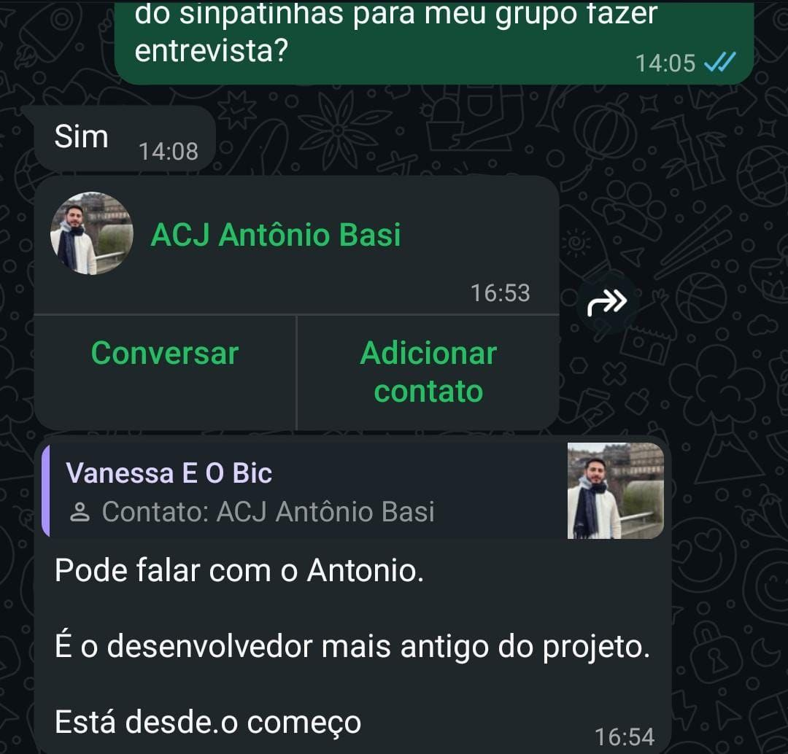
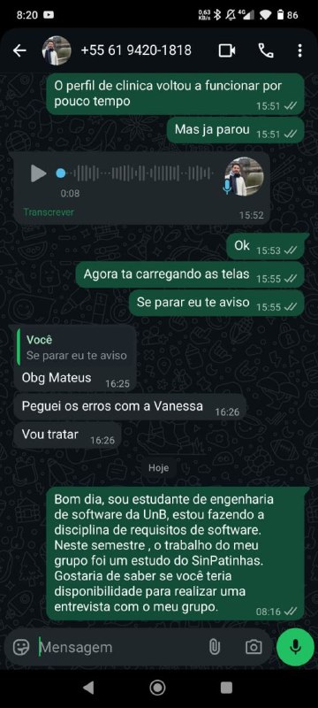

# Validação e Revisão Informal de Requisitos

A fase de validação em projetos de desenvolvimento de software é crucial e tem como objetivo confirmar se o produto ou sistema em construção atende integralmente às expectativas e necessidades do usuário.

---

## Abordagem de Verificação Não Estruturada

Uma das técnicas empregadas nesse processo é a **Comprovação Informal**, também chamada de **Revisão Não Estruturada**, **Validação em Linguagem Natural** ou **Inspeção Informal**.

### Definição
Consiste na apresentação dos requisitos do sistema (ou modelos preliminares) em linguagem natural, o mais próxima possível da fala cotidiana, para clientes e usuários-chave.

### Propósito
Esse método tem como objetivo permitir que os stakeholders identifiquem **ambiguidades, inconsistências, erros ou omissões** na descrição dos requisitos, evitando falhas que poderiam passar despercebidas em revisões técnicas mais formais. O foco está na compreensão e na aderência ao negócio.

---

## Cenário do Projeto: Bilheteria Digital

No contexto do projeto **Bilheteria Digital**, optou-se por realizar a validação diretamente com a empresa parceira responsável pelo sistema.

### Estratégia Adotada
Foi estabelecido um canal de comunicação **direto e rápido**, visando obter feedback imediato e garantir alinhamento com a visão do usuário final e com a operação real da plataforma.

---

## Meio de Interação com Stakeholders

Para execução desta revisão informal:

- **Método de Comunicação:** mensagem enviada via **WhatsApp**, considerado um canal acessível, rápido e informal.
- **Stakeholder envolvido:** Antônio Basi, **desenvolvedor sênior** da plataforma SinPatinhas, escolhido por seu conhecimento consolidado sobre o sistema.

### Motivação
Selecionar um membro experiente aumenta a confiabilidade da validação, garantindo que os requisitos sejam analisados sob a perspectiva técnica e operacional.

*Imagem de n° 1: Integração com equipe do projeto* 

*Imagem de n° 2: Integração com desenvolvedor do projeto*

---

### Atualizações

Até o momento estamos aguardando confirmação para **validação da análise e elicitação de requisitos sobre o projeto** em reunião com o desenvolvedor.

---

## Referências

MACIEL, Geovanna. *Comprovação informal*. Repositório da disciplina de Requisitos de Software da Universidade de Brasília, 2023. Disponível em: requisitos-de-software.github.io/2023.1-BilheteriaDigital/validacao/validacao-informal/. Acesso em: 19 nov. 2025.

---

## Agradecimentos

Agradecemos o apoio das ferramentas de **IA generativa (ChatGPT – OpenAI)** utilizadas para **revisão, estruturação e padronização técnica do conteúdo**.
A base conceitual foi desenvolvida com base nos fundamentos de engenharia de requisitos estudados ao longo da disciplina e por **Maciel (2023)**.

---

## Histórico de Versão

| Versão | Data       | Descrição                                                                                   | Autor(es)         | Revisor(es) |
|--------|------------|---------------------------------------------------------------------------------------------|-------------------|-------------|
| 1.0    | 19/11/2025 | Criação da página, estruturação da sessão e registro da validação informal dos requisitos. | Antonio Carvalho  |             |
