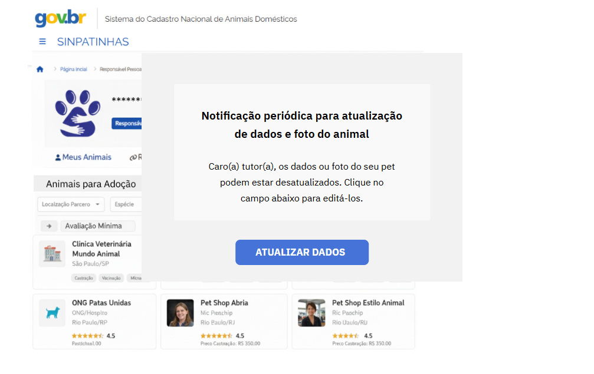

# Validação com Portótipos

## Introdução

A prototipação é uma técnica essencial dentro da Engenharia de Requisitos e do processo de desenvolvimento de software, pois permite representar de forma tangível e interativa os requisitos de um sistema antes de sua implementação definitiva. Segundo Vazquez e Simões (2016), a prototipação é uma técnica que busca simular para o usuário o funcionamento dos seus requisitos antes que o produto final esteja pronto <a href="assets/images/analise/prototip.png" target="_blank">1</a>. Essa abordagem iterativa possibilita a verificação antecipada da adequação dos requisitos, bem como o descobrimento de novas necessidades por parte dos usuários.

O *Guide to the Software Engineering Body of Knowledge* – SWEBOK v4.0 (2025) complementa essa visão ao afirmar que a construção de um protótipo pode demonstrar dimensões importantes da implementação e ajudar a expor pressupostos incorretos dos engenheiros de software. Além disso, o SWEBOK destaca que protótipos são úteis para compreender melhor o comportamento dinâmico de interfaces e para coletar feedback precoce, reduzindo desperdícios associados a requisitos incorretos.<a href="assets/images/analise/prototip2.png" target="_blank">2</a> <a href="assets/images/analise/prototip3.png" target="_blank">2</a>

Dessa forma, a prototipação desempenha um papel estratégico na comunicação entre usuários e desenvolvedores, fortalecendo a compreensão mútua e aumentando a qualidade do produto final.

## Objetivos

O objetivo desta seção é apresentar o processo de prototipação realizado no contexto da Engenharia de Requisitos, utilizando o Figma como ferramenta de apoio à modelagem visual e à validação dos requisitos junto aos stakeholders.

Os objetivos específicos são:

- Representar graficamente as principais funcionalidades e fluxos de navegação do sistema;

- Possibilitar a validação dos requisitos elicitados com os usuários;

- Coletar feedback sobre aspectos de usabilidade e design da interface;

- Identificar possíveis falhas ou inconsistências nos requisitos antes da implementação;

- Fornecer uma base sólida para o desenvolvimento do produto final.

## Metodologia (Figma)

A prototipação foi desenvolvida utilizando o Figma, uma ferramenta online de design colaborativo que permite criar interfaces interativas e de fácil compartilhamento. O processo metodológico adotado seguiu as seguintes etapas:

Elicitação de requisitos: Com base nas informações obtidas junto aos usuários, foram definidos os requisitos funcionais e não funcionais do sistema.

Elaboração de wireframes: Foram criadas representações iniciais das telas, com foco na organização de elementos e na experiência do usuário.

Construção do protótipo interativo: Os wireframes foram refinados e conectados no Figma para simular o fluxo de navegação entre as telas.

Validação com usuários: O protótipo foi apresentado aos stakeholders para análise e coleta de feedback, permitindo ajustes e melhorias antes do desenvolvimento definitivo.

Conforme afirmam Vazquez e Simões (2016), a prototipação “permite ao usuário analisar se os seus requisitos estão sendo atendidos e até mesmo descobrir novos requisitos”, reforçando seu papel essencial na validação e evolução contínua do projeto.

| **Participantes** | **Protótipo** | **Descrição** |
|--------------------|---------------|--------------|
| **Pedro Gomes** | [Protótipo 01](#prototipo01)  |Aplicativo Móvel "SINPatinhas Agente" (iOS/Android) - [**RNFNI001**](../elicitacao/tecnicas_elicitacao/requisitos_elicitados.md#rnfni001) |
|  | [Protótipo 02](#prototipo01)  | Acesso Offline aos Dados dos Pets - [**RNFNI002**](../elicitacao/tecnicas_elicitacao/requisitos_elicitados.md#rnfni002) |
| **Antonio Carvalho** | [Protótipo 03](#prototipo03)  | Sistema de adoção de animais (funcionalidade para facilitar a adoção de animais) - [**RFNI016**](../elicitacao/tecnicas_elicitacao/requisitos_elicitados.md#rfni016) |
|  | [Protótipo 04](#prototipo04) | Integração direta com parceiros (clínicas, ONGs, pet shops) - [**RFNI018**](../elicitacao/tecnicas_elicitacao/requisitos_elicitados.md#rfni018) |
|  | [Protótipo 06](#prototipo06) | Notificação Periódica para Atualização de Dados - [**RFNI021**](../elicitacao/tecnicas_elicitacao/requisitos_elicitados.md#rfni021) |
| **Heloisa Santos** |   — | — |
| **Letícia Paiva** | [Protótipo 05](#prototipo05)  | Alertas e Notificações Automáticas - [**RFNI017**](../elicitacao/tecnicas_elicitacao/requisitos_elicitados.md#rfni017) |
| **Isaac Menezes** | — | — |
| — |  | — |
| **Mateus Negrini** | [Protótipo 07](#prototipo07) | Acesso à Área de Instruções Integradas - [**HU019**](../../modelagem/gravacoes/mateus/historias.md) |
|  | [Protótipo 08](#prototipo08) | Emissão de Alertas de Acesso Suspeito ou Tentativas de Violação - [**HU023**](../../modelagem/gravacoes/mateus/historias.md) |
|  | [Protótipo 09](#prototipo09) | Vincular Foto do Tutor ao Registro de Adoção - [**HU024**](../../modelagem/gravacoes/mateus/historias.md) |
|  | [Protótipo 10](#prototipo10) | Notificação Periódica para Atualização de Dados e Fotos do Animal - [**HU020**](../../modelagem/gravacoes/mateus/historias.md) |

---

## Protótipo 01 - Aplicativo Móvel "SINPatinhas Agente" e Acesso Offline aos Dados dos Pets

<iframe width="560" height="500" src="https://www.youtube.com/embed/GNzpGv44cuQ"
 title="Vídeo" frameborder="0" allowfullscreen></iframe>

---

# Protótipo 02 - Acesso Offline aos Dados dos Pets

<iframe width="560" height="500" src="https://www.youtube.com/embed/HWXnLrvC-zA"
 title="Vídeo" frameborder="0" allowfullscreen></iframe>

**Validação dos Protótipos 01 e 02 com Dono de Pet**

<iframe width="560" height="500" src="https://www.youtube.com/embed/lc6ecCUG4oo"
 title="Vídeo" frameborder="0" allowfullscreen></iframe>

---

## Protótipos - Antonio Carvalho

## Protótipo 03 - Sistema de adoção de animais (funcionalidade para facilitar a adoção de animais)

### 1. Fluxo RFNI016: Adoção de Animais

#### 1.1. Tela: Animais para Adoção (Visão Geral)

| Elemento            | Nome no Esboço                                            | Detalhe da Prototipagem                                                                                                |
| :------------------ | :-------------------------------------------------------- | :--------------------------------------------------------------------------------------------------------------------- |
| **Sub-Aba Ativa** | `Animais para Adoção`                                     | Permanece na mesma tela (Conteúdo da listagem de animais).                                                            |
| Sub-Aba Inativa     | `Rede de Integração com Parceiros`                        | **CLICÁVEL (Trigger: On Click) $\rightarrow$ Navegar para:** `Tela: Rede de Integração com Parceiros` |
| **Filtros** | `Localização Próxima`, `Espécie`, `Porte`, `Idade`, `Sexo`, `Vacinado?` | (Elementos de filtro para visualização, não clicáveis no protótipo básico de navegação).                             |

* [Link para o protótipo](https://www.figma.com/site/TAnLTJvdBwvF1lZ9r3rDZ0/SinPatinhas?node-id=0-3&t=ZlGFR8c1pH9uiOuQ-1)

*Autor: Antonio Carvalho*

## Vídeo de Protótipo e Validação com Tutora de Animal

A validação com o usuário foi feita de forma presencial, no dia **12 de novembro de 2025**.

<iframe width="560" height="315" src="https://www.youtube.com/embed/1DKhPI8m0YQ" title="YouTube video player" frameborder="0" allow="accelerometer; autoplay; clipboard-write; encrypted-media; gyroscope; picture-in-picture; web-share" referrerpolicy="strict-origin-when-cross-origin" allowfullscreen></iframe> 
<iframe width="560" height="315" src="https://www.youtube.com/embed/RWEa7YcWovY" title="YouTube video player" frameborder="0" allow="accelerometer; autoplay; clipboard-write; encrypted-media; gyroscope; picture-in-picture; web-share" referrerpolicy="strict-origin-when-cross-origin" allowfullscreen></iframe> 

## Participantes da validação

| **Participante** | **Papel** |
|------------------|-----------|
| **Antonio Carvalho** | Integrante do grupo, responsável por coordenar a validação com a tutora. |
| **Maria Clara** | Estudante de Gestão Pública, 19 anos, responsável por validar o protótipo 3. |

---

## Protótipo 04 - Integração direta com parceiros (clínicas, ONGs, pet shops)

### 2. Fluxo RFNI018: Rede de Integração com Parceiros

#### 2.1. Tela: Rede de Integração com Parceiros (Visão Geral)

| Elemento            | Nome no Esboço                                            | Detalhe da Prototipagem                                                                                                |
| :------------------ | :-------------------------------------------------------- | :--------------------------------------------------------------------------------------------------------------------- |
| Sub-Aba Inativa     | `Animais para Adoção`                                     | Permanece na mesma tela (Conteúdo da listagem de parceiros)                   |
| **Sub-Aba Ativa** | `Rede de Integração com Parceiros`                        | Permanece na mesma tela (Conteúdo da listagem de parceiros).                                                          |
| **Filtros** | `Localização Parceiro`, `Espécie`, `Serviço`, `Ordenar por: Melhor Avaliação / Mais Próximo / Melhor Preço` | (Elementos de filtro para visualização, e o "Ordenar por" pode ter simulação de clique para mudar a ordem da lista). |

* [Link para o protótipo](https://www.figma.com/site/TAnLTJvdBwvF1lZ9r3rDZ0/SinPatinhas?node-id=0-3&t=ZlGFR8c1pH9uiOuQ-1)

*Autor: Antonio Carvalho*

## Vídeo de Protótipo e Validação com Tutora de Animal

A validação com o usuário foi feita de forma presencial, no dia **12 de novembro de 2025**.

<iframe width="560" height="315" src="https://www.youtube.com/embed/pf19UmVtw-c" title="YouTube video player" frameborder="0" allow="accelerometer; autoplay; clipboard-write; encrypted-media; gyroscope; picture-in-picture; web-share" referrerpolicy="strict-origin-when-cross-origin" allowfullscreen></iframe> 
<iframe width="560" height="315" src="https://www.youtube.com/embed/SYHVgpuw1ZI" title="YouTube video player" frameborder="0" allow="accelerometer; autoplay; clipboard-write; encrypted-media; gyroscope; picture-in-picture; web-share" referrerpolicy="strict-origin-when-cross-origin" allowfullscreen></iframe>

## Participantes da validação

| **Participante** | **Papel** |
|------------------|-----------|
| **Antonio Carvalho** | Integrante do grupo, responsável por coordenar a validação com a tutora. |
| **Maria Clara** | Estudante de Gestão Pública, 19 anos, responsável por validar o protótipo 4. |

---

## Protótipo 06 - Notificação periódica para atualização de dados e foto do animal

### 3. Fluxo RFNI021: Notificação Periódica para Atualização de Dados

#### 3.1. Tela: Rede de Integração com Parceiros (Modal de Notificação)

O Requisito Funcional **RFNI021** (Notificação periódica para atualização de dados e fotos do animal) é apresentado na tela de **"Rede de Integração com Parceiros"** como um modal sobreposto, conforme a imagem fornecida.

| Elemento | Nome no Esboço | Detalhe da Prototipagem |
| :--- | :--- | :--- |
| **Título do Modal** | `Notificação periódica para atualização de dados e foto do animal` | Texto em destaque. |
| **Corpo do Modal** | `Caro(a) tutor(a), os dados ou foto do seu pet podem estar desatualizados. Clique no campo abaixo para editá-los.` | Mensagem de alerta e instrução. |
| **Botão de Ação** | `ATUALIZAR DADOS` | Botão primário para redirecionar o usuário à tela de edição de dados do animal. |
| **Tela de Fundo** | `Rede de Integração com Parceiros` | A tela subjacente mostra a listagem de parceiros (`ONG Patas Unidas`, `Pet Shop Abria`, `Pet Shop Estilo Animal`, etc.) e o menu lateral com a opção `Meus Animais` e a sub-aba inativa `Animais para Adoção`. |

* [Link para o protótipo](https://www.figma.com/site/TAnLTJvdBwvF1lZ9r3rDZ0/SinPatinhas?node-id=0-3&t=ZlGFR8c1pH9uiOuQ-1)

*Autor: Antonio Carvalho*

## Vídeo de Protótipo e Validação com Tutora de Animal

A validação com o usuário foi feita de forma presencial, no dia **23 de novembro de 2025**.

<iframe width="560" height="315" src="https://www.youtube.com/embed/w4ysQvcnXck" title="YouTube video player" frameborder="0" allow="accelerometer; autoplay; clipboard-write; encrypted-media; gyroscope; picture-in-picture; web-share" referrerpolicy="strict-origin-when-cross-origin" allowfullscreen></iframe>

## Participantes da validação

| **Participante** | **Papel** |
|------------------|-----------|
| **Antonio Carvalho** | Integrante do grupo, responsável por coordenar a validação com a tutora. |
| **Maria Clara** | Estudante de Gestão Pública, 19 anos, responsável por validar o protótipo 6. |

---

# Protótipo 05 - Alertas e Notificações Automáticas (RFNI017)

---

## Protótipos - Mateus Santos Negrini
## Vídeo de Protótipo e Validações com Tutora de Animal

A validação com a tutora foi feita de forma presencial, no dia **23 de novembro de 2025**.

<iframe width="560" height="315" src="https://www.youtube.com/embed/yzr-pjIf9bY" title="YouTube video player" frameborder="0" allow="accelerometer; autoplay; clipboard-write; encrypted-media; gyroscope; picture-in-picture; web-share" referrerpolicy="strict-origin-when-cross-origin" allowfullscreen></iframe> 

## Protótipo 07 - Acesso à Área de Instruções Integradas

### 1. História de usuário HU019: Acesso à Área de Instruções Integradas

<iframe style="border: 1px solid rgba(0, 0, 0, 0.1);" width="800" height="450" src="https://embed.figma.com/site/q84mLY3u1t2wX7tlcH27OX/Tutorial-integrado?embed-host=share" allowfullscreen></iframe>

* [Link para o protótipo](https://www.figma.com/site/q84mLY3u1t2wX7tlcH27OX/Tutorial-integrado?t=mF99ewbKknaLKeDv-1)
* [Link para o PDF do protótipo](../pdfs/prototipos/mateus/tutorial%20integrado.pdf)

*Autor: Mateus Santos Negrini*

## Protótipo 08 - Emissão de Alertas de Acesso Suspeito ou Tentativas de Violação

### 1. História de usuário HU023: Emissão de Alertas de Acesso Suspeito ou Tentativas de Violação

<iframe style="border: 1px solid rgba(0, 0, 0, 0.1);" width="800" height="450" src="https://embed.figma.com/site/5QeAGua9i3eG3pWQbWqRlL/Notificar-acesso-indevido?embed-host=share" allowfullscreen></iframe>

* [Link para o protótipo](https://www.figma.com/site/5QeAGua9i3eG3pWQbWqRlL/Notificar-acesso-indevido?t=mF99ewbKknaLKeDv-1)
* [Link para o PDF do protótipo](../pdfs/prototipos/mateus/notificar%20acesso%20indevido.pdf)

*Autor: Mateus Santos Negrini*

## Protótipo 09 - Vincular Foto do Tutor ao Registro de Adoção

### 1. História de usuário HU024: Vincular Foto do Tutor ao Registro de Adoção

<iframe style="border: 1px solid rgba(0, 0, 0, 0.1);" width="800" height="450" src="https://embed.figma.com/site/8pndki2RlAOPlkKt5JDydM/Adicionar-foto?embed-host=share" allowfullscreen></iframe>

* [Link para o protótipo](https://www.figma.com/site/8pndki2RlAOPlkKt5JDydM/Adicionar-foto?t=mF99ewbKknaLKeDv-1)
* [Link para o PDF do protótipo](../pdfs/prototipos/mateus/adicionar%20foto.pdf)

*Autor: Mateus Santos Negrini*

## Protótipo 10 - Notificação Periódica para Atualização de Dados e Fotos do Animal

### 1. História de usuário HU020: Notificação Periódica para Atualização de Dados e Fotos do Animal

<iframe style="border: 1px solid rgba(0, 0, 0, 0.1);" width="800" height="450" src="https://embed.figma.com/site/DwJFKc1e65HLxembpVVqdp/Atualizacao-cadastral?embed-host=share" allowfullscreen></iframe>

* [Link para o protótipo](https://www.figma.com/site/DwJFKc1e65HLxembpVVqdp/Atualizacao-cadastral?t=mF99ewbKknaLKeDv-1)
* [Link para o PDF do protótipo](../pdfs/prototipos/mateus/atualização%20cadastral.pdf)

*Autor: Mateus Santos Negrini*

## Agradecimentos

Agradeço o apoio das ferramentas de **IA generativa (ChatGPT – OpenAI)** utilizadas para **revisão, estruturação e padronização técnica do conteúdo**.
A base conceitual foi desenvolvida com base nos fundamentos de **Barbosa (2005)** e **CTEC2402**.
 
---

## Referências Bibliográficas

1. VAZQUEZ, Carlos Eduardo; SIMÕES, Guilherme Siqueira. Engenharia de Requisitos: Software Orientado ao Negócio. Rio de Janeiro: Brasport, 2016.

2. IEEE COMPUTER SOCIETY. Guide to the Software Engineering Body of Knowledge (SWEBOK) v4.0. Piscataway, NJ: IEEE, 2025.

| Data       | Versão | Descrição                                 | Autor                                      | Revisor                                     |
| :--------: | :----: | :---------------------------------------- | :----------------------------------------: | :----------------------------------------: |
| 11/11/2025 |  1.0   |  Criação da página de prototipação  | Pedro Gomes | Antonio  |
| 12/11/2025   | 1.1 | Edição da página de protótipos com confirguração geral de estrutura e adição dos protótipos unitários | Antonio Carvalho |    |
---