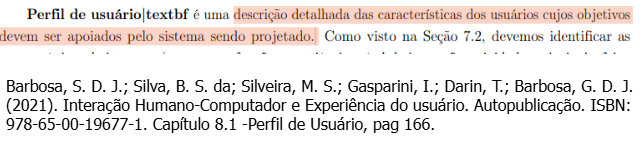

# Referências para lista de verificação de Perfil de Usuários

| Item | 
|------|
| [V020](#V020) | 
| [V021](#V021) | 
| [V022](#V022) | 
| [V023](#V023) | 
| [V024](#V024) | 
| [V025](#V025) | 
| [V026](#V026) | 
| [V027](#V027) | 
| [V028](#V028) | 
| [V029](#V029) | 
| [V030](#V030) | 

## Item V020 - O perfil de usuário possui registro dos objetivos dos usuários?

---

## Item V021 - O perfil de usuário descreve características (faixa etária, nível de instrução) dos usuários do sistema?

---

## Item V022 - As características analisadas para o perfil do usuário são relevantes para o desenvolvimento do sistema projetado?

---

## Item V023 -  Foram coletados dados sobre as características dos usuários através de estudo? (entrevistas, questionários)

---

## Item V024 -  Os dados coletados foram agregados em grupos de acordo com os valores observados?

---

## Item V025 -  Foram traçados perfis de usuário considerando as faixas de dados agregados?

---

## Item V026 -  Foi calculada a proporção de usuários que se encaixam em cada perfil?

---

## Item V027 -  O perfil de usuário foi elaborado dentro de um processo iterativo?

---

## Item V028 -  As características foram priorizadas de acordo com a sua relevância para o produto e projeto? (dados sobre o usuário, seu conhecimento sobre o produto)

---

## Item V029 -  Os usuários foram categorizados em grupos?

---

## Item V030 -  Os grupos correspondem à distribuição dos usuários nas faixas de dados agregados?

---

