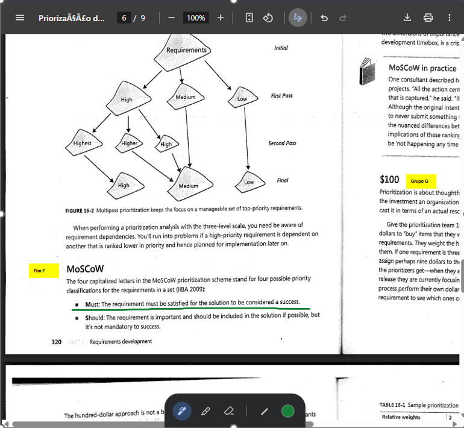
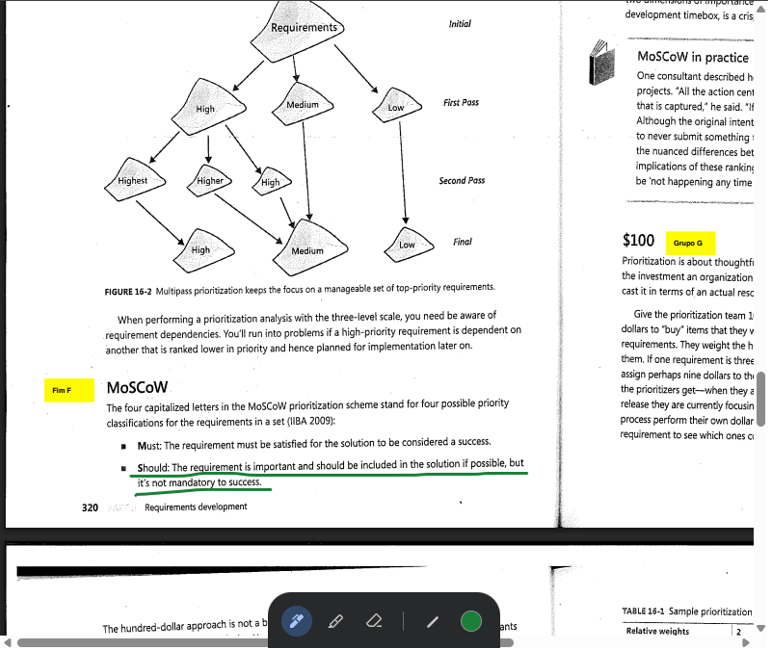
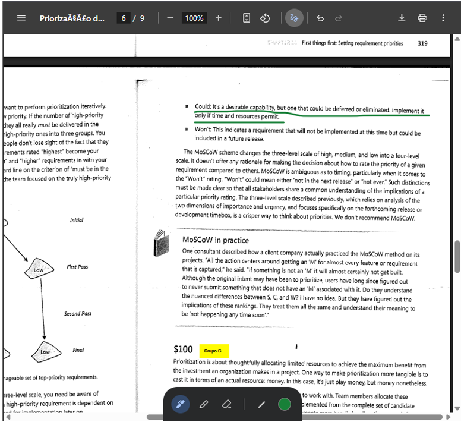
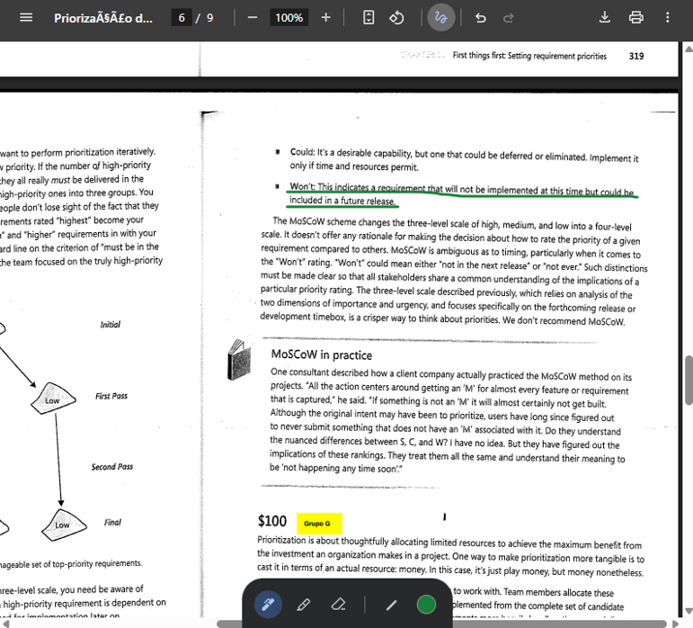

# Primeiros Resultados da Priorização dos Requisitos – Metodologia MoSCoW

> Esta página apresenta os **resultados iniciais da priorização dos requisitos** elicitados para o sistema **SinPatinhas**, obtidos por meio da aplicação da metodologia **MoSCoW** com os integrantes Antonio Carvalho e Pedro Oliveira priorizando com o tutor animal Douglas, o qual possui 23 anos de idade e é estudante de Engenharia de Software na Universidade de Brasília.  
> 
> A técnica foi aplicada antes da consolidação de requisitos funcionais, não funcionais, não implementados e agora, nesta página, está em alinhamento ao conjunto consolidado descritos na [página de Consolidação dos Requisitos Elicitados](../../elicitacao/tecnicas_elicitacao/requisitos_elicitados.md).  
>  
> A priorização MoSCoW classifica os requisitos conforme seu nível de importância para o produto, auxiliando a equipe no planejamento das entregas e na definição de escopo mínimo viável (MVP).

---

## Metodologia MoSCoW

A técnica **MoSCoW** agrupa os requisitos em quatro categorias de prioridade:

| Prioridade | Significado | Descrição |
|-------------|--------------|-----------|
| **Must have (M)** | Deve ter | Requisitos indispensáveis para o funcionamento do sistema. Devem estar presentes no MVP. |
| **Should have (S)** | Deveria ter | Requisitos importantes, mas que podem ser adiados se houver limitação de tempo ou recursos. |
| **Could have (C)** | Poderia ter | Requisitos desejáveis, de menor prioridade. Implementação opcional. |
| **Won’t have (W)** | Não terá agora | Requisitos que não serão implementados na versão atual, mas podem ser considerados futuramente. |

---

## Requisitos Funcionais – Resultados da Priorização

**Tabela 1 – Classificação MoSCoW dos requisitos funcionais implementados.**

| Código | Descrição | Prioridade |
|---------|------------|-------------|
| [RF001](../tecnicas_elicitacao/requisitos_elicitados.md#rf001) | Cadastro de tutores com dados pessoais. | Must |
| [RF002](../tecnicas_elicitacao/requisitos_elicitados.md#rf002) | Cadastro de animais vinculados ao tutor. | Must |
| [RF003](../tecnicas_elicitacao/requisitos_elicitados.md#rf003) | Geração de número de Registro Geral do Animal (RGA). | Should |
| [RF004](../tecnicas_elicitacao/requisitos_elicitados.md#rf004) | Associação de microchip ao cadastro. | Must |
| [RF005](../tecnicas_elicitacao/requisitos_elicitados.md#rf005) | Emissão de documento oficial de identificação (RG Pet). | Must |
| [RF006](../tecnicas_elicitacao/requisitos_elicitados.md#rf006) | Consulta pública via RGA ou microchip. | Could |
| [RF007](../tecnicas_elicitacao/requisitos_elicitados.md#rf007) | Atualização do status do animal (perdido, encontrado, óbito, transferência). | Should |
| [RF008](../tecnicas_elicitacao/requisitos_elicitados.md#rf008) | Registro do histórico de saúde por veterinários. | Should |
| [RF009](../tecnicas_elicitacao/requisitos_elicitados.md#rf009) | Transferência de titularidade do animal. | Must |
| [RF010](../tecnicas_elicitacao/requisitos_elicitados.md#rf010) | Perfis de acesso distintos (Tutor e Veterinário). | Must |
| [RF011](../tecnicas_elicitacao/requisitos_elicitados.md#rf011) | Relatórios e estatísticas para órgãos públicos. | Could |
| [RF012](../tecnicas_elicitacao/requisitos_elicitados.md#rf012) | Permitir login integrado via Gov.br. | Won't |
| [RF013](../tecnicas_elicitacao/requisitos_elicitados.md#rf013) | Preenchimento automático de dados via Gov.br. | Could |

---

## Requisitos Funcionais Não Implementados

**Tabela 2 – Classificação MoSCoW dos requisitos funcionais não implementados.**

| Código | Descrição | Prioridade |
|---------|------------|-------------|
| [RFNI016](../tecnicas_elicitacao/requisitos_elicitados.md#rfni016) | Sistema de adoção de animais. | Must |
| [RFNI018](../tecnicas_elicitacao/requisitos_elicitados.md#rfni018) | Integração direta com parceiros (clínicas, ONGs, pet shops). | Could |
| [RFNI019](../tecnicas_elicitacao/requisitos_elicitados.md#rfni019) | Área de instruções integradas (manual digital). | Must |
| [RFNI020](../tecnicas_elicitacao/requisitos_elicitados.md#rfni020) | Emissão de alertas de acesso suspeito. | Should |
| [RFNI021](../tecnicas_elicitacao/requisitos_elicitados.md#rfni021) | Notificação periódica para atualização de dados e fotos do animal. | Could |
| [RFNI022](../tecnicas_elicitacao/requisitos_elicitados.md#rfni022) | Vincular foto do tutor ao registro de adoção. | Must |

---

## Requisitos Não Funcionais

**Tabela 3 – Classificação MoSCoW dos requisitos não funcionais.**

| Código | Descrição | Prioridade |
|---------|------------|-------------|
| [RNF001](../tecnicas_elicitacao/requisitos_elicitados.md#rnf001) | Conformidade com a LGPD. | Must |
| [RNF002](../tecnicas_elicitacao/requisitos_elicitados.md#rnf002) | Disponibilidade: 99,8% de uptime (24/7). | Should |
| [RNF003](../tecnicas_elicitacao/requisitos_elicitados.md#rnf003) | Usabilidade: interface intuitiva para cidadãos. | Must |
| [RNF004](../tecnicas_elicitacao/requisitos_elicitados.md#rnf004) | Desempenho: resposta em consultas públicas < 2s. | Must |
| [RNF005](../tecnicas_elicitacao/requisitos_elicitados.md#rnf005) | Compatibilidade: suporte a navegadores principais e mobile. | Must |
| [RNF006](../tecnicas_elicitacao/requisitos_elicitados.md#rnf006) | Integração: APIs com clínicas e órgãos públicos. | Must |
| [RNF008](../tecnicas_elicitacao/requisitos_elicitados.md#rnf008) | Design de interface limpo e organizado. | Should |
| [RNF009](../tecnicas_elicitacao/requisitos_elicitados.md#rnf009) | Confiabilidade: garantia contra perda de dados. | Must |
| [RNF024](../tecnicas_elicitacao/requisitos_elicitados.md#rnf024) | Auditabilidade: logs de acesso e modificações. | Must |

---

## Análise dos Resultados

Com base na classificação MoSCoW:

- **Requisitos Must** representam aproximadamente **60%** do total, refletindo foco em funcionalidades essenciais de cadastro, identificação e segurança.  
- **Requisitos Should e Could** totalizam cerca de **35%**, sugerindo oportunidades de evolução incremental (ex.: relatórios, alertas, melhorias visuais).  
- **Requisitos Won’t (5%)** foram postergados por dependerem de integrações externas (ex.: login Gov.br).  

A aplicação da técnica permitiu **estabelecer o escopo mínimo viável (MVP)** do sistema, priorizando o atendimento às necessidades básicas de registro, rastreamento e confiabilidade das informações.

---

## Tabela de Contribuição

| **Nome**           | **Contribuição (%)** | **Função**                                      |
|---------------------|----------------------|-------------------------------------------------|
| Antonio Carvalho       | 50%                  | Autor da página de aplicação do método MoSCoW     |
| Pedro Gomes           | 50%                   | Revisão e correção dos links para garantir a rastreabilidade |

---

## Referências  

WIEGERS, Karl; BEATTY, Joy. *Software Requirements*. 3. ed. Redmond, WA: Microsoft Press, 2013.

---

## Histórico de Versão

| Versão | Data | Descrição | Autores | Revisores |
|:------:|:------:|:------------|:------------|:-----------|
| 1.0 | 18/10/2025 | Criação da página de priorização MoSCoW | Antonio Carvalho | --- |
| 1.1 | 21/10/2025 | Remoção da coluna "Fonte" e adição de links para a lista consolidada de requisitos | Pedro Gomes | Antonio |
