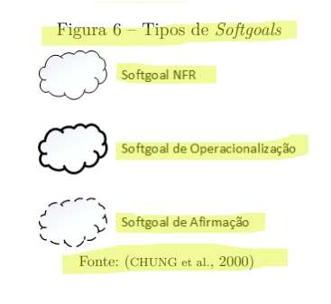
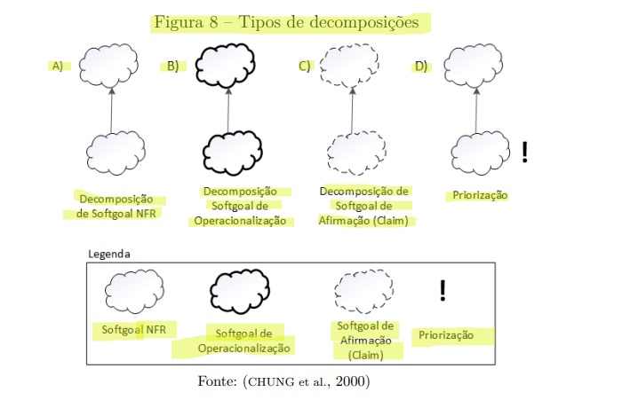
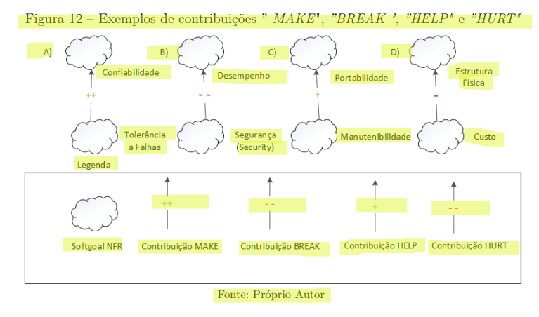
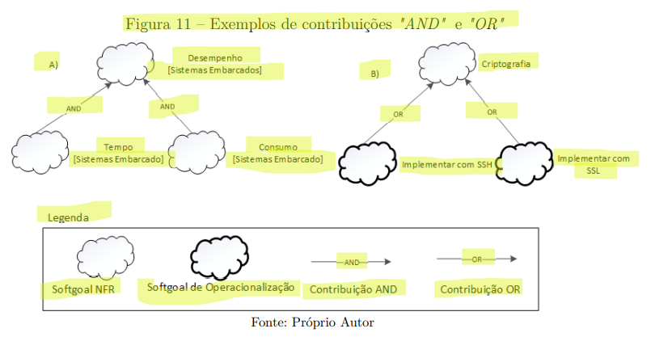

# NFR Framework – Projeto SinPatinhas

## Introdução

O **NFR Framework** é uma metodologia utilizada para representar e analisar **Requisitos Não Funcionais (RNFs)** de um sistema.  
No contexto do **SinPatinhas**, ele auxilia a equipe a identificar, registrar e avaliar as decisões de projeto que influenciam aspectos como **usabilidade**, **segurança**, **confiabilidade** e **desempenho** da aplicação <a id="anchor_1" href="#REF1">[1]</a>.

O uso do NFR Framework permite que cada decisão de desenvolvimento seja documentada de forma lógica e visual, garantindo **rastreabilidade** e **justificativa** para as escolhas técnicas feitas durante o ciclo de vida do sistema <a id="anchor_1" href="#REF1">[1]</a>.

*SERRANO, M.; SERRANO, M. *Requisitos – Aula 17*. Material de aula, Universidade de Brasília (UnB), 2025.* 

---

## Softgoal Interdependency Graph (SIG)

O **Softgoal Interdependency Graph (SIG)** é um gráfico que representa os **softgoals** — objetivos que não possuem critérios de satisfação precisamente definidos.  
No **SinPatinhas**, o SIG permite visualizar como cada requisito não funcional se relaciona com outros e quais decisões contribuem positiva ou negativamente para sua satisfação <a id="anchor_2" href="#REF1">[2]</a>.

---

### Tipos de Softgoal

Os **softgoals** são divididos em três tipos principais  <a id="anchor_1" href="#REF2">[2]</a>:

- **NFR Softgoal:** representa um requisito não funcional, como “Usabilidade” ou “Segurança”.  
- **Softgoal de Operacionalização:** detalha como o NFR será alcançado, por exemplo, “Autenticação via senha segura”.  
- **Softgoal de Afirmação:** representa justificativas ou decisões do projeto, como “Uso de autenticação por senha é suficiente para o público-alvo”.

*CHUNG, L.; NIXON, B.; YU, E.; MYLOPOULOS, J.*Non-Functional Requirements in Software Engineering.* Kluwer Academic Publishers, 2000.*

Esses tipos auxiliam o time do **SinPatinhas** a organizar visualmente as decisões relacionadas aos requisitos não funcionais.

---

### Interdependências entre Softgoals

Os softgoals no NFR Framework podem se **relacionar entre si** por meio de **decomposições** e **contribuições**.

#### Decomposições

As decomposições dividem um softgoal em outros mais específicos  <a id="anchor_1" href="#REF2">[2]</a>.  
**Exemplo (SinPatinhas):**
- “Usabilidade” → “Interface intuitiva”, “Tempo de resposta rápido”, “Feedback visual”.

*CHUNG, L.; NIXON, B.; YU, E.; MYLOPOULOS, J. *Non-Functional Requirements in Software Engineering.* Kluwer Academic Publishers, 2000.*

---

#### Contribuições

As contribuições indicam como um softgoal influencia outro, podendo ser positivas ou negativas <a id="anchor_1" href="#REF3">[3]</a>:

**Tabela 1 – Estrutura de registro de contribuições entre softgoals**

| Tipo de Contribuição | Significado |
|----------------------|-------------|
| **MAKE (++)** | Contribuição fortemente positiva |
| **HELP (+)** | Contribuição parcialmente positiva |
| **HURT (-)** | Contribuição parcialmente negativa |
| **BREAK (--)** | Contribuição fortemente negativa |
| **UNKNOWN (?)** | Contribuição de impacto indefinido |
| **SOME(+) / SOME(-)** | Contribuição positiva ou negativa de intensidade incerta |
| **AND / OR** | Dependência lógica entre softgoals descendentes e ascendentes |
| **EQUAL (=)** | Representa equivalência semântica entre softgoals |

*SILVA, Reinaldo Antônio da. *NFR4ES: Um Catálogo de Requisitos Não-Funcionais para Sistemas Embarcados.* Dissertação (Mestrado em Ciência da Computação) - Programa de Pós-Graduação em Ciência da Computação, Centro de Informática, Universidade Federal de Pernambuco, Recife, 2019 . Orientador: Prof. Jaelson Freire Brelaz de Castro. Coorientador: Prof. João Henrique Correia Pimentel. Área de Concentração: Engenharia de Software.*

Essas relações ajudam o time do **SinPatinhas** a compreender como decisões como “armazenar imagens de animais em nuvem” podem afetar tanto **desempenho** quanto **segurança**.

#### Exemplo de Propagação de Impactos

No SinPatinhas, a decisão de **armazenar imagens dos animais em nuvem** contribui positivamente para a **usabilidade** (HELP +), pois permite acesso rápido às informações,  
mas impacta negativamente a **segurança** (HURT -), devido ao aumento do risco de exposição de dados.

Essas contribuições foram representadas no **Softgoal Interdependency Graph (SIG)**, garantindo a propagação correta dos impactos entre os softgoals relacionados.

| **Softgoal** | **Tipo de Contribuição** | **Descrição do Impacto** |
|----------------|---------------------------|--------------------------|
| Usabilidade | HELP (+)| Acesso facilitado por meio de login intuitivo |

---

### Procedimento de Avaliação

O **procedimento de avaliação** do NFR Framework determina o **nível de satisfação de cada softgoal** a partir das decisões tomadas no projeto.  
No **SinPatinhas**, essa análise permite verificar se requisitos como **usabilidade** e **segurança dos dados dos tutores** estão sendo suficientemente atendidos.  

Os estados possíveis para cada softgoal são:

- **Satisfeito**  
- **Fracamente satisfeito**  
- **Negado**  
- **Fracamente negado**  
- **Indeterminado**  
- **Conflitante**

Esse processo garante que o produto final atenda aos **requisitos de qualidade** esperados pelos usuários e stakeholders.

---

## Modelagem de Artefato NFR

**Tabela 1 – Estrutura para criação de um artefato NFR-Framework**  
*Autoria: Antonio Carvalho*

| **Campo** | **Detalhamento** |
|------------|------------------|
| **Nr Requisito** | CNFR0X |
| **Cartão de especificação** | Desempenho |
| **Descrição** | O sistema deve processar e gerar documento PDF em menos de 5 segundos |
| **Justificativa** | Garante agilidade no fluxo de trabalho do tutor ao conseguir informação |
| **Origem** | #RFNI00X |
| **Critério de Ajuste** | Tempo de geração de arquivo < 5 s |
| **Dependências** | Depende da eficiência de armazenamento em nuvem e da otimização das consultas ao banco de dados. |
| **Dependências** | #RNF00X  |
| **Prioridade** | Alta (8/10) |
| **Conflitos** |	Pode gerar impacto negativo em Segurança e Disponibilidade, devido ao uso de cache e serviços externos
| **História Relacionada** |	[HU003 – Como tutor, quero cadastrar um animal rapidamente para disponibilizá-lo para adoção]
| **Softgoals Relacionados** |	Usabilidade (HELP +), Desempenho (MAKE ++), Segurança (HURT -)
| **Propagação de Impactos** |	A melhoria no desempenho contribui fortemente para Usabilidade (++), mas tem impacto parcialmente negativo em Segurança (-), pois aumenta a exposição de dados em transações mais frequentes

---

## Artefatos e gravações unitários 

| **Participantes** | **Visualizar artefato nesta página** | **Página Específica** | **Descrição** |
|---------------|-----------------------|------------------|------------------|
| **Antonio Carvalho**    | [CNFR01](#cnfr01)  | [#CNFR01](../../modelagem/gravacoes/antonio/nfr_frame.md) | Segurança |
|                         | [CNFR02](#cnfr02)  | [#CNFR02](../../modelagem/gravacoes/antonio/nfr_frame.md) | Confiabilidade |
| **Pedro Gomes**         |   | [#CNFR05](../../modelagem/gravacoes/pedro/nfr_frame.md) | Aplicativo Móvel SinPatinhas |
|                         |   | [#CNFR06](../../modelagem/gravacoes/pedro/nfr_frame.md) | Acesso Offline à Ficha do Próprio Animal |
| **Mateus Negrini**      |   | [#CNFR07](../../modelagem/gravacoes/mateus/nfr_frame_1.md) | Desempenho |
|                         |   | [#CNFR08](../../modelagem/gravacoes/mateus/nfr_frame_2.md) | Confiabilidade |
| **Letícia Paiva**    |   | [#CNFR09](../../modelagem/gravacoes/leticia/nfr_frame.md) | Integração entre Clínicas, ONGs e Sistema SinPatinhas  |

---

## Artefatos

### #CNFR01 - 1° Cartão de Especificação NFR – Segurança  
 
| **Campo** | **Detalhamento** |
|------------|------------------|
| **Nr Requisito** | CNFR01 |
| **Cartão de Especificação** | Segurança e Auditabilidade |
| **Descrição** | O sistema deve detectar acessos não autorizados e registrar **logs de ações e modificações**, garantindo **alertas automáticos** e **transparência operacional**. |
| **Justificativa** | A presença de mecanismos de segurança e auditoria aumenta a confiança dos usuários e assegura o cumprimento de boas práticas de **governança de dados** e **conformidade institucional**. |
| **Origem** | [RNF017](../../elicitacao/tecnicas_elicitacao/requisitos_elicitados.md#rnf017) / [RNF024](../../elicitacao/tecnicas_elicitacao/requisitos_elicitados.md#rnf024) / Entrevista 3 |
| **Critério de Ajuste** | Geração de alerta em até **2 segundos** após tentativa de acesso indevido. Registro de **100% das ações** críticas em log seguro. Tempo de consulta a logs ≤ **5 segundos**. |
| **Dependências** | Módulo de autenticação; API de notificações; banco de dados seguro; infraestrutura de logs e auditoria. |
| **Prioridade** | Alta (9/10) |
| **Conflitos** | O excesso de registros pode afetar o **desempenho** ([RNF012](../../elicitacao/tecnicas_elicitacao/requisitos_elicitados.md#rnf012)); bloqueios de segurança podem afetar a **disponibilidade** ([RNF014](../../elicitacao/tecnicas_elicitacao/requisitos_elicitados.md#rnf014)). |
| **Histórias Relacionadas** | [HU010](../../modelagem/gravacoes/antonio/historias.md#hu010--login-e-segurança-de-sessão) / [HU011](../../modelagem/gravacoes/antonio/historias.md#hu011--visualização-de-logs-administrativos) |
| **Softgoals Relacionados** | Segurança (MAKE ++), Auditabilidade (MAKE ++), Disponibilidade (HURT -), Desempenho (HURT -) |
| **Propagação de Impactos** | O fortalecimento dos controles de auditoria e segurança **melhora a confiabilidade geral** do sistema, mas pode **aumentar o custo computacional** e reduzir o desempenho em picos de uso. |

---

### Tema: **Confiabilidade e Segurança Operacional do Sistema SinPatinhas**  

---

### Requisito Não Funcional – RNF017  

#### **Identificação**
| **Código** | **Descrição** | **Fonte** |
|-------------|---------------|------------|
| **RNF017** | **Segurança: geração de alertas em caso de acesso não autorizado.** | Entrevista 3 |

---

#### **1. Categoria (Softgoal Type)**  
**Segurança (Security)**  
> Garante que o sistema detecte e responda adequadamente a tentativas de acesso indevido, protegendo dados sensíveis de tutores, animais e parceiros.

---

#### **2. Softgoal Refinements (Refinamentos do Softgoal)**  

| **Tipo de Refinamento** | **Softgoal Derivado** | **Descrição** |
|--------------------------|-----------------------|----------------|
| **Operationalization** | *Detecção de Acesso Indevido* | O sistema deve identificar padrões de login suspeitos (falhas repetidas, IP desconhecido, etc.). |
| **Operationalization** | *Geração de Alertas Automáticos* | Ao detectar tentativa de acesso não autorizado, deve enviar notificação imediata a administradores. |
| **Operationalization** | *Registro de Eventos Críticos* | Cada tentativa de violação deve ser registrada em log seguro para auditoria posterior. |

---

#### **3. Operationalizations (Mecanismos de Implementação)**  

| **Operacionalização** | **Descrição Técnica** | **Ferramenta/Solução Potencial** |
|------------------------|------------------------|----------------------------------|
| **O1. Sistema de Monitoramento de Sessões** | Implementação de middleware que monitora autenticações e identifica acessos suspeitos. | JWT + Middleware Express / Spring Security |
| **O2. Alertas Automáticos** | Envio de e-mails ou mensagens via webhook (Slack/Discord) a cada tentativa falha acima de 3. | API de Notificação (SMTP, SendGrid, Webhooks) |
| **O3. Bloqueio Temporário de Conta** | Suspensão temporária do usuário após N tentativas mal-sucedidas. | Configuração no Backend com contador e tempo de bloqueio |
| **O4. Log Seguro de Acesso** | Registro criptografado dos eventos no banco de dados com timestamp e IP. | SQL Server + Hash SHA-256 |

---

#### **4. Mecanismos de Avaliação (Claims e Métricas)**  

| **Claim** | **Métrica de Avaliação** | **Meta** |
|------------|--------------------------|-----------|
| "O sistema é capaz de identificar acessos não autorizados" | Percentual de tentativas suspeitas detectadas | ≥ 95% |
| "Alertas são gerados em tempo hábil" | Tempo médio entre detecção e notificação | ≤ 2 segundos |
| "Eventos críticos são auditáveis" | Presença de registro completo (timestamp, IP, usuário, tipo de evento) | 100% dos casos |

---

#### **5. Interdependências (Softgoal Interactions)**  

| **Relacionamento** | **Softgoal Associado** | **Tipo de Influência** |
|---------------------|-------------------------|-------------------------|
| RNF017 ↔ RNF024 | Auditabilidade | **+** (Complementar: logs aumentam segurança) |
| RNF017 ↔ RNF014 | Disponibilidade | **-** (Bloqueios podem afetar disponibilidade momentânea) |

---

#### **6. Rastreabilidade**  
| **Relação** | **Elemento Relacionado** |
|--------------|---------------------------|
| **Requisito Funcional Relacionado** | RF020 – Autenticação e controle de acesso |
| **Histórias Relacionadas** | HU010 – Login e segurança de sessão |
| **Fonte** | Entrevista 3 |

---

---

### Requisito Não Funcional – RNF024  

#### **Identificação**
| **Código** | **Descrição** | **Fonte** |
|-------------|---------------|------------|
| **RNF024** | **Auditabilidade: logs de acesso e modificações realizadas no sistema.** | Entrevista 3 |

---

#### **1. Categoria (Softgoal Type)**  
**Auditabilidade (Auditability)**  
> Garante a capacidade de rastrear ações, acessos e alterações feitas por usuários, assegurando a transparência e integridade do sistema.

---

#### **2. Softgoal Refinements (Refinamentos do Softgoal)**  

| **Tipo de Refinamento** | **Softgoal Derivado** | **Descrição** |
|--------------------------|-----------------------|----------------|
| **Operationalization** | *Registro de Logs de Acesso* | Cada ação executada deve ser registrada com data, usuário e IP. |
| **Operationalization** | *Registro de Alterações de Dados* | Toda modificação em registros sensíveis (cadastro de tutores, animais, etc.) deve ser logada. |
| **Operationalization** | *Disponibilização de Relatórios de Auditoria* | Administradores podem consultar logs por data, usuário ou tipo de evento. |

---

#### **3. Operationalizations (Mecanismos de Implementação)**  

| **Operacionalização** | **Descrição Técnica** | **Ferramenta/Solução Potencial** |
|------------------------|------------------------|----------------------------------|
| **O1. Log Centralizado** | Criação de tabela de logs com campos `usuario`, `ação`, `timestamp`, `entidade`, `ip`. | SQL Server / Elastic Stack |
| **O2. Versionamento de Dados** | Registro automático de versões anteriores antes de qualquer alteração. | Triggers SQL ou Auditoria ORM |
| **O3. Painel de Auditoria** | Interface administrativa com filtros de visualização de logs. | React + API RESTful |
| **O4. Backup e Retenção de Logs** | Armazenamento seguro por no mínimo 12 meses. | Azure Storage / AWS S3 Glacier |

---

#### **4. Mecanismos de Avaliação (Claims e Métricas)**  

| **Claim** | **Métrica de Avaliação** | **Meta** |
|------------|--------------------------|-----------|
| "Todas as ações são registradas adequadamente" | Cobertura de log (ações logadas / ações executadas) | ≥ 98% |
| "Logs podem ser auditados e rastreados" | Tempo de resposta para consulta de log | ≤ 5 segundos |
| "Integridade dos logs é garantida" | Detecção de logs alterados ou corrompidos | 0 casos por mês |

---

#### **5. Interdependências (Softgoal Interactions)**  

| **Relacionamento** | **Softgoal Associado** | **Tipo de Influência** |
|---------------------|-------------------------|-------------------------|
| RNF024 ↔ RNF017 | Segurança | **+** (Logs reforçam detecção de incidentes) |
| RNF024 ↔ RNF012 | Desempenho | **-** (Registro detalhado pode impactar performance) |

---

#### **6. Rastreabilidade**  
| **Relação** | **Elemento Relacionado** |
|--------------|---------------------------|
| **Requisito Funcional Relacionado** | RF022 – Monitoramento administrativo |
| **Histórias Relacionadas** | HU011 – Visualização de logs administrativos |
| **Fonte** | Entrevista 3 |

---

### Conclusão  

| **Aspecto Avaliado** | **RNF017 (Segurança)** | **RNF024 (Auditabilidade)** |
|-----------------------|-------------------------|------------------------------|
| **Softgoal Type** | Security | Auditability |
| **Objetivo** | Prevenir e alertar acessos não autorizados | Registrar e rastrear ações e alterações |
| **Mecanismo Principal** | Middleware de detecção e alerta | Log centralizado e painel de auditoria |
| **Métrica-chave** | Tempo de resposta dos alertas ≤ 2s | Cobertura de logs ≥ 98% |
| **Interdependência Positiva** | Reforça a auditabilidade | Aumenta a segurança geral do sistema |

[Voltar para tabela de artefatos](#tabela_artefatos)

---

### #CNFR02 - 2° Cartão de Especificação NFR – Confiabilidade e Continuidade Operacional  

| **Campo** | **Detalhamento** |
|------------|------------------|
| **Nr Requisito** | CNFR02 |
| **Cartão de Especificação** | Confiabilidade e Disponibilidade do Sistema |
| **Descrição** | O sistema deve garantir **execução estável e contínua das operações**, com **mínima indisponibilidade**, **recuperação automática de falhas** e **preservação dos dados em caso de erro ou queda inesperada**. |
| **Justificativa** | A confiabilidade assegura que o SinPatinhas possa manter suas funcionalidades mesmo diante de falhas, preservando informações críticas sobre animais, tutores e atendimentos, e garantindo **continuidade de serviço para parceiros e usuários**. |
| **Origem** | [RNF020](../../elicitacao/tecnicas_elicitacao/requisitos_elicitados.md#rnf020) / Entrevista 2 / Logs de incidentes do sistema |
| **Critério de Ajuste** | Disponibilidade ≥ **99,5%** mensal. Tempo médio de recuperação após falha (MTTR) ≤ **30 segundos**. Taxa máxima de falhas críticas ≤ **0,5%** por mês. Integridade de dados preservada em **100%** dos eventos críticos. |
| **Dependências** | Servidores redundantes; backups automáticos; monitoramento de uptime; planos de contingência e replicação de banco de dados. |
| **Prioridade** | Alta (9/10) |
| **Conflitos** | Mecanismos de redundância podem aumentar o **custo computacional** ([RNF012](../../elicitacao/tecnicas_elicitacao/requisitos_elicitados.md#rnf012)); auditorias constantes podem afetar o **desempenho** ([RNF024](../../elicitacao/tecnicas_elicitacao/requisitos_elicitados.md#rnf024)). |
| **Histórias Relacionadas** | [HU042](../../modelagem/gravacoes/antonio/historias.md#hu042--recuperação-automática-em-caso-de-falha) |
| **Softgoals Relacionados** | Confiabilidade (MAKE ++), Disponibilidade (HELP +), Desempenho (HURT -), Segurança (HELP +) |
| **Propagação de Impactos** | O aumento da confiabilidade **melhora a experiência dos usuários** e a **continuidade das operações**, mas pode exigir **infraestrutura mais robusta** e processos de **monitoramento contínuo**. |

---

### Tema: **Confiabilidade e Disponibilidade Operacional do Sistema SinPatinhas**

---

### Requisito Não Funcional – RNF020  

#### **Identificação**
| **Código** | **Descrição** | **Fonte** |
|-------------|---------------|------------|
| **RNF020** | **Confiabilidade: o sistema deve manter funcionamento contínuo, mesmo em caso de falhas pontuais.** | Entrevista 2 |

---

#### **1. Categoria (Softgoal Type)**  
**Confiabilidade (Reliability)**  
> Garante que o sistema **opere de maneira previsível e consistente**, reduzindo o número e a gravidade das falhas, com **recuperação rápida** e **preservação da integridade dos dados**.

---

#### **2. Softgoal Refinements (Refinamentos do Softgoal)**  

| **Tipo de Refinamento** | **Softgoal Derivado** | **Descrição** |
|--------------------------|-----------------------|----------------|
| **Operationalization** | *Alta Disponibilidade (High Availability)* | Implementar arquitetura com servidores redundantes e failover automático. |
| **Operationalization** | *Tolerância a Falhas (Fault Tolerance)* | O sistema deve continuar operando mesmo que um componente falhe. |
| **Operationalization** | *Recuperação Automática (Self-Healing)* | Reinício automático de serviços em caso de falha. |
| **Operationalization** | *Integridade de Dados (Data Integrity)* | Garantir que dados críticos não sejam corrompidos durante falhas. |

---

#### **3. Operationalizations (Mecanismos de Implementação)**  

| **Operacionalização** | **Descrição Técnica** | **Ferramenta/Solução Potencial** |
|------------------------|------------------------|----------------------------------|
| **O1. Replicação de Banco de Dados** | Utilização de instâncias secundárias para failover automático em caso de indisponibilidade. | SQL Server Always On / PostgreSQL Streaming Replication |
| **O2. Backup Incremental Automático** | Agendamento de cópias de segurança diárias e restauração validada. | Azure Backup / AWS S3 Glacier |
| **O3. Monitoramento de Saúde de Serviços** | Detecção automática de falhas e reinício de containers ou processos. | Prometheus + Grafana + Docker Healthcheck |
| **O4. Balanceamento de Carga** | Distribuição de requisições entre múltiplos servidores ativos. | Nginx / HAProxy / AWS Load Balancer |

---

#### **4. Mecanismos de Avaliação (Claims e Métricas)**  

| **Claim** | **Métrica de Avaliação** | **Meta** |
|------------|--------------------------|-----------|
| "O sistema mantém disponibilidade contínua" | Percentual de uptime mensal | ≥ 99,5% |
| "As falhas são rapidamente recuperadas" | Tempo médio de recuperação (MTTR) | ≤ 30 segundos |
| "Os dados permanecem íntegros após falha" | Percentual de operações críticas com consistência preservada | 100% |
| "As falhas não comprometem o uso geral" | Número de incidentes críticos por mês | ≤ 2 |

---

#### **5. Interdependências (Softgoal Interactions)**  

| **Relacionamento** | **Softgoal Associado** | **Tipo de Influência** |
|---------------------|-------------------------|-------------------------|
| RNF020 ↔ RNF017 | Segurança | **+** (Backups e redundâncias reforçam a proteção dos dados) |
| RNF020 ↔ RNF012 | Desempenho | **-** (Camadas redundantes aumentam latência) |
| RNF020 ↔ RNF024 | Auditabilidade | **+** (Logs de incidentes permitem análise e prevenção de falhas futuras) |

---

#### **6. Rastreabilidade**  
| **Relação** | **Elemento Relacionado** |
|--------------|---------------------------|
| **Requisito Funcional Relacionado** | RF030 – Recuperação de Sessões e Continuidade Operacional |
| **História Relacionada** | HU042 – Recuperação Automática em Caso de Falha |
| **Fonte** | Entrevista 2 |

---

### Conclusão  

| **Aspecto Avaliado** | **RNF020 (Confiabilidade e Continuidade Operacional)** |
|-----------------------|--------------------------------------|
| **Softgoal Type** | Reliability |
| **Objetivo** | Garantir disponibilidade contínua e recuperação imediata após falhas |
| **Mecanismo Principal** | Arquitetura redundante com replicação e monitoramento de serviços |
| **Métrica-chave** | Disponibilidade ≥ 99,5% / MTTR ≤ 30s |
| **Interdependências Relevantes** | Segurança (RNF017), Desempenho (RNF012), Auditabilidade (RNF024) |
| **Benefício Esperado** | Maior estabilidade do sistema e confiança dos usuários e parceiros no funcionamento da plataforma |

[Voltar para tabela de artefatos](#tabela_artefatos)

---

## Agradecimentos

Agradeço o apoio das ferramentas de **IA generativa (ChatGPT – OpenAI)** utilizadas para **revisão, padronização técnica e formatação textual**.  
O conteúdo conceitual e as decisões de modelagem foram elaborados por **Antonio Carvalho** e **Letícia Paiva**, com base nos fundamentos de **Serrano & Serrano (2025)**.

---

## Referências  

| **Código** | **Referência Completa** |
|-------------|--------------------------|
| [REF1] | SERRANO, Milene; SERRANO, Maurício. *NFR Framework e Requisitos Não Funcionais – Aula 11*. Universidade de Brasília (UnB), 2025. |
| [REF2] | CHUNG, L.; NIXON, B.; YU, E.; MYLOPOULOS, J. *Non-Functional Requirements in Software Engineering.* Kluwer Academic Publishers, 2000.
| [REF3] | SILVA, Reinaldo Antônio da. *NFR4ES: Um Catálogo de Requisitos Não-Funcionais para Sistemas Embarcados.* Dissertação (Mestrado em Ciência da Computação) - Programa de Pós-Graduação em Ciência da Computação, Centro de Informática, Universidade Federal de Pernambuco, Recife, 2019 . Orientador: Prof. Jaelson Freire Brelaz de Castro. Coorientador: Prof. João Henrique Correia Pimentel. Área de Concentração: Engenharia de Software. |
| **Código** | **Sub-referência Básica Completa** |
| [REF1_1] | [Ebrary] Young, Ralph. Requirements Engineering Handbook. Norwood, US: Artech House Books, 2003. |
| [REF1_2] | [Open Access] Leite, Julio Cesar Sampaio do Prado. Livro Vivo - Engenharia de Requisitos. http://livrodeengenhariaderequisitos.blogspot.com.br/ (último acesso: 2017) |
| [REF1_3] | [Ebrary] Chemuturi, Murali. Mastering Software Quality Assurance : Best Practices, Tools and Technique for Software Developers. Ft. Lauderdale, US: J. Ross Publishing Inc., 2010. |
| [REF1_4] | Software & Systems Requirements Engineering: In Practice - Brian Berenbach, Daniel Paulish, Juergen Kazmeier, Arnold Rudorfer (Livro bem completo mas, não tem exemplar físico na biblioteca, nem mesmo consta na Ebrary) |
| [REF1_5] | Requirements Engineering and Management for Software Development Projects - Murali Chemuturi (Livro bem completo mas, não tem exemplar físico na biblioteca, nem mesmo consta na Ebrary) |

---

## Tabela de Versionamento

| **Versão** | **Data** | **Descrição** | **Autores** | **Revisores** |
|-------------|-----------|----------------|--------------|---------------|
| **1.0** | 10/10/2025 | Criação da página NFR Framework | Antonio |  |
| **1.1** | 14/10/2025 | Edição e revisão da página | Antonio |  |
| **1.2** | 07/11/2025 | Criando novo estilo de apresentação de artefatos | Antonio |  |

---