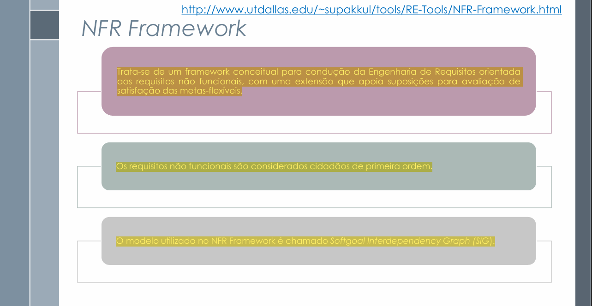
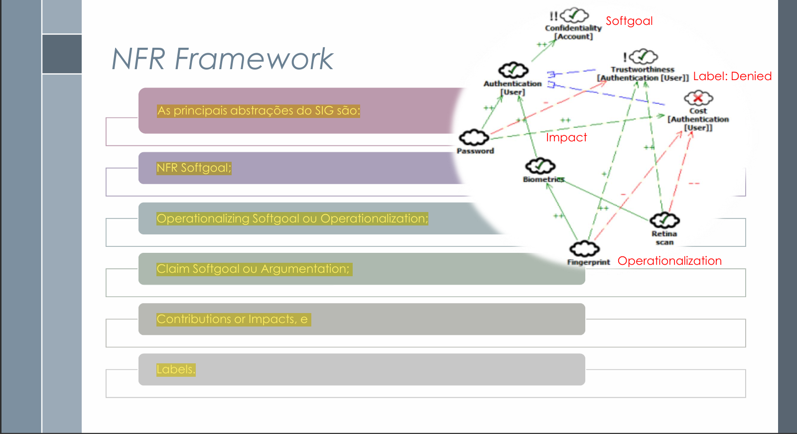

# NFR Framework – Projeto SinPatinhas

## Introdução

O **NFR Framework** é uma metodologia utilizada para representar e analisar **Requisitos Não Funcionais (RNFs)** de um sistema.  
No contexto do **SinPatinhas**, ele auxilia a equipe a identificar, registrar e avaliar as decisões de projeto que influenciam aspectos como **usabilidade**, **segurança**, **confiabilidade** e **desempenho** da aplicação.  

O uso do NFR Framework permite que cada decisão de desenvolvimento seja documentada de forma lógica e visual, garantindo **rastreabilidade** e **justificativa** para as escolhas técnicas feitas durante o ciclo de vida do sistema <a id="anchor_1" href="#REF1">[1]</a>.

*SERRANO, M.; SERRANO, M. *Requisitos – Aula 17*. Material de aula, Universidade de Brasília (UnB), 2025.* 

---

## Artefatos e Gravações Unitários

| **Participantes** | **Página Específica** | **Descrição** |
|---------------|------------------|------------------|
| **Antonio Carvalho**    | [#CNFR01](../../modelagem/gravacoes/antonio/nfr_frame.md) |  |
|                         | [#CNFR02](../../modelagem/gravacoes/antonio/nfr_frame.md) |  |

---

## Softgoal Interdependency Graph (SIG)

O **Softgoal Interdependency Graph (SIG)** é um gráfico que representa os **softgoals** — objetivos que não possuem critérios de satisfação precisamente definidos.  
No **SinPatinhas**, o SIG permite visualizar como cada requisito não funcional se relaciona com outros e quais decisões contribuem positiva ou negativamente para sua satisfação <a id="anchor_2" href="#REF1">[2]</a>.

---

### Tipos de Softgoal

Os **softgoals** são divididos em três tipos principais:

- **NFR Softgoal:** representa um requisito não funcional, como “Usabilidade” ou “Segurança”.  
- **Softgoal de Operacionalização:** detalha como o NFR será alcançado, por exemplo, “Autenticação via senha segura”.  
- **Softgoal de Afirmação:** representa justificativas ou decisões do projeto, como “Uso de autenticação por senha é suficiente para o público-alvo”.

Esses tipos auxiliam o time do **SinPatinhas** a organizar visualmente as decisões relacionadas aos requisitos não funcionais.

---

### Interdependências entre Softgoals

Os softgoals no NFR Framework podem se **relacionar entre si** por meio de **decomposições** e **contribuições**.

#### Decomposições

As decomposições dividem um softgoal em outros mais específicos.  
**Exemplo (SinPatinhas):**
- “Usabilidade” → “Interface intuitiva”, “Tempo de resposta rápido”, “Feedback visual”.

---

#### Contribuições

As contribuições indicam como um softgoal influencia outro, podendo ser positivas ou negativas:

**Tabela 1 – Estrutura de registro de contribuições entre softgoals**

| Tipo de Contribuição | Significado |
|----------------------|-------------|
| **MAKE (++)** | Contribuição fortemente positiva |
| **HELP (+)** | Contribuição parcialmente positiva |
| **HURT (-)** | Contribuição parcialmente negativa |
| **BREAK (--)** | Contribuição fortemente negativa |
| **UNKNOWN (?)** | Contribuição de impacto indefinido |
| **SOME(+) / SOME(-)** | Contribuição positiva ou negativa de intensidade incerta |
| **AND / OR** | Dependência lógica entre softgoals descendentes e ascendentes |
| **EQUAL (=)** | Representa equivalência semântica entre softgoals |

*SERRANO, M.; SERRANO, M. *Requisitos – Aula 17*. Material de aula, Universidade de Brasília (UnB), 2025.*

Essas relações ajudam o time do **SinPatinhas** a compreender como decisões como “armazenar imagens de animais em nuvem” podem afetar tanto **desempenho** quanto **segurança**.

#### Exemplo de Propagação de Impactos

No SinPatinhas, a decisão de **armazenar imagens dos animais em nuvem** contribui positivamente para a **usabilidade** (HELP +), pois permite acesso rápido às informações,  
mas impacta negativamente a **segurança** (HURT -), devido ao aumento do risco de exposição de dados.

Essas contribuições foram representadas no **Softgoal Interdependency Graph (SIG)**, garantindo a propagação correta dos impactos entre os softgoals relacionados.

| **Softgoal** | **Tipo de Contribuição** | **Descrição do Impacto** |
|----------------|---------------------------|--------------------------|
| Usabilidade | HELP (+)| Acesso facilitado por meio de login intuitivo |
---

### Procedimento de Avaliação

O **procedimento de avaliação** do NFR Framework determina o **nível de satisfação de cada softgoal** a partir das decisões tomadas no projeto.  
No **SinPatinhas**, essa análise permite verificar se requisitos como **usabilidade** e **segurança dos dados dos tutores** estão sendo suficientemente atendidos.  

Os estados possíveis para cada softgoal são:

- **Satisfeito**  
- **Fracamente satisfeito**  
- **Negado**  
- **Fracamente negado**  
- **Indeterminado**  
- **Conflitante**

---

Esse processo garante que o produto final atenda aos **requisitos de qualidade** esperados pelos usuários e stakeholders.

---

## Modelagem de Artefato NFR

**Tabela 1 – Estrutura para criação de um artefato NFR-Framework**  
*Autoria: Antonio Carvalho*

| **Campo** | **Detalhamento** |
|------------|------------------|
| **Nr Requisito** | CNFR0X |
| **Cartão de especificação** | Desempenho |
| **Descrição** | O sistema deve processar e gerar documento PDF em menos de 5 segundos |
| **Justificativa** | Garante agilidade no fluxo de trabalho do tutor ao conseguir informação |
| **Origem** | #RFNI00X |
| **Critério de Ajuste** | Tempo de geração de arquivo < 5 s |
| **Dependências** | Depende da eficiência de armazenamento em nuvem e da otimização das consultas ao banco de dados. |
| **Dependências** | #RNF00X  |
| **Prioridade** | Alta (8/10) |
| **Conflitos** |	Pode gerar impacto negativo em Segurança e Disponibilidade, devido ao uso de cache e serviços externos
| **História Relacionada** |	[HU003 – Como tutor, quero cadastrar um animal rapidamente para disponibilizá-lo para adoção]
| **Softgoals Relacionados** |	Usabilidade (HELP +), Desempenho (MAKE ++), Segurança (HURT -)
| **Propagação de Impactos** |	A melhoria no desempenho contribui fortemente para Usabilidade (++), mas tem impacto parcialmente negativo em Segurança (-), pois aumenta a exposição de dados em transações mais frequentes

---

## Agradecimentos

Agradeço o apoio das ferramentas de **IA generativa (ChatGPT – OpenAI)** utilizadas para **revisão, padronização técnica e formatação textual**.  
O conteúdo conceitual e as decisões de modelagem foram elaborados por **Antonio Carvalho** e **Letícia Paiva**, com base nos fundamentos de **Serrano & Serrano (2025)**.

---

## Tabela de Contribuições

| **Nome** | **Contribuição (%)** | **Função** |
|-----------|----------------------|-------------|
| **Antonio Carvalho** | 100% | Autor da página NFR Framework |

---

## Tabela de Versionamento

| **Versão** | **Data** | **Descrição** | **Autores** | **Revisores** |
|-------------|-----------|----------------|--------------|---------------|
| **1.0** | 10/10/2025 | Criação da página NFR Framework | Antonio | Letícia |
| **1.1** | 14/10/2025 | Edição e revisão da página | Antonio | Letícia |

---

## Referência Bibliográfica

SERRANO, M.; SERRANO, M. *Requisitos – Aula 17*. Material de aula, Universidade de Brasília (UnB), 2025.  
CHUNG, L.; NIXON, B.; YU, E.; MYLOPOULOS, J. *Non-Functional Requirements in Software Engineering.* Kluwer Academic Publishers, 2000.

---
