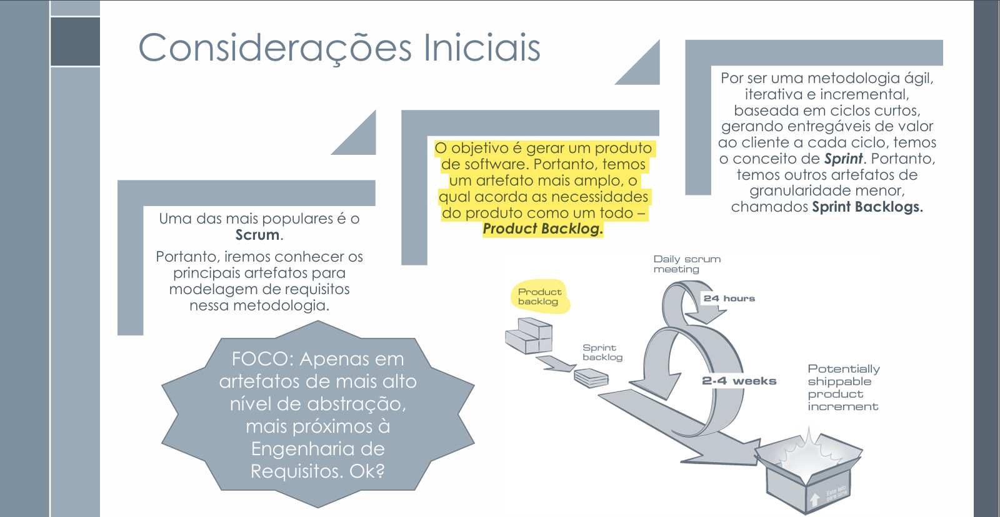
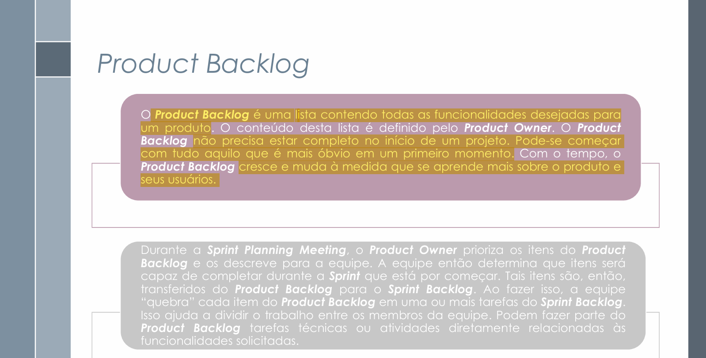
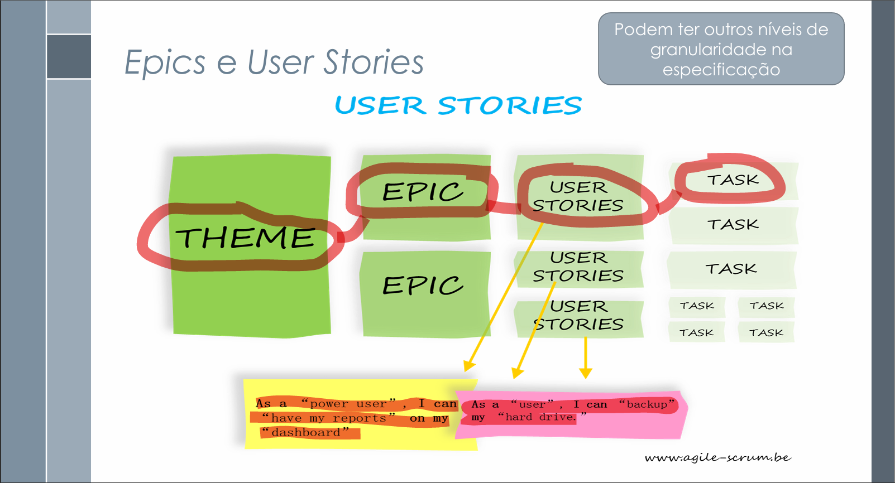
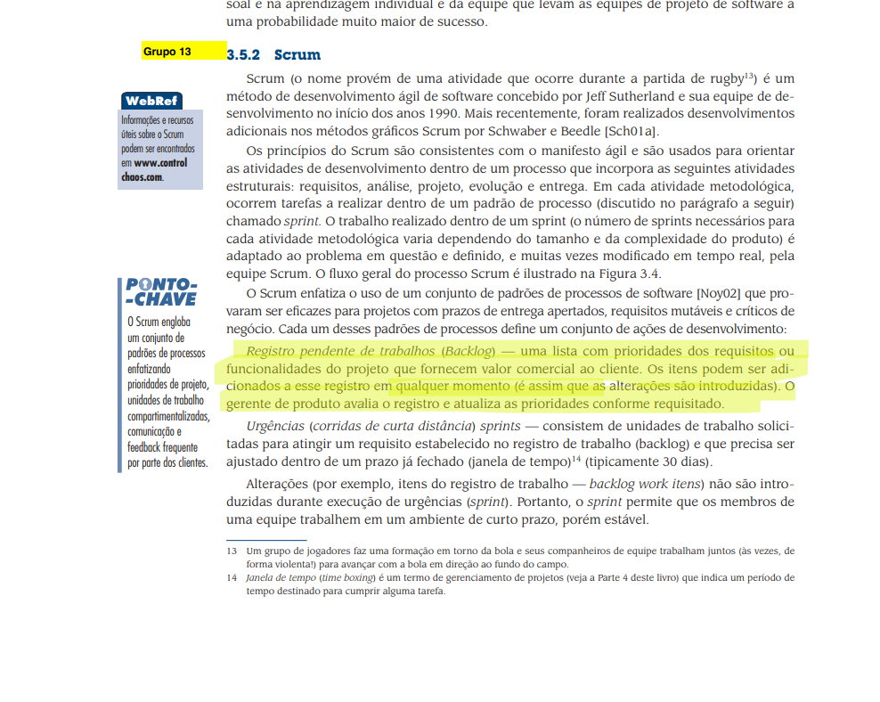

# Backlog – Projeto SinPatinhas

## Introdução

O **Product Backlog** é uma **lista dinâmica e priorizada de funcionalidades**, criada e mantida pelo **Product Owner**, que representa tudo o que se deseja implementar no sistema <a id="anchor_1" href="#REF1">[1]</a>.  

O backlog evolui continuamente, sendo atualizado à medida que o conhecimento sobre o produto e seus usuários aumenta.  
Cada item do backlog — conhecido como **Product Backlog Item (PBI)** — representa uma **feature** ou **história de usuário** que agrega valor ao cliente <a id="anchor_2" href="#REF2">[2]</a>.

*SERRANO, Milene; SERRANO, Maurício. *Product Backlog e User Stories – Aula 15*. Material de aula, Universidade de Brasília (UnB), 2025.*

---

## Tabela de Contribuição

| **Nome** | **Contribuição (%)** | **Função** |
|-----------|----------------------|-------------|
| **Letícia Paiva** | 50% | Co-autora da página de backlog |
| **Antonio Carvalho** | 50% | Co-autor da página de backlog |

---

## Artefatos e Gravações Unitários

| **Participantes** | **Página Específica** | **Descrição** |
|---------------|------------------|------------------|
| **Antonio Carvalho** | [#BL001](../../modelagem/gravacoes/antonio/backlog.md) | Exibição de horários de funcionamento |
|                      | [#BL002](../../modelagem/gravacoes/antonio/backlog.md) | Integração com ONGs, clínicas e pet shops |
| **Leticia** | [#BL001](../../modelagem/gravacoes/leticia/backlog.md) |  |
|                      | [#BL002](../../modelagem/gravacoes/leticia/backlog.md) |  |
| **Pedro Gomes** | [#BL001](../../modelagem/gravacoes/pedro/backlog.md) |  |
|                      | [#BL002](../../modelagem/gravacoes/pedro/backlog.md) |  |

---

## Estrutura Hierárquica

Para melhor organização, o backlog do **SinPatinhas** foi estruturado nos seguintes níveis de abstração <a id="anchor_3" href="#REF1">[1]</a>:

- **Temas:** agrupamentos de funcionalidades relacionadas;  
- **Épicos:** grandes objetivos do sistema;  
- **Histórias de Usuário (PBIs):** unidades menores, detalhadas e mensuráveis, que podem ser concluídas em uma Sprint.

Para a criação do backlog, foi utilizado como base dois artefatos produzidos: as **Histórias de Usuário** <a id="anchor_4" href="#REF2">[2]</a> e a metodologia de **priorização MoSCoW**.

*SERRANO, Milene; SERRANO, Maurício. *Product Backlog e User Stories – Aula 15*. Material de aula, Universidade de Brasília (UnB), 2025.*

---

## Metodologia de Construção

A elaboração do backlog baseou-se nos seguintes princípios do **Scrum** e **SAFe (Scaled Agile Framework)** <a id="anchor_6" href="#REF1">[1]</a>:

1. **Priorização contínua:** o Product Owner define os itens mais importantes;  
2. **Refinamento progressivo:** os PBIs são detalhados e decompostos em histórias menores;  
3. **Estimativa colaborativa:** o esforço de cada item é estimado pela equipe;  
4. **Transparência e rastreabilidade:** todos os itens são vinculados aos requisitos e histórias de usuário correspondentes.  

*PRESSMAN, R. S.; MAXIM, B. R. *Engenharia de Software: uma abordagem profissional.* 9ª ed. AMGH, 2021.*

A priorização utilizou o método **MoSCoW**, que classifica os itens em:

- **Must have (Essencial)** – indispensáveis para o funcionamento básico;  
- **Should have (Importante)** – desejáveis, mas não críticos;  
- **Could have (Desejável)** – opcionais, caso haja tempo;  
- **Won’t have (Postergado)** – não planejados para o ciclo atual.  

---

## Modelo de Backlog

#### Definição de tema

Ao analisar as histórias de usuário criadas, organize os temas <a id="anchor_8" href="#REF1">[1]</a>.

#### Épicos

Após a definição dos temas, eles são divididos em épicos e, dessa forma, o nível de abstração das atividades que vão ser realizadas diminui <a id="anchor_9" href="#REF1">[1]</a>.

#### Histórias de Usuário

As histórias de usuário especificam ainda mais os épicos, elas apresentam descrições de uma determinada funcionalidade, geralmente seguem a forma *“Eu, como ___, desejo ___, para ___.”* <a id="anchor_10" href="#REF1">[1]</a>.

#### Exemplo de tabela para organização do backlog

**Tabela 1 – Histórias de usuário classificadas com o Épico X**

| **Identificação** | **História do usuário** | **Requisito do Backlog** | **Prioridade (MoSCoW)** | | **Status** | **Responsável** | **Rastreabilidade** |
|--------------------|--------------------------|--------------------------|---------------------------|----------------------|------------|------------|------------|
| BL00X | História de usuário utilizada | Breve descrição do item | Nome da funcionalidade | Must/Should/Could/Won’t | Status | Responsável pelo item | Código do requisito |

---

## Agradecimentos

Agradeço o apoio das ferramentas de **IA generativa (ChatGPT – OpenAI)** utilizadas para **revisão, formatação e padronização técnica do texto**.  
O conteúdo conceitual e as decisões de modelagem foram elaborados por **Antonio Carvalho** e **Letícia Paiva**, com base nos fundamentos de **Serrano & Serrano (2025)** <a id="anchor_11" href="#REF1">[1]</a>, **Pressman & Maxim (2021)** <a id="anchor_12" href="#REF2">[2]</a>

## Tabela de Versionamento

| **Versão** | **Data** | **Descrição** | **Autor** | **Revisor** |
|-------------|------------|----------------|-------------|--------------|
| 1.0 | 10/10/2025 | Criação da página de backlog | Antonio | Letícia |
| 1.1 | 14/10/2025 | Edição da página de backlog | Antonio | Letícia |
| 1.2 | 19/10/2025 | Edição e elaboração do modelo | Letícia | — |

---

## Referências Bibliográficas

[1] SERRANO, Milene; SERRANO, Maurício. *Product Backlog e User Stories – Aula 15*. Material de aula, Universidade de Brasília (UnB), 2025.  
[3] PRESSMAN, R. S.; MAXIM, B. R. *Engenharia de Software: uma abordagem profissional.* 9ª ed. AMGH, 2021.  

---