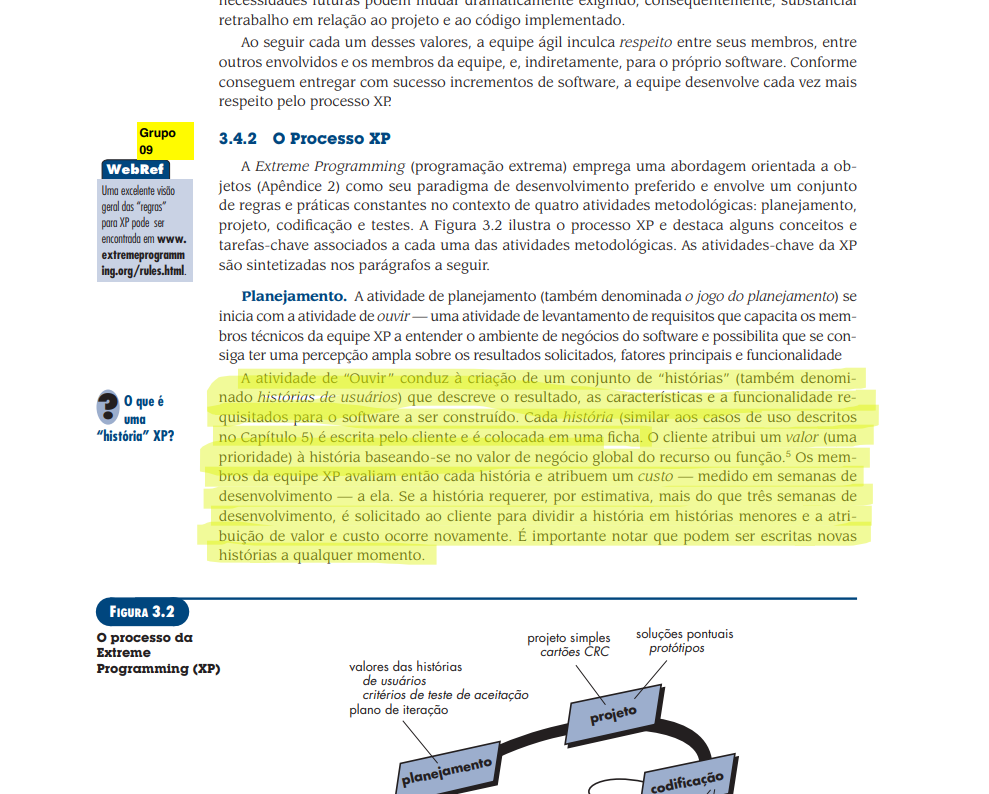
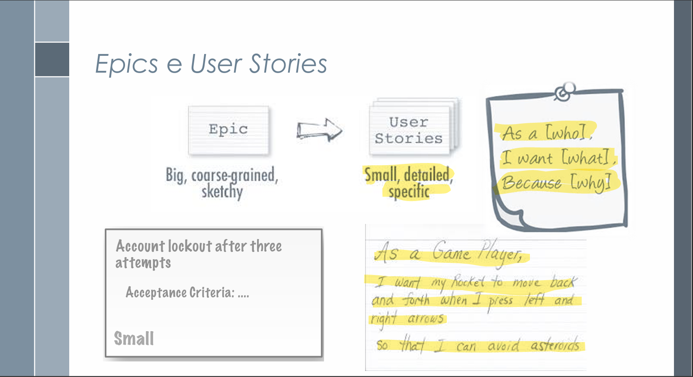
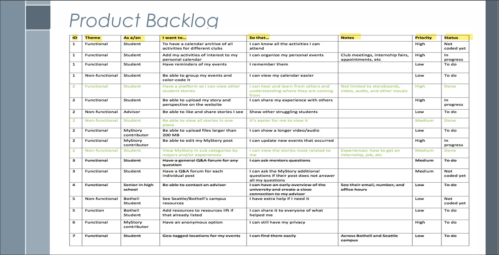

# Histórias de Usuário – Projeto SinPatinhas

## Introdução

Este artefato documenta as **Histórias de Usuário do Sistema SinPatinhas**, conforme os princípios da **modelagem ágil de requisitos** utilizados em metodologias como **Scrum** e **Extreme Programming (XP)** <a id="anchor_1" href="#REF2">[2]</a>. 

 
*PRESSMAN, R. S.; MAXIM, B. R. Engenharia de Software: uma abordagem profissional. 8ª ed. Porto Alegre: AMGH, 2016. Capítulo 3 – Desenvolvimento*

---

De acordo com **Serrano e Serrano (2025)**, as histórias de usuário são **itens do Product Backlog** que descrevem funcionalidades sob a perspectiva do cliente, com foco em *“o que deve ser feito”* e não em *“como deve ser feito”* e contendo questionamentos como: Como [persona], quero [função], para [benefício]. <a id="anchor_2" href="#REF1">[1]</a>.  

*SERRANO, Milene; SERRANO, Maurício. *Product Backlog e User Stories – Aula 15*. Material de aula, Universidade de Brasília (UnB), 2025.*

---

## Tabela de Contribuição

| **Nome** | **Contribuição (%)** | **Função** |
|-----------|----------------------|-------------|
| **Letícia Paiva** | 50% | Co-autora da página de histórias de usuário |
| **Antonio Carvalho** | 50% | Co-autor da página de histórias de usuário |

---

## Artefatos e Gravações Unitários

| **Participantes** | **Página Específica** | **Descrição** |
|---------------|------------------|------------------|
| **Letícia Paiva**    | [#HU001](../../modelagem/gravacoes/leticia/historias.md) |  |
|                      | [#HU002](../../modelagem/gravacoes/leticia/historias.md) |  |
|                      | [#HU009](../../modelagem/gravacoes/leticia/historias.md) |  |
|                      | [#HU010](../../modelagem/gravacoes/leticia/historias.md) |  |
|                      | [#HU011](../../modelagem/gravacoes/leticia/historias.md) |  |
|                      | [#HU012](../../modelagem/gravacoes/leticia/historias.md) |  |
| **Antonio Carvalho** | [#HU003](../../modelagem/gravacoes/antonio/historias.md) | Cadastro e Gerenciamento de Perfis Ampliados |
|                      | [#HU004](../../modelagem/gravacoes/antonio/historias.md) | Publicação de Campanhas e Materiais Educativos |
|                      | [#HU005](../../modelagem/gravacoes/antonio/historias.md) | Exibição de Horários de Clínicas Parceiras |
|                      | [#HU006](../../modelagem/gravacoes/antonio/historias.md) | Integração Direta com Parceiros |
|                      | [#HU007](../../modelagem/gravacoes/antonio/historias.md) | Acesso Simplificado para Usuários com Baixa Afinidade Tecnológica |
|                      | [#HU008](../../modelagem/gravacoes/antonio/historias.md) | Sincronização de Dados entre ONGs e Clínicas |
| **Pedro Gomes**      | [#HU013](../../modelagem/gravacoes/pedro/historias.md) |  |
|                      | [#HU014](../../modelagem/gravacoes/pedro/historias.md) |  |
|                      | [#HU015](../../modelagem/gravacoes/pedro/historias.md) |  |
|                      | [#HU016](../../modelagem/gravacoes/pedro/historias.md) |  |
|                      | [#HU017](../../modelagem/gravacoes/pedro/historias.md) |  |
|                      | [#HU018](../../modelagem/gravacoes/pedro/historias.md) |  |
| **Heloisa Silva**    | [#HU032](../../modelagem/gravacoes/heloisa/historias.md) | Mapa interatico com localização de estabelecimentos parceiros |
|                      | [#HU033](../../modelagem/gravacoes/heloisa/historias.md) | Filtro de distância para o mapa |
|                      | [#HU034](../../modelagem/gravacoes/heloisa/historias.md) |  Tema para o mapa |
|                      | [#HU035](../../modelagem/gravacoes/heloisa/historias.md) | Sistema de avaliação de estabelecimentos parceiros |
|                      | [#HU036](../../modelagem/gravacoes/heloisa/historias.md) | Validação visual para o avaliador de estabelecimentos |
|                      | [#HU037](../../modelagem/gravacoes/heloisa/historias.md) | Notificação para o estabelecimento avaliado |
|                     

---

## Objetivo

O objetivo deste artefato é **registrar, organizar e rastrear** as histórias de usuário que representam os requisitos funcionais do sistema **SinPatinhas**. Assim, busca-se:

- Traduzir necessidades reais em funcionalidades compreensíveis; <a id="anchor_4" href="#REF1">[1]</a>;  
- Apoiar o desenvolvimento iterativo e incremental <a id="anchor_4" href="#REF2">[2]</a>;  
- Estabelecer critérios claros de aceitação <a id="anchor_5" href="#REF2">[2]</a>;  
- Promover rastreabilidade com os requisitos funcionais e o backlog do produto.

---

## Metodologia

As histórias de usuário foram estruturadas com base na **Extreme Programming (XP)** e nos conceitos de **Product Backlog Item (PBI)** do **Scrum** <a id="anchor_6" href="#REF1">[1]</a>.  

O processo seguiu as seguintes etapas:

1. **Criação das Histórias:** elaboradas a partir da visão do usuário (*Como [persona], quero [função], para [benefício]*) <a id="anchor_7" href="#REF1">[1]</a>.  
2. **Priorização:** conforme o valor de negócio atribuído pelo Product Owner.  
3. **Estimativa:** em pontos de história ou esforço relativo <a id="anchor_8" href="#REF1">[1]</a>.  
4. **Planejamento das Sprints:** seleção das histórias priorizadas para cada iteração. <a id="anchor_8" href="#REF2">[2]</a>.  
5. **Implementação e Testes de Aceitação:** execução e validação das funcionalidades. <a id="anchor_8" href="#REF2">[2]</a>.  
---

## Estrutura de História de Usuário

**Tabela 1 – Estrutura para criação de uma história de usuário**  
*Autoria: Antonio Carvalho*

| **Campo** | **Descrição** |
|------------|----------------|
| **Identificação** | HU00X – Identificador da História |
| **Tema** | Módulo ou funcionalidade principal |
| **Descrição** | *Quem* [tipo_de_usuário], *o que* [ação], *para que* [finalidade]. |
| **Critérios de Aceitação** | Itens observáveis para validar o sucesso da história. |
| **Prioridade** | Alta / Média / Baixa |
| **Status** | Não validada / Validada |
| **Rastreabilidade** | Código do requisito relacionado |

*SERRANO, Milene; SERRANO, Maurício. *Product Backlog e User Stories – Aula 15*. Material de aula, Universidade de Brasília (UnB), 2025.*

## Agradecimentos

Agradeço o apoio das ferramentas de **IA generativa (ChatGPT – OpenAI)** utilizadas para **revisão, formatação e padronização técnica do texto**.  
O conteúdo conceitual e as decisões de modelagem foram elaborados por **Antonio Carvalho** e **Letícia Paiva**, com base nos fundamentos de **Serrano & Serrano (2025)** <a id="anchor_10" href="#REF1">[1]</a> e **Pressman & Maxim (2016)** <a id="anchor_11" href="#REF2">[2]</a>.

---

## Referências Bibliográficas

[1] SERRANO, Milene; SERRANO, Maurício. *Product Backlog e User Stories – Aula 15*. Material de aula, Universidade de Brasília (UnB), 2025.
[3] PRESSMAN, R. S.; MAXIM, B. R. *Engenharia de Software: uma abordagem profissional.* 8ª ed. Porto Alegre: AMGH, 2016. Capítulo 3 – Desenvolvimento Ágil, seção sobre Extreme Programming (XP) e Histórias de Usuário, p. 88–90.  

---
