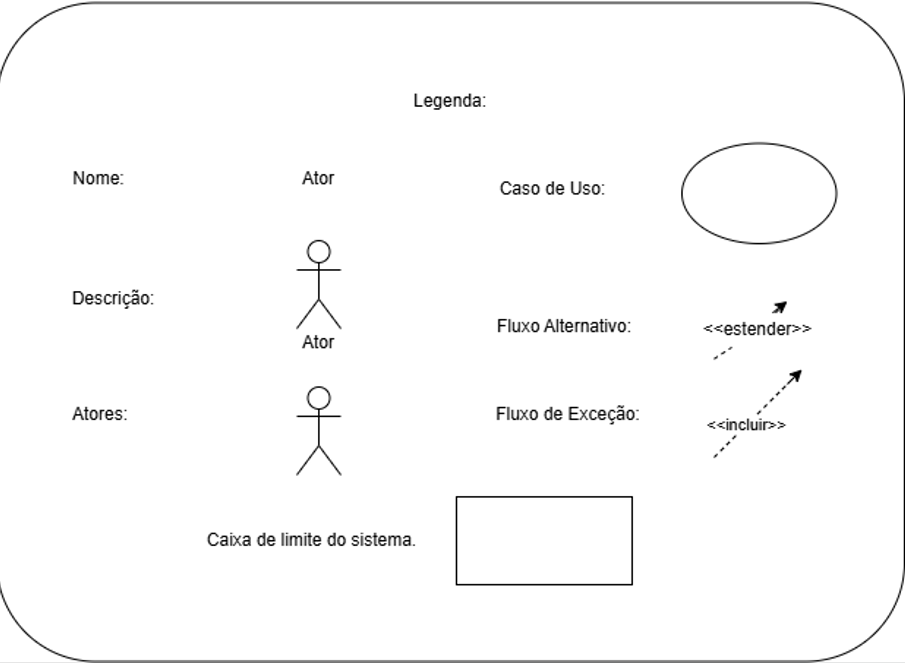

# Casos de Uso – Projeto SinPatinhas

## Introdução

Os **casos de uso** são um dos principais artefatos da **UML (Unified Modeling Language)**, permitindo descrever as **interações entre usuários (atores)** e o **sistema**. Por meio deles, é possível compreender **como o sistema deve se comportar** em diferentes situações, garantindo que os **requisitos funcionais** sejam bem representados e validados junto aos stakeholders.

No contexto do **projeto SinPatinhas**, os casos de uso representam ações essenciais como **cadastro de tutores e animais (RF001 e RF002)**, **geração de registro oficial (RF003)**, **emissão de documento de identificação (RF005)** e **atualização de status (RF007)**. Essa modelagem contribui para o entendimento funcional do sistema e auxilia na documentação das regras de negócio.

---

### Diagrama de Casos de Uso do SinPatinhas:

Com base nos requisitos elicitados anteriormente para o projeto SinPatinhas, **foi desenvolvido o Diagrama de Casos de Uso UML apresentado abaixo**. O modelo representa as principais interações entre o ator Usuário e o sistema SinPatinhas, incluindo diferentes tipos de perfis — **Pessoa Física, Pessoa Jurídica e Clínicas/Hospitais Veterinários** — que executam ações específicas no sistema.

O diagrama contempla **funcionalidades como cadastro de usuários e animais**, recebimento de tutelas, visualização e edição de registros, além de histórico de transferências e confirmação de alterações. Também **há interação com o servidor do SinPatinhas, responsável pelo processamento das operações e pela comunicação entre os módulos do sistema**.

Assim, **o diagrama sintetiza o comportamento esperado do sistema em relação aos usuários e demais entidades envolvidas, servindo como base para a modelagem e implementação das funcionalidades descritas nos requisitos**.
 
*Figura 1: Diagrama de casos de uso*
 

 *Figura 2: Legenda do diagrama de casos de uso*
 

* [Link para o diagrama de casos de uso](https://viewer.diagrams.net/index.html?tags=%7B%7D&lightbox=1&target=blank&highlight=0000ff&edit=_blank&layers=1&nav=1&dark=0#R%3Cmxfile%3E%3Cdiagram%20name%3D%22P%C3%A1gina-1%22%20id%3D%22YY2I2kYa37VnRreWqp_o%22%3E7V1Ld5tI0%2F4t38LnTBbS6QvXpXzL%2BB0n49iTTDybHCQhiRiBBpAvWcxv%2F7qBRnTTkkAGhGx5kYgWaomqp6rr1tUn%2BGz%2B%2FDGwFrNP%2Fth2TxAYP5%2Fg8xOEsIIR%2BY%2BOvCQjUDFBMjINnHE6thq4c37Z6SC7bemM7ZC7MfJ9N3IW%2FODI9zx7FHFjVhD4T%2FxtE9%2Flv3VhTe3CwN3IcoujfzvjaJaMGkhfjf9uO9MZ%2B2aomck7Q2v0MA38pZd%2Bn0tv6o2t4OG3E4Qv478TdEZeg%2FjvQ%2FKxucW%2BIyVAOLPG%2FlNuCF%2Bc4LPA96Pk1fz5zHYp0Rk5k89drnk3e57A9qIyH%2FhndvX9Ovhy%2F8d4cPpD86ajj%2F%2Bc9dJZHi13mdIp%2FbHRCyMcffZFepsdRPazjF3WkN0Oir8LZk9L4GX7czsKXsgt6USakn4kRZaq9tVk4GnFJ4jZXbM8k5Ca%2Fl4rRcc0m35FCfIiJYacMN8mX9Thx9lwsLhWflxh4%2BnqD9xD2wkzi%2BZkynN4gk99QpmJG3N36PqjBzIU%2F3%2B3sEaON03vepo5kU2H6ARPRM7I2MT3olRYICbXYfYJk15Fgf9g%2F0nHIkoeCAD9jOO6qzE6EsPTHqffYw1D311G9iAYsanpaHZlpnOc%2Ba4fxM%2BSQjf7RiYhkLACn7rLkTO%2BorODn1f3%2F83%2F%2FjkN1SV5o8jqjSAT0bMWEhAYHCQ0UAQEUGWAgGZTgFDKSgo%2BHQf%2B4i8rmNpRyp6F73iRHVw8EjqF6VhTtNOQwtHONGXihAwJ8bDaEO3UloSJ%2FBSynJCBU6KWIsvx7CC9W8aBke%2B61iJ0EtUVi5E9Wgah82jf2mEiKmCjiIJGRTTwIytyfI9egtIi%2B9n6zIksfLm6R97zv98%2BfnqQwm4j2suLrFkAmSkT0MYwph%2BIfGJscvKpIyQVULNN4hlHAd2bgI5Pr%2B5%2FPVx%2FPv%2Fn9lt5AdWr4m7vAsocgc5LKNT5FVRHeP9LKCxhqR9FtCERtYmIXrmnxuifb1Z5Ec0A30kZHdyZp87L96%2Fo7gb1nHvr17J3WcYdtL3xgLrj5MrzPYqTHOxWDKJEtZ%2Bd6Dt93QcAp9f38bWi6%2Bn1%2BXPu5vOX3MWNHTjkqWL4ycV9o6CE%2FjIY2ZtuxKmY22MuclDkTo4dMqeDjQW2S7D2yMcbZCxKv%2BGGytOK%2BYqhcmpHEZicPFD6obyfL86DuWmI8tJMQzdVaABiaxg6P2sUa9nCrDF6MhK8Qm3hA1H6isGbZVDTO6D0SzidR6XfkNKfEqX%2F8fMZPD%2Fz%2Fq6gfnBV5O3fMNMOREZ1ldeQUO1AbAOWcDyPMtqQjN6cXd1PftyOl%2F%2BaYQUZ1aoib%2B%2BGGQsHVLPMxlY4y7iy3kzzyC%2F8nr%2B4T%2B%2BLL1YWWnz1kr%2Fa1UZLZSZimmTtY6udMtF6qs4pIH1HE63HT4OEaZq2yUpgqRv6XkgDIKUD%2Bh6VCGMc9X1D%2Bv4L0fe3w%2BHlxO1fVVA3ZlXk7d0mY6DqvIyqGu83IV0ezm5XRkt4nUcZbUhG74iMfoXa8Nx%2FHpSX0QzwBySjJbzzXaJlXKRM3RgnK0tc3CkzCrOqDebHoWxdr2pJGcJMALVqSqFDcZ1NCARCMcrtUUsfPef9aenR5dU9WPbvf%2F768nsFRVLdczb2rKXxoaQdTY0XUU1R9m9J4WPacb8y%2BnPw47%2Brq16FCDTudNpR%2FpMPJUtkmHzkRsVdkNFjlmiPWSIio88X%2Fq%2BrkWFXkNHDyxLhQzF1dSEioahdkNGjrbs%2FGZ1RW1f5a%2BQ93k4qyGins0Tyn3wokX1D5W1dnfmC%2B5NQ5RjX35%2BEPhAJ%2FQ%2Fjz%2BajfVZBQg8vrq%2FsVGG3Lo9Lx2%2BsiGDGi0dQXGbHkxqtDzT2AURcsBEYrEyv9rI8Jl4dCUEaqK9iDWR%2FGqeOoIH7Olazd1lRT9XopAa5aQ1dDHM2HJ5UDsWvUqFQcg2lWSRFtiKojcnq0a%2FaYxbp96v702%2FB6eKPi9sKWqayX8VUB7%2B1sFWYHYxjpfDlGGYXApTK0bHaY%2Fnd%2F67uv%2F64erqNvlbYF6EcnmOlHIpjpWl8iayqazIZVaUazmyIeurRtdpjyRSR0S%2B%2FgD38fFlFRiu7Viw1yC2kUnutMZiVENIczH7aUfTCiG%2BsQVSB9zGtc1zAlgIVay0OeN6AvlHwxkLiA0SCv5fzAJkEkKFLx2W%2FfcXeC6Te47NQvf%2FRiyWA1fJm5bu5MpJN1bypT9ijTqHCOYUmNmtwCjept61btVJDPF8uvHHzRRUnk%2FKpCFKwk5tJmGa95G6ItU6YB7bEReQjYQgpu9bCaEiYCqst%2B5taNUV%2FyBIoq9biJfMTkcwrd%2FbxHv%2F5caMANSMshyQDBeAWZKBp4FYrczhk4OZcbAJQ8Dh%2B%2Bs99vuGWjj4AhrB8GNnA67aDbEL2m1TvIrTV3dU7FqZSWpcSVJCSv5YRgbMoKuHMWtCXy7k7GNEb8Ck1JJ2R5V5bQ9u98UMntWyHfhT589wNA9eZ0jcinwpR3i1YRi6x6M%2By%2FnCN%2BFEsAKnJYhtYgiW25tVuzmrFuNAnx3PC6OQMnwxg4PjkzTH955Mdvx7Mhw4hg%2F2W2MHexYKZ1AX%2BHErHIVNosIe7ULSkHVsOHdq2We3weg7pJRySV2%2FRwMJfZW95V6e9msLY6jiwBacjKVqIxCIRY2fbCQKNz10oLW8U0WvurJNt2V6B5J7DSB2I6QgQDGOre1geB4BPNGO9sPWoaSQUjeh6kMDrDlSv8ugKFERTZvdoWcEqMkFf3M%2FfNBRKlGfsAgX4HqBQ5%2FJQKOuHBAuKuforBYv14YF1TyAEB1TInmAFtGTSemFX777Vg0SPIZBe03YHjxCXUYtTNa1HSvRXPjK0%2FMpApJ8YiNkf4icuLjlNs7dEgVANFsObXCXqhIWwP1OHLbsQJeJNRxeiBe0glKrq7cLAKBHS6EbYUbDPDJY%2B2F%2FQ0TjuZj60jgMZ3A%2Bn44BRza0buVYYOqOSuhpAITULMWo%2BNdsRNS6qFBPsrsZV1MdgZeXxOzVMiPqm0q5el3llmjWn6sSNYo7lrxxv5C6dIBuccrekVwLoiABFPMysNLs3onnDfF6Qpf3mznhMPy7Vcq9xG6q0ruFDt4Yi2xuiSVDHHLP6JXwnh6uZXVywDyBLOaT5CKPpgr3tlRpsP2dHFIcGjT6x%2BTgcEXj0AdhRfegGPxlsvRjD2MkrrBmD0ojjts6xNWOtW138C1U6uycrdGEq2HpgydjJ5WxMzwmHSGigjkMkXpUy3aUirUnw1VdtpiPQVwFGJtYgUZ98DAyZrSNRVi6y3jqyw4jg0n4P5pG44ydLKuzNOJJtwziyirJBFfpZS4vYWmWWWSKa1JoVkU9V7sGQMLvl7Jaoii9dOqyK%2FQ3arnowZZG3o1I4KZ7XCs096292gu6%2BqxIaKrar2QLsWtEc1oVoiVZoOlK%2BWArxpoVq4pJqo3IpRIZ6lqABrZRCmB2pwDlifResKwrs8wg1DW13tBuGMFuuC03teC80QGsH7zW3rD%2FivVXdzroxM1MBaDvD3RTWCd1sDOvrC%2FWaxfqxKqreIkmhDBsCWDYKtIt6FHQx%2BTajFdRoRZAQXt6ll34Qzfyp71nuxWpUQMrqnmuf7porbBm2lpHPQ23Vkk%2FNaUS4UQHWrOxS4djqJaOSAC%2BN3Nc5K12IUL%2BnSqpaNzTzJxVj2HZ%2FRPMYVV4TlVAFf0x%2BrFercQkoOS9mbJPrGzsMfYu8uIx3Rp%2BHhJZvhA0a5DcmQAX3UZEPUEFFRigFaaqPFZJjQXhW%2FG8ZJMwYvx1miP0PyerQDWYUA3YxM87chAUeoSMxti5%2F98NFn4x%2Fox6T42VtBMK3wh%2BhiAuZHeFPMcgU8%2BdTzAGTSIj%2Fm%2FVBwpg3wheVFf5m67zWDb4UgyG3NiHoLyug0mMRa5BYfrUyIaDlvNaqzjd1hMi86umJek7nIr5BuCrE5ZsGpeZrvv42HWqKdwrL5q6yy9kuSa6Ou1VLAMtcey220WiNNMcv7d%2Blz97oJZQdkBugsnhOjLf0ffIqNuAGzMYDsZBO%2FGBOFzQ7XNijRJ9O4iVNSw3Ey%2BQbtY3Wn0z4NgGoKXaamE82YV3aCkSRcFNpjpvFSrZvTrjMJPHWnjpHSdR13ltSgezIjHbFsGiQn1rOc8y0IGNa6h15w3CRiFksOGPnkQlN3MPI8py55ebEKnfD%2B2a8uOFIlZ3cKety1qDEFkt8LuZORMvRwSztUHWKA2LYpGq0wPMosLxwYidOwsAbOdaR9RLWCyXLmilhvUzmm2O95Jici7ETCTL%2FnplmCEzTVy1Gtklsc6pacu7Mnws7iNlmz0%2BSsGAsjHr8L451si%2BRXKaowc%2FETyGvRompbI39oxBLYjir0BkTYyzpld2uzSU5GebM9yYOMXYDxsRhwBhojx0BG%2B%2BZoabOC7gJZAJutMvP4%2B6xNdpYFcrrwP6LbmGZQ0taPAUMoBO%2BDGPv%2BypQtyovDF3tm6a2ZrMoJLqbPy6Mn790gl1V%2BopQqAta31cGy5x1svv2ZWSecKVCgMjnu9m%2BLDSxhfAV7csg7uvCthwyn9lXcLtwkRzukoZOY%2BPS8x%2Fz7v17tht0hWeXaUoiODIzsLmFSC26Bbf2yB7G8c9oGVGn4F3zzBSr86G8eXK73pyKCmy7CEe%2BO4v5RhWmzIof%2BXMqinEOcNJQqvzgGKxioQ5SK%2B2tN2fNq0Xv7NL6FTPX9aeO975ZhsVGXNIkhsz%2FalAii%2F7XYGSHYbwGJmo0yScd%2BYcg65iV8U8SDpG18q%2BDfR9vz%2B2Pj8u5c%2B1cjH74f9xMhlavuApygS9pNpFYaePeiFKsZ41%2FLsMoyStmtAND%2F7kXzqwxtZKzdxD4P2e%2B8IPI8hInG4wSotM7gunwN0SP5iNPAfIvPiS3xinMiTV33JfkA7%2Fb7qNNUZF7P%2F2tyTcG1OhavfdoBQ754h6BkBUtCXC23DeyFutueUr5Qt9UQGKSA9emXmgv60slftIPFjPLS6dEyRiFfi9FOx3O5UCT9xziSXjpN4E0aZu8kyQRyPwi6QmQ%2FCf%2Ba578YMz%2FsGwu8izDB4dMR%2BdMhKOXQpG7Lw5ixHNI6Du0Rg%2FT2O3piRzVUz6ayf8YfMg9w9ge%2BUHcXasXzZzRg0eURvJZx3Mih00v3pvj8sb7cr%2BFu2%2FshAvXSmE0ce30ESmOnclLj3Yty4ie50jMqB6hwzz9lUMrtOk5IHkEZkn2jHT0jt4sBxmY7BEhr%2BbEP3HIw9NKafpOD61JzDORJAzwmpXJ%2FX2zSECo9fU15Dh3rGlgzbOF5cwKaSVXcvE1zA6HuXO8G4IFb0ZrwFYm4T7oR3RzQsKyw1wO4aiQjwr5qJCPCrmrCnkQH4UW3zXwIt9Lz%2BSyxvaSqeW7fqyoA2Jozvx6tKLckdhSb9aUZa9ILHksS63UcSiX1JIvBka2YqV2fb8CC4PK21gIXHsSHZeBFpcBx4sVuUQpub4lKjRRHd0RoiS3SCzAgnLplBpRhQS7vEhVplfqCMkN7sxT5%2BX7V3R3g3rOvfVr2buU6pWtCduK54ixrZ9rsq7dOCSMpZe27hPtWANQwFfPvqIBPFbFLJ6u9aFp6KYKDaAj1tK8%2FgScFJlNdTDpAyikahVta1sHWaq2A3ubjZKYzcK4HUEtZoW22e59sy8eN1AathAW5kLNHGyE0dqfXdfefako1Nzc5DVKGuxXSZslAa90C%2B%2Bq0KdOK1a%2FlIW7KtRaSKZqWDHX236EobFH67UUHpJwCyg3HTlK1Lqq82ClbSobL8nZ3lqXYaq2jhTtYFhHPIaNYpeU0g0ShI4rkqkaxjA7wLdmEEMOv%2FWdn0uFAwr2sYI6AGa2A%2FbgLBBk8nazvrvdLJy3CdFezWZUQj2HM2thx7CObIqiYQLm6yFD9xb%2FOM25x4FVMX0fh1ezLH8aWknjINfx1bnaoItdOL8A6GU3gtYRu5OzpLgPdEBDquT5%2FTh8ygqbkh0rY2diU7LYNOsVOYtV9mthBxOn2NUgLpTIKqLjw5isIDqpVhSxlWOVYyab4bmdo9vKlCprgrJMlCKxRKAkOZ1M%2Fng0%2FeZ59ihKC1pOsnbmeZJtxnYPAcH2Y7ZgvuBfum1ObaxAaDtZ%2BHO56gm9oTVk3oiilkljlrAxmCZezt3BKE6zZAr12hra7o0fOukJZUM%2Fivz5Wo2bP95tGdH46lkCuGoLf3nCsoUUCv3stOIxZbKapzq0rRyRTEhydD%2B3w1EgbPWiIWSBG53YCVSZA0LVIGSWzd52AYFi6C5Z794EuUUlDCHY%2B74rUIwQfSZzvx2MF0LTcN8UL5rZbxjjhJL7prfchk7zyXKit21qyPUx0ou001utugcldmW%2BPUME7d0QgUVD5Nqe2t7YejuKGQmhPEXikbSqKGAJjyTnqJWlyDrvrcLuDjFOBIr4RDIPBQGjMWJV82q3HmqcUf%2F15IKiWasUydVUBdaaZ6v9%2BOPSVE2%2FqCOxU9EYEyheOgsgfK6mJG06baPN1CHcKSW7rtHBYaPiRc7O0gnNzWhqOFxe7Uy%2FXdqLUPbEJtSui%2Fv2fXClEcNQWzY6uT4UCfriHv3XgYjd4k8mod3Mhn5Y4mDhthe79VaT1BTIFsEGVrcS0cpq1NGaMgU02FeAglQVQ5NQhJ39s83kNPtYgzqIE3SqqbKS7gb6uRft%2FvYXh5Sd28sRUEeO%2Bn0px6aqy0pb7UJQCb%2BjIevQ7AYD5elwvW%2Fo1Pdh8rpr2VPb7CzhGbUlw9uLK44yXA%2FTZR7egR%2BbsmW1L22irJHjLYsuwn0OCKxBXAOLbtEju3SXz%2FFeNZe2kKOA3pT1qxwt3mJlljdvBOtG7WPOvCkQWt4NmxhFhrkSu%2Basm2LmgxE6LlK5eCYUbDLT2mJfkFezOKsJU%2FrYoGcTpjIkaQzSbotzSU0S3Wh%2Fkttn34EY9ZYQ764iJimbaaqrjrwISuYgbG4DIO5ZDKO4xGuXPcTynYPx3kZGe6FdgEtp0htbwcNvdIMhSPYVsv8%2BJP%2Bv32P6Qfo7z2hHfYY315nTbX1pa4fQISvr3OrXsmW46zqmnjwMFMxurBbD5VCWdmwO5JVKw8D%2B8rVYaIWHlWLCVqqdd0g1kMvAp2KwslvJc84%2B%2BWMaH7z4fw%3D%3D%3C%2Fdiagram%3E%3C%2Fmxfile%3E#%7B%22pageId%22%3A%22YY2I2kYa37VnRreWqp_o%22%7D)

## Estrutura para Criação de um Caso de Uso

A criação de um caso de uso deve seguir uma estrutura organizada que descreva de forma clara as **ações, condições e resultados esperados**.  
A tabela a seguir apresenta os componentes utilizados.

**Tabela 1 – Estrutura para Criação de um Caso de Uso**  
*Autoria: Antonio Carvalho*

| **Componente** | **Descrição** |
|----------------|----------------|
| **Código** | Identificador único do caso de uso (ex.: #UC001). |
| **Descrição** | Breve explicação sobre a funcionalidade tratada. |
| **Ator(es)** | Usuário(s) ou sistema(s) que interagem com o caso. |
| **Pré-condições** | Condições que devem ser atendidas antes da execução do caso. |
| **Ação** | A operação principal realizada. |
| **Fluxo principal** | Sequência de passos que descrevem o comportamento esperado. |
| **Fluxos alternativos** | Caminhos opcionais que podem ocorrer durante a execução. |
| **Fluxos de exceção** | Tratamento de erros ou situações inesperadas. |
| **Pós-condições** | Estado do sistema após a execução. |
| **Data de Criação** | Data em que o caso foi documentado. |
| **Rastreabilidade** | Código dos requisitos relacionados. |
| **Cenário Relacionado** | Link para o cenário correspondente. |
| **Léxico Relacionado** | Termos do léxico utilizados no caso de uso. |

---

## Artefatos e gravações unitários 

| **Participantes** | **Visualizar artefato nesta página** | **Página Específica** | **Descrição** |
|---------------|--------------|------------------|------------------|
| **Antonio Carvalho** | [UC001](#uc001) | [#UC001](/modelagem/gravacoes/antonio/caso_de_uso.md) | Sistema de Adoção de Animais (RFNI016) |
|                    | [UC002](#uc002) | [#UC002](/modelagem/gravacoes/antonio/caso_de_uso.md) | Notificação Periódica para Atualização de Dados e Fotos do Animal (RFNI021) |
|                    | [UC013](#uc013) | [#UC013](/modelagem/gravacoes/antonio/caso_de_uso.md) | Acesso via Web e Mobile (RNFNI001) |
|                    | [UC014](#uc014) | [#UC014](/modelagem/gravacoes/antonio/caso_de_uso.md) | Funcionalidades Offline (RNFNI002) |
|                    | [UC015](#uc015) | [#UC015](/modelagem/gravacoes/antonio/caso_de_uso.md) | Integração Direta com Parceiros (RNFNI003) |
| **Letícia Paiva**    | [UC003](#uc003)  | [#UC003](/modelagem/gravacoes/leticia/caso_de_uso.md) | Sistema de adoção (RNFI016) |
|                      | [UC004](#uc004) | [#UC004] | [#UC004](/modelagem/gravacoes/leticia/caso_de_uso.md) | Alertas e Notificações Automáticas (RNFI017) |
| **Pedro Gomes**      | | [#UC005](/modelagem/gravacoes/pedro/caso_de_uso.md)   | Aplicativo Móvel |
|                      | | [#UC006](/modelagem/gravacoes/pedro/caso_de_uso.md)   | Acesso Offline à Ficha do Animal |
| **Mateus Santos Negrini** | | [#UC007](/modelagem/gravacoes/mateus/caso_de_uso.md) | Acesso à Área de Instruções Integradas (RF33) |
|                           | | [#UC008](/modelagem/gravacoes/mateus/caso_de_uso.md) | Notificação Periódica para Atualização de Dados e Fotos do Animal (RF44) |
| **Heloisa Silva**         | | [#UC009](/modelagem/gravacoes/heloisa/casos_de_uso.md) | Exibir mapa interativo com a localização das clínicas e hospitais veterinários cadastrados (RFNI001) |
|                           | | [#UC010](/modelagem/gravacoes/heloisa/casos_de_uso.md) | Sistema de avaliação numérica para estabelecimentos (RFNI010) |
| **Isaac Menezes**         | [UC011](#uc011) | [#UC011](/modelagem/gravacoes/isaac/caso_de_uso.md) | Exibir média de consultas da clínica/hospital (RNFI014) |
|                           | [UC012](#uc012) | [#UC012](/modelagem/gravacoes/isaac/caso_de_uso.md) | Exibir média de consultas do profissional (RNFI015) |

---

## Artefatos

### #UC001 – Sistema de Adoção de Animais ([RFNI016](../../../elicitacao/tecnicas_elicitacao/requisitos_elicitados.md#rfni016))

**Autor:** [Antonio Carvalho](https://github.com/antonioscarvalho)

**Tabela 01** – Caso de Uso 01 – Sistema de Adoção de Animais ([RFNI016](../../../elicitacao/tecnicas_elicitacao/requisitos_elicitados.md#rfni016))

| **Item** | **Informações** |
|-----------|----------------|
| **Código** | #UC001 |
| **Descrição** | O sistema deve permitir que tutores e ONGs disponibilizem animais para adoção e que usuários interessados possam visualizar e solicitar adoção. |
| **Ator** | Tutor/ONG (Douglas, 23 anos) e Adotante |
| **Pré-condições** | O tutor/ONG deve estar autenticado e possuir animais cadastrados. O adotante também deve estar autenticado. |
| **Ação** | O tutor cadastra o animal para adoção e o adotante acessa a listagem para enviar solicitação. |
| **Fluxo principal** | <ul><li>O tutor acessa sua conta e cadastra o animal para adoção.</li><li>O adotante acessa o módulo “Adoção”.</li><li>Visualiza lista de animais disponíveis com fotos e informações.</li><li>Filtra por espécie, idade e localização.</li><li>Seleciona um animal e envia solicitação de adoção.</li><li>O sistema notifica o responsável pelo animal.</li></ul> |
| **Fluxo alternativo** | <ul><li>O adotante cancela a solicitação de adoção antes da confirmação.</li><li>O tutor decide remover o animal da listagem antes da adoção.</li></ul> |
| **Fluxo de exceção** | <ul><li>O animal já foi adotado antes da solicitação.</li><li>O sistema exibe mensagem informando indisponibilidade do animal.</li></ul> |
| **Pós-condições** | O sistema registra a solicitação e atualiza o status do animal para “Em processo de adoção”. |
| **Data de Criação** | 11/10/2025 |
| **Rastreabilidade** | [RFNI016](../../../elicitacao/tecnicas_elicitacao/requisitos_elicitados.md#rfni016) — Sistema de Adoção de Animais |
| **Cenário relacionado** | [CNR003](../../../modelagem/gravacoes/antonio/cenarios.md#cnr003) |
| **Léxico relacionado** | [LX001](../../../modelagem/gravacoes/antonio/lexicos.md#lx001) |
| **Origem** | Entrevista 2 |

### Validação com tutora de animal

A validação com o usuário foi feita de forma presencial, no dia 12 de outubro.

<iframe width="560" height="315" src="https://www.youtube.com/embed/veQV-Rdvk44" title="YouTube video player" frameborder="0" allow="accelerometer; autoplay; clipboard-write; encrypted-media; gyroscope; picture-in-picture; web-share" referrerpolicy="strict-origin-when-cross-origin" allowfullscreen></iframe> 

---

### Participantes da validação

| Participante | Papel |
| ------------ | ----- |
| Antonio Carvalho | Integrante do grupo, responsável por coordenar a validação com a tutora. |
| Maria Clara | Estudante de Gestão Pública de 19 anos de idade, responsável por validar o artefato de casos de uso. |

[Voltar para tabela de artefatos](#tabela_artefatos)

---

### #UC002 – Notificação Periódica para Atualização de Dados e Fotos do Animal ([RFNI021](../../../elicitacao/tecnicas_elicitacao/requisitos_elicitados.md#rfni021))

**Autor:** [Antonio Carvalho](https://github.com/antonioscarvalho)

**Tabela 02** – Caso de Uso 02 – Notificação Periódica para Atualização de Dados e Fotos do Animal ([RFNI021](../../../elicitacao/tecnicas_elicitacao/requisitos_elicitados.md#rfni021))

| **Item** | **Informações** |
|-----------|----------------|
| **Código** | #UC002 |
| **Descrição** | O sistema deve enviar notificações automáticas aos tutores para que atualizem periodicamente os dados e fotos de seus animais. |
| **Ator** | Tutor (Douglas, 23 anos) |
| **Pré-condições** | O tutor deve estar autenticado e possuir animal cadastrado no sistema. |
| **Ação** | O tutor recebe uma notificação e acessa o sistema para atualizar as informações. |
| **Fluxo principal** | <ul><li>O sistema envia notificação automática ao tutor a cada período determinado (ex: 6 meses).</li><li>O tutor acessa o link contido na notificação.</li><li>Visualiza as informações atuais do animal.</li><li>Atualiza dados ou envia nova foto.</li><li>O sistema salva e confirma a atualização.</li></ul> |
| **Fluxo alternativo** | <ul><li>O tutor visualiza os dados mas não altera nenhuma informação.</li><li>O sistema apenas atualiza a data de última verificação.</li></ul> |
| **Fluxo de exceção** | <ul><li>O tutor ignora a notificação por um longo período.</li><li>O sistema envia lembretes adicionais ou exibe alerta no perfil do animal.</li></ul> |
| **Pós-condições** | O cadastro do animal é atualizado e a data da última modificação é registrada. |
| **Data de Criação** | 11/10/2025 |
| **Rastreabilidade** | [RFNI021](../../../elicitacao/tecnicas_elicitacao/requisitos_elicitados.md#rfni021) — Notificação Periódica para Atualização de Dados e Fotos do Animal |
| **Cenário relacionado** | [CNR004](../../../modelagem/gravacoes/antonio/cenarios.md#cn004) |
| **Léxico relacionado** | [LX002](../../../modelagem/gravacoes/antonio/lexicos.md#lx002) |
| **Origem** | Entrevista 3 |

### Validação com tutora de animal

A validação com o usuário foi feita de forma presencial, no dia 12 de outubro.

<iframe width="560" height="315" src="https://www.youtube.com/embed/veQV-Rdvk44" title="YouTube video player" frameborder="0" allow="accelerometer; autoplay; clipboard-write; encrypted-media; gyroscope; picture-in-picture; web-share" referrerpolicy="strict-origin-when-cross-origin" allowfullscreen></iframe> 

---

### Participantes da validação

| Participante | Papel |
| ------------ | ----- |
| Antonio Carvalho | Integrante do grupo, responsável por coordenar a validação com a tutora. |
| Maria Clara | Estudante de Gestão Pública de 19 anos de idade, responsável por validar o artefato de casos de uso. |

[Voltar para tabela de artefatos](#tabela_artefatos)

---

### #UC003 – Sistema de Adoção (RNFI016)

## #UC003 – Sistema de Adoção ([RFNI016](../../../elicitacao/tecnicas_elicitacao/requisitos_elicitados.md#rfni016))

**Autor:** [Letícia Paiva](https://github.com/leticiakrpaiva)

**Tabela 03** – Caso de Uso 03 – Sistema de Adoção (RFNI016)

| **Item** | **Informações** |
|-----------|----------------|
| **Código** | `#UC003` |
| **Descrição** | O sistema deve permitir que um candidato a adotante busque animais disponíveis e manifeste interesse por um deles utilizando filtros de busca. |
| **Ator** | Candidato a Adotante |
| **Pré-condições** | O candidato deve ter acesso à internet, ao endereço do site e o sistema deve estar em funcionamento. |
| **Ação** | Manifestar interesse em adotar um animal. |
| **Fluxo principal** | <ul><li>O adotante acessa a página principal do site.</li><li>Navega até o módulo “Adoção”.</li><li>Utiliza filtros como espécie, idade e porte.</li><li>O sistema lista animais compatíveis.</li><li>O ator seleciona um animal.</li><li>Visualiza o perfil completo.</li><li>Clica em “Tenho Interesse”.</li><li>O sistema registra o interesse e notifica a entidade responsável.</li></ul> |
| **Fluxo alternativo** | <ul><li>A busca não retorna resultados.</li><li>O sistema sugere alterar os filtros utilizados.</li></ul> |
| **Fluxo de exceção** | <ul><li>O animal já foi adotado antes do envio da solicitação.</li><li>O sistema emite mensagem de indisponibilidade e indica animais semelhantes.</li></ul> |
| **Pós-condições** | O registro de manifestação de interesse é salvo e associado ao perfil do animal no sistema. |
| **Data de Criação** | 11/10/2025 |
| **Rastreabilidade** | `RFNI016` |
| **Cenário relacionado** | [`#CEN01`](../../../modelagem/cenarios.md#cen001) |
| **Léxico relacionado** | `#LX008` |

---

### #UC004 – Alertas e Notificações Automáticas (RNFI017)

### #UC004 – Alertas e Notificações Automáticas ([RFNI017](../../../elicitacao/tecnicas_elicitacao/requisitos_elicitados.md#rfni017))

**Autor:** [Letícia Paiva](https://github.com/leticiakrpaiva)

**Tabela 04** – Caso de Uso 04 – Alertas e Notificações Automáticas (RFNI017)

| **Item** | **Informações** |
|-----------|----------------|
| **Código** | `#UC004` |
| **Descrição** | O sistema deve permitir que tutores de animais agendem lembretes de saúde e recebam notificações automáticas por e-mail na data programada. |
| **Ator** | Tutor do Animal |
| **Pré-condições** | <ul><li>O tutor deve estar autenticado no site.</li><li>O animal deve estar cadastrado no perfil do tutor.</li></ul> |
| **Ação** | Agendar lembrete de saúde. |
| **Fluxo principal** | <ul><li>O tutor acessa sua área pessoal.</li><li>Seleciona o perfil do animal.</li><li>Navega até “Lembretes de Saúde”.</li><li>Clica em “Novo Agendamento”.</li><li>Preenche tipo do lembrete, nome, data e hora.</li><li>Confirma o agendamento.</li><li>O sistema salva e exibe mensagem de sucesso.</li><li>Na data programada, o sistema envia o e-mail automático.</li></ul> |
| **Fluxo alternativo** | <ul><li>O tutor cancela a operação antes de confirmar o agendamento.</li></ul> |
| **Fluxo de exceção** | <ul><li>O tutor insere uma data inválida (ex.: data no passado).</li><li>O sistema exibe erro e impede o registro.</li><li>O sistema falha ao salvar o lembrete.</li><li>O sistema exibe uma mensagem de erro e orienta tentar novamente.</li></ul> |
| **Pós-condições** | O lembrete é registrado e vinculado ao perfil do animal. |
| **Data de Criação** | 11/10/2025 |
| **Rastreabilidade** | `RFNI017` |
| **Cenário relacionado** | [`#CEN02`](../../../modelagem/cenarios.md#cen002) |
| **Léxico relacionado** | `#LX004` |

---

### #UC005 – Aplicativo Móvel

---

### #UC006 – Acesso Offline à Ficha do Animal

---

### #UC007 – Acesso à Área de Instruções Integradas (RF33)

---

### #UC008 – Notificação Periódica para Atualização de Dados e Fotos do Animal (RF44)

---

### #UC009 – Exibir mapa interativo com a localização das clínicas e hospitais veterinários cadastrados (RFNI001)

---

### #UC010 – Sistema de avaliação numérica para estabelecimentos (RFNI010)

---

### #UC011 – Exibir média de consultas da clínica/hospital (RNFI014)
**Autor:** [Isaac Menezes](https://github.com/ispratamena250)

**Tabela 05** – Caso de Uso 11 – Exibir para o usuário a média de consultas da clínica/hospital em questão ([RFNI014](../../../elicitacao/tecnicas_elicitacao/requisitos_elicitados.md#rfni014))

| **Componente** | **Descrição** |
|----------------|----------------|
| **Código** | `#UC011` |
| **Descrição** | Exibir para o usuário a média de consultas da clínica/hospital em questão |
| **Ator(es)** | Usuário do sistema |
| **Pré-condições** | - O usuário deve estar no aplicativo   - O usuário deve estar na página da clínica/hospital correspondente |
| **Ação** | Visualizar a média ponderada |
| **Fluxo Principal** | 1. O ator abre o aplicativo SinPatinhas   2. Ele procura a página de interesse   3. O sistema calcula a média ponderada das consultas da clínica/hospital   4. O valor é exibido |
| **Fluxos Alternativos** | - Sistema exibe "ainda não foram feitas consultas"   - A página em questão não existe |
| **Fluxos de Exceção** | - Falha de conexão de internet: aplicativo exibe mensagem de erro |
| **Pós-condições** | A página da clínica existe |
| **Data de Criação** | 12/10/2025 |
| **Rastreabilidade** | `RNFI014` |
| **Cenário Relacionado** | [#CNR009](/modelagem/gravacoes/isaac/cenarios.md) |
| **Léxico Relacionado** | [#LX014, #LX015, #LX016, #LX017, #LX018, #LX019, #LX020](/modelagem/gravacoes/isaac/lexicos.md) |

---

### #UC012 – Exibir média de consultas do profissional (RNFI015)
**Autor:** [Isaac Menezes](https://github.com/ispratamena250)

**Tabela 06** – Caso de Uso 12 – Exibir para o usuário a média de consultas do profissional ([RFNI015](../../../elicitacao/tecnicas_elicitacao/requisitos_elicitados.md#rfni015))

| **Componente** | **Descrição** |
|----------------|----------------|
| **Código** | `#UC011` |
| **Descrição** | Exibir para o usuário a média de consultas do profissional |
| **Ator(es)** | Usuário do sistema |
| **Pré-condições** | - O usuário deve ter o aplicativo SinPatinhas instalado   - Deve ter acesso à internet   - Deve procurar o perfil do profissional em questão |
| **Ação** | Visualizar a média ponderada do total das consultas do profissional |
| **Fluxo Principal** | 1. O usuário acessa o aplicativo   2. Procura o perfil de interesse   3. O sistema calcula a média ponderada   4. O sistema exibe para o usuário |
| **Fluxos Alternativos** | - O aplicativo exibe mensagem informando que o profissional ainda não fez consultas   - O sistema informa que o perfil não existe |
| **Fluxos de Exceção** | - Falha na conexão de internet: o sistema exibe mensagem de erro |
| **Pós-condições** | O perfil existe |
| **Data de Criação** | 12/10/2025 |
| **Rastreabilidade** | `RNFI014` |
| **Cenário Relacionado** | [#CNR009](/modelagem/gravacoes/isaac/cenarios.md) |
| **Léxico Relacionado** | [#LX014, #LX015, #LX016, #LX017, #LX018, #LX019, #LX020](/modelagem/gravacoes/isaac/lexicos.md) |

---

### #UC013 – Acesso via Web e Mobile ([RNFNI001](#rnfni001))

**Autor:** [Antonio Carvalho](https://github.com/antonioscarvalho)

**Tabela 07** – Caso de Uso 13 – Acesso via Web e Mobile ([RNFNI001](#rnfni001))

| **Item** | **Informações** |
|-----------|----------------|
| **Código** | #UC013 |
| **Descrição** | O sistema deve permitir o acesso e uso das funcionalidades principais tanto em navegadores web quanto em dispositivos móveis, com prioridade para o uso mobile. |
| **Ator** | Usuário (Tutor, ONG ou Adotante) |
| **Pré-condições** | O usuário deve possuir conexão à internet e dispositivo compatível (celular, tablet ou computador). |
| **Ação** | O usuário acessa o sistema por meio do navegador no dispositivo desejado. |
| **Fluxo principal** | <ul><li>O usuário abre o navegador web ou mobile.</li><li>Digita o endereço da aplicação.</li><li>O sistema adapta automaticamente a interface conforme o dispositivo.</li><li>O usuário autentica-se e acessa suas funcionalidades normalmente.</li></ul> |
| **Fluxo alternativo** | <ul><li>O usuário tenta acessar o sistema em um dispositivo com resolução muito baixa.</li><li>O sistema exibe uma interface simplificada, garantindo usabilidade mínima.</li></ul> |
| **Fluxo de exceção** | <ul><li>O navegador não é compatível com o sistema.</li><li>O sistema exibe mensagem informando a incompatibilidade e sugere navegadores suportados.</li></ul> |
| **Pós-condições** | O sistema permite que o usuário realize suas atividades independentemente da plataforma utilizada. |
| **Data de Criação** | 04/11/2025 |
| **Rastreabilidade** | [RNFNI001](#rnfni001) — Acesso via web e mobile |
| **Cenário relacionado** | [CNR005](../../../modelagem/gravacoes/antonio/cenarios.md#cnr005) |
| **Léxico relacionado** | [LX003](../../../modelagem/gravacoes/antonio/lexicos.md#lx003) |
| **Origem** | Entrevista com usuários sobre acessibilidade e dispositivos utilizados |

### Validação com tutora de animal

A validação com o usuário foi feita de forma presencial, no dia 12 de outubro.

<iframe width="560" height="315" src="https://www.youtube.com/embed/veQV-Rdvk44" title="YouTube video player" frameborder="0" allow="accelerometer; autoplay; clipboard-write; encrypted-media; gyroscope; picture-in-picture; web-share" referrerpolicy="strict-origin-when-cross-origin" allowfullscreen></iframe> 

---

### Participantes da validação

| Participante | Papel |
| ------------ | ----- |
| Antonio Carvalho | Integrante do grupo, responsável por coordenar a validação com a tutora. |
| Maria Clara | Estudante de Gestão Pública de 19 anos de idade, responsável por validar o artefato de casos de uso. |

[Voltar para tabela de artefatos](#tabela_artefatos)

---

### #UC14 – Funcionalidades Offline ([RNFNI002](#rnfni002))

**Autor:** [Antonio Carvalho](https://github.com/antonioscarvalho)

**Tabela 08** – Caso de Uso 14 – Funcionalidades Offline ([RNFNI002](#rnfni002))

| **Item** | **Informações** |
|-----------|----------------|
| **Código** | #UC014 |
| **Descrição** | O sistema deve oferecer funcionalidades básicas (como visualização de informações e preenchimento de formulários) em modo offline, sincronizando dados automaticamente quando a conexão for restabelecida. |
| **Ator** | Tutor/Adotante |
| **Pré-condições** | O usuário deve ter feito login anteriormente e possuir cache local de dados. |
| **Ação** | O usuário acessa o sistema sem conexão à internet. |
| **Fluxo principal** | <ul><li>O usuário tenta acessar o sistema sem internet.</li><li>O sistema identifica o modo offline.</li><li>Permite acesso a dados armazenados localmente.</li><li>O usuário visualiza informações ou preenche formulários offline.</li><li>Ao reconectar, o sistema sincroniza automaticamente os dados.</li></ul> |
| **Fluxo alternativo** | <ul><li>O usuário tenta acessar uma funcionalidade indisponível no modo offline.</li><li>O sistema exibe aviso e bloqueia a ação até reconexão.</li></ul> |
| **Fluxo de exceção** | <ul><li>O cache local foi corrompido ou está vazio.</li><li>O sistema informa a impossibilidade de uso offline e orienta a reconexão.</li></ul> |
| **Pós-condições** | As informações criadas ou modificadas offline são sincronizadas com o servidor central. |
| **Data de Criação** | 04/11/2025 |
| **Rastreabilidade** | [RNFNI002](#rnfni002) — Funcionalidades offline |
| **Cenário relacionado** | [CNR006](../../../modelagem/gravacoes/antonio/cenarios.md#cnr006) |
| **Léxico relacionado** | [LX004](../../../modelagem/gravacoes/antonio/lexicos.md#lx004) |
| **Origem** | Discussão técnica sobre usabilidade e acesso remoto em áreas sem internet |

### Validação com tutora de animal

A validação com o usuário foi feita de forma presencial, no dia 12 de outubro.

<iframe width="560" height="315" src="https://www.youtube.com/embed/veQV-Rdvk44" title="YouTube video player" frameborder="0" allow="accelerometer; autoplay; clipboard-write; encrypted-media; gyroscope; picture-in-picture; web-share" referrerpolicy="strict-origin-when-cross-origin" allowfullscreen></iframe> 

---

### Participantes da validação

| Participante | Papel |
| ------------ | ----- |
| Antonio Carvalho | Integrante do grupo, responsável por coordenar a validação com a tutora. |
| Maria Clara | Estudante de Gestão Pública de 19 anos de idade, responsável por validar o artefato de casos de uso. |

[Voltar para tabela de artefatos](#tabela_artefatos)

---

### #UC015 – Integração Direta com Parceiros ([RNFNI003](#rnfni003))

**Autor:** [Antonio Carvalho](https://github.com/antonioscarvalho)

**Tabela 09** – Caso de Uso 15 – Integração Direta com Parceiros ([RNFNI003](#rnfni003))

| **Item** | **Informações** |
|-----------|----------------|
| **Código** | #UC015 |
| **Descrição** | O sistema deve possibilitar integração direta com parceiros externos (como clínicas veterinárias, ONGs e pet shops) para troca de informações sobre animais, eventos e adoções. |
| **Ator** | Administrador, Parceiro (ONG, clínica ou pet shop) |
| **Pré-condições** | O parceiro deve estar cadastrado e possuir permissão de integração via API. |
| **Ação** | O administrador autoriza a integração e o parceiro conecta seu sistema via API. |
| **Fluxo principal** | <ul><li>O administrador acessa o painel de integrações.</li><li>Seleciona “Adicionar novo parceiro”.</li><li>Define chaves de autenticação (API Key).</li><li>O parceiro utiliza a chave para conectar seu sistema.</li><li>O sistema sincroniza automaticamente os dados relevantes (animais disponíveis, eventos, etc.).</li></ul> |
| **Fluxo alternativo** | <ul><li>O parceiro ainda não possui infraestrutura técnica para integração.</li><li>O sistema oferece exportação/importação manual via planilhas.</li></ul> |
| **Fluxo de exceção** | <ul><li>Erro de autenticação na integração.</li><li>O sistema invalida a chave e notifica o administrador.</li></ul> |
| **Pós-condições** | A comunicação e sincronização de dados entre sistemas é estabelecida com sucesso. |
| **Data de Criação** | 04/11/2025 |
| **Rastreabilidade** | [RNFNI003](#rnfni003) — Integração direta com parceiros |
| **Cenário relacionado** | [CNR007](../../../modelagem/gravacoes/antonio/cenarios.md#cnr007) |
| **Léxico relacionado** | [LX005](../../../modelagem/gravacoes/antonio/lexicos.md#lx005) |
| **Origem** | Reunião de definição de integrações externas com parceiros potenciais |

### Validação com tutora de animal

A validação com o usuário foi feita de forma presencial, no dia 12 de outubro.

<iframe width="560" height="315" src="https://www.youtube.com/embed/veQV-Rdvk44" title="YouTube video player" frameborder="0" allow="accelerometer; autoplay; clipboard-write; encrypted-media; gyroscope; picture-in-picture; web-share" referrerpolicy="strict-origin-when-cross-origin" allowfullscreen></iframe> 

---

### Participantes da validação

| Participante | Papel |
| ------------ | ----- |
| Antonio Carvalho | Integrante do grupo, responsável por coordenar a validação com a tutora. |
| Maria Clara | Estudante de Gestão Pública de 19 anos de idade, responsável por validar o artefato de casos de uso. |

[Voltar para tabela de artefatos](#tabela_artefatos)

---

## Tabela de Contribuição

| **Nome**              | **Contribuição (%)** | **Função**                  |
|------------------------|----------------------|-----------------------------|
| Antonio Carvalho | 16,6% | Autor da página de apresentação de casos de uso e criador dos artefatos UC001, UC002, UC013, UC014, UC015 |
| Léticia Paiva | 16,6% | Criador dos artefatos UC003 e UC004 |
 
---

## Referências

Pressman, R. S. *Engenharia de Software: uma abordagem profissional*. 8ª Ed. AMGH, 2016.  
Sommerville, I. *Engenharia de Software*. 10ª Ed. Pearson, 2019.

---

## Tabela de Versionamento

| Versão | Data | Descrição | Autores | Revisores |
|:------:|:-----------|:-------------------------------------------|:--------|:-----------|
| 1.0 | 10/10/2025 | Criação da página de **Casos de Uso** e exemplo explicativo | Antonio | Letícia |
| 1.1 | 19/10/2025 | Refatoração da tabela de artefatos | Isaac | Antonio |
| 1.2 | 04/11/2025 | Criando novo estilo de apresentação de artefatos | Antonio | Letícia |