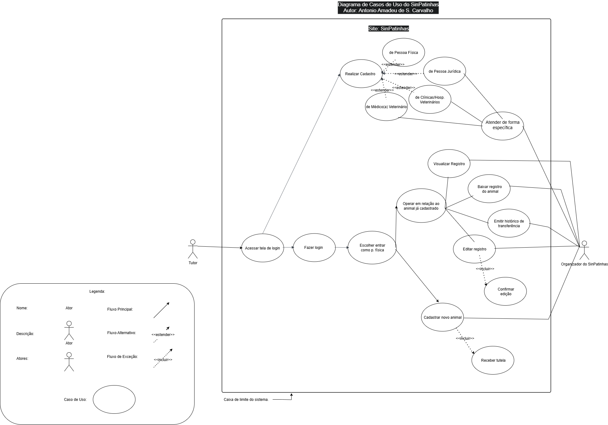

# Casos de Uso – Projeto SinPatinhas

---

* [Link para validação de casos de uso com tutora de animal](https://www.youtube.com/watch?v=veQV-Rdvk44)

---

## Introdução

Os **casos de uso** são um dos principais artefatos da **UML (Unified Modeling Language)**, permitindo descrever as **interações entre usuários (atores)** e o **sistema**. Por meio deles, é possível compreender **como o sistema deve se comportar** em diferentes situações, garantindo que os **requisitos funcionais** sejam bem representados e validados junto aos stakeholders.

No contexto do **projeto SinPatinhas**, os casos de uso representam ações essenciais como **cadastro de tutores e animais (RF001 e RF002)**, **geração de registro oficial (RF003)**, **emissão de documento de identificação (RF005)** e **atualização de status (RF007)**. Essa modelagem contribui para o entendimento funcional do sistema e auxilia na documentação das regras de negócio.

---

### Diagrama de Casos de Uso do SinPatinhas:

Com base nos requisitos elicitados anteriormente para o projeto SinPatinhas, **foi desenvolvido o Diagrama de Casos de Uso UML apresentado abaixo**. O modelo representa as principais interações entre o ator Usuário e o sistema SinPatinhas, incluindo diferentes tipos de perfis — **Pessoa Física, Pessoa Jurídica e Clínicas/Hospitais Veterinários** — que executam ações específicas no sistema.

O diagrama contempla **funcionalidades como cadastro de usuários e animais**, recebimento de tutelas, visualização e edição de registros, além de histórico de transferências e confirmação de alterações. Também **há interação com o servidor do SinPatinhas, responsável pelo processamento das operações e pela comunicação entre os módulos do sistema**.

Assim, **o diagrama sintetiza o comportamento esperado do sistema em relação aos usuários e demais entidades envolvidas, servindo como base para a modelagem e implementação das funcionalidades descritas nos requisitos**.

* [Link para o diagrama de casos de uso](https://app.diagrams.net/?title=v2_caso_de_uso_sinpatinhas.drawio&lightbox=1&page-id=YY2I2kYa37VnRreWqp_o&client=1)

## Artefatos e Gravações Unitários

| Participante | Página Específica |
|---------------|------------------|
| **Antonio Carvalho** | [Modelagem dos casos de uso - Caso de uso UC001 – Sistema de Adoção de Animais RFNI016 e #UC002 – Notificação Periódica para Atualização de Dados e Fotos do Animal RFNI021](/modelagem/gravacoes/antonio/caso_de_uso.md) |
| **Letícia Paiva** | [Modelagem dos casos de uso - Caso de uso 03 e 04](/modelagem/gravacoes/leticia/caso_de_uso.md) |
| **Pedro Gomes** | [Modelagem dos casos de uso - Caso de uso 05 e 06](/modelagem/gravacoes/pedro/caso_de_uso.md) |
| **Mateus Santos Negrini** | [Modelagem dos casos de uso - Caso de uso 07 e 08](/modelagem/gravacoes/pedro/caso_de_uso.md) |
| **Heloisa** | [Modelagem dos casos de uso - Caso de uso 09 e 10](/modelagem/gravacoes/mateus/caso_de_uso.md) |
| **Heloisa** | [Modelagem dos casos de uso - Caso de uso 09 e 10](/modelagem/gravacoes/heloisa/casos_de_uso.md) |
| **Isaac Menezes** | [Modelagem dos casos de uso - Caso de uso 11 e 12](/modelagem/gravacoes/isaac/caso_de_uso.md) |

---

## Estrutura para Criação de um Caso de Uso

A criação de um caso de uso deve seguir uma estrutura organizada que descreva de forma clara as **ações, condições e resultados esperados**.  
A tabela a seguir apresenta os componentes utilizados.

**Tabela 1 – Estrutura para Criação de um Caso de Uso**  
*Autoria: Antonio Carvalho*

| **Componente** | **Descrição** |
|----------------|----------------|
| **Código** | Identificador único do caso de uso (ex.: #UC001). |
| **Descrição** | Breve explicação sobre a funcionalidade tratada. |
| **Ator(es)** | Usuário(s) ou sistema(s) que interagem com o caso. |
| **Pré-condições** | Condições que devem ser atendidas antes da execução do caso. |
| **Ação** | A operação principal realizada. |
| **Fluxo principal** | Sequência de passos que descrevem o comportamento esperado. |
| **Fluxos alternativos** | Caminhos opcionais que podem ocorrer durante a execução. |
| **Fluxos de exceção** | Tratamento de erros ou situações inesperadas. |
| **Pós-condições** | Estado do sistema após a execução. |
| **Data de Criação** | Data em que o caso foi documentado. |
| **Rastreabilidade** | Código dos requisitos relacionados. |
| **Cenário Relacionado** | Link para o cenário correspondente. |
| **Léxico Relacionado** | Termos do léxico utilizados no caso de uso. |

---

## Tabela de Contribuição

| Nome | Contribuição (%) | Função |
|------|------------------|--------|
| Antonio Carvalho | 100% | Autor da página de apresentação de casos de uso |
 

---

## Tabela de Versionamento

| Versão | Data | Descrição | Autores | Revisores |
|:------:|:-----------|:-------------------------------------------|:--------|:-----------|
| 1.0 | 10/10/2025 | Criação da página de **Casos de Uso** e exemplo explicativo | Antonio | Leticia |

---

## Referências

Pressman, R. S. *Engenharia de Software: uma abordagem profissional*. 8ª Ed. AMGH, 2016.  
Sommerville, I. *Engenharia de Software*. 10ª Ed. Pearson, 2019.
