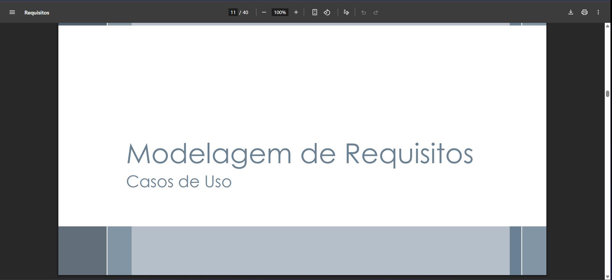

# Casos de uso – Antonio Carvalho

---

* [Link para validação de casos de uso com tutora de animal](https://www.youtube.com/watch?v=veQV-Rdvk44)

---

## UC001 – Sistema de Adoção de Animais ([RFNI016](../../elicitacao/tecnicas_elicitacao/requisitos_elicitados.md#rfni016))

**Autor:** [Antonio Carvalho](https://github.com/antonioscarvalho)

**Tabela 01** – Caso de Uso 01 – Sistema de Adoção de Animais ([RFNI016](../../elicitacao/tecnicas_elicitacao/requisitos_elicitados.md#rfni016))

| **Item** | **Informações** |
|-----------|----------------|
| **Código** | #UC001 |
| **Descrição** | O sistema deve permitir que tutores e ONGs disponibilizem animais para adoção e que usuários interessados possam visualizar e solicitar adoção. |
| **Ator** | Tutor/ONG (Douglas, 23 anos) e Adotante |
| **Pré-condições** | O tutor/ONG deve estar autenticado e possuir animais cadastrados. O adotante também deve estar autenticado. |
| **Ação** | O tutor cadastra o animal para adoção e o adotante acessa a listagem para enviar solicitação. |
| **Fluxo principal** | <ul><li>O tutor acessa sua conta e cadastra o animal para adoção.</li><li>O adotante acessa o módulo “Adoção”.</li><li>Visualiza lista de animais disponíveis com fotos e informações.</li><li>Filtra por espécie, idade e localização.</li><li>Seleciona um animal e envia solicitação de adoção.</li><li>O sistema notifica o responsável pelo animal.</li></ul> |
| **Fluxo alternativo** | <ul><li>O adotante cancela a solicitação de adoção antes da confirmação.</li><li>O tutor decide remover o animal da listagem antes da adoção.</li></ul> |
| **Fluxo de exceção** | <ul><li>O animal já foi adotado antes da solicitação.</li><li>O sistema exibe mensagem informando indisponibilidade do animal.</li></ul> |
| **Pós-condições** | O sistema registra a solicitação e atualiza o status do animal para “Em processo de adoção”. |
| **Data de Criação** | 11/10/2025 |
| **Rastreabilidade** | [RFNI016](../../elicitacao/tecnicas_elicitacao/requisitos_elicitados.md#rfni016) — Sistema de Adoção de Animais |
| **Cenário relacionado** | [CNR003](/modelagem/gravacoes/antonio/cenarios.md#crn003) |
| **Léxico relacionado** | [LX001](/modelagem/gravacoes/antonio/lexicos.md#lx001) |
| **Origem** | Entrevista 2 |

---

## #UC002 – Notificação Periódica para Atualização de Dados e Fotos do Animal ([RFNI021](../../elicitacao/tecnicas_elicitacao/requisitos_elicitados.md#rfni021))

**Autor:** [Antonio Carvalho](https://github.com/antonioscarvalho)

**Tabela 02** – Caso de Uso 02 – Notificação Periódica para Atualização de Dados e Fotos do Animal ([RFNI021](../../elicitacao/tecnicas_elicitacao/requisitos_elicitados.md#rfni021))

| **Item** | **Informações** |
|-----------|----------------|
| **Código** | #UC002 |
| **Descrição** | O sistema deve enviar notificações automáticas aos tutores para que atualizem periodicamente os dados e fotos de seus animais. |
| **Ator** | Tutor (Douglas, 23 anos) |
| **Pré-condições** | O tutor deve estar autenticado e possuir animal cadastrado no sistema. |
| **Ação** | O tutor recebe uma notificação e acessa o sistema para atualizar as informações. |
| **Fluxo principal** | <ul><li>O sistema envia notificação automática ao tutor a cada período determinado (ex: 6 meses).</li><li>O tutor acessa o link contido na notificação.</li><li>Visualiza as informações atuais do animal.</li><li>Atualiza dados ou envia nova foto.</li><li>O sistema salva e confirma a atualização.</li></ul> |
| **Fluxo alternativo** | <ul><li>O tutor visualiza os dados mas não altera nenhuma informação.</li><li>O sistema apenas atualiza a data de última verificação.</li></ul> |
| **Fluxo de exceção** | <ul><li>O tutor ignora a notificação por um longo período.</li><li>O sistema envia lembretes adicionais ou exibe alerta no perfil do animal.</li></ul> |
| **Pós-condições** | O cadastro do animal é atualizado e a data da última modificação é registrada. |
| **Data de Criação** | 11/10/2025 |
| **Rastreabilidade** | [RFNI021](../../elicitacao/tecnicas_elicitacao/requisitos_elicitados.md#rfni021) — Notificação Periódica para Atualização de Dados e Fotos do Animal |
| **Cenário relacionado** | [CNR004](/modelagem/gravacoes/antonio/cenarios.md#cn004) |
| **Léxico relacionado** | [LX002](/modelagem/gravacoes/antonio/lexicos.md#lx002) |
| **Origem** | Entrevista 3 |

---

## Referência para elaboração desses artefatos em específico: Requisitos de Software – Aula 11: Especificação e Casos de Uso em Requisitos. 

---

## Tabela de Contribuição

| **Nome** | **Contribuição (%)** | **Função** |
|-----------|----------------------|-------------|
| Antonio Carvalho | 100% | Autor desta página |

---

## Tabela de Versionamento

| **Versão** | **Data** | **Descrição** | **Autores** | **Revisores** |
|-------------|-----------|----------------|--------------|----------------|
| 1.0 | 11/10/2025 | Adição dos casos de uso referentes aos requisitos não implementados RFNI016 e RFNI021 | Antonio | - |

---

## Referências  

SERRANO, Milene; SERRANO, Maurício. *Requisitos de Software – Aula 11: Especificação e Casos de Uso em Requisitos.* Brasília: Universidade de Brasília, 2025.  
