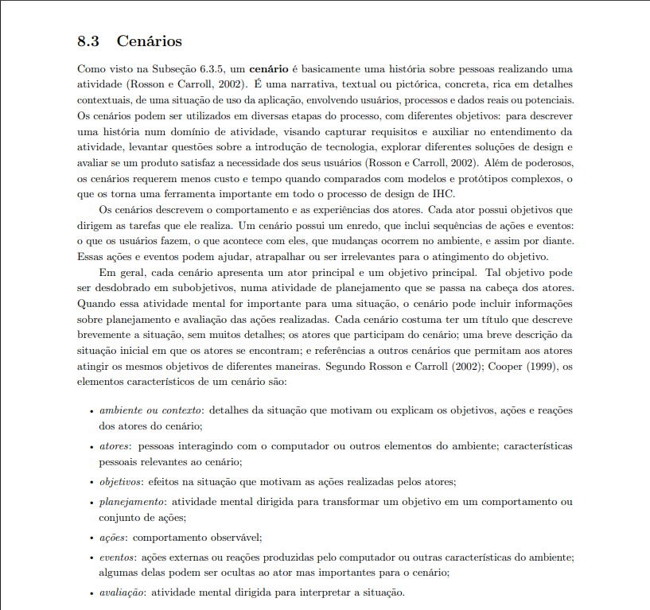

# Cenários – Antonio Carvalho

## Cenário 03 — Sistema de Adoção de Animais ([RFNI016](../../../elicitacao/tecnicas_elicitacao/requisitos_elicitados.md#rfni016))

**Autor:** Antonio Carvalho

**Tabela 1 – Cenário 03: Sistema de Adoção de Animais ([RFNI016](../../../elicitacao/tecnicas_elicitacao/requisitos_elicitados.md#rfni016))**

| **Componente** | **Descrição** |
|-----------------|----------------|
| **Título** | Sistema de Adoção de Animais |
| **Código** | CNR003 |
| **Caso de uso trabalhado** | [UC001](/modelagem/gravacoes/antonio/casos_de_uso.md#uc001) |

**Ambiente/Contexto**  
Local: Portal do SinPatinhas acessado via navegador web ou aplicativo móvel.  
Tempo: Quando o tutor ou ONG deseja disponibilizar um animal para adoção.  
Pré-condição: Usuário autenticado (tutor ou ONG) com animal cadastrado.

**Atores**  
Douglas, 23 anos, estudante de engenharia de software na UnB, tutor de um cão, deseja adotar outro animal.

**Objetivos**  
Permitir a divulgação de animais disponíveis para adoção e facilitar o contato entre tutores/ONGs e adotantes interessados.

**Planejamento**  
O ator deseja encontrar um novo animal para adoção, com informações seguras e verificadas.

**Ações**  
1. Douglas acessa o módulo “Adoção”.  
2. Visualiza lista de animais disponíveis com fotos e informações básicas.  
3. Filtra por espécie, idade e localização.  
4. Seleciona um animal de interesse.  
5. Envia solicitação de adoção.  
6. O sistema notifica o responsável pelo animal.

**Eventos**  
- Exibição de perfis de animais disponíveis.  
- Envio de notificações entre usuários.  
- Atualização do status de “Disponível” para “Em processo de adoção”.

**Avaliação**  
O ator confirma se conseguiu visualizar e solicitar a adoção com sucesso.

**Exceção**  
Caso o animal seja adotado antes da solicitação, o sistema exibe uma mensagem informando indisponibilidade.

---

## Cenário 04 — Notificação Periódica para Atualização de Dados e Fotos do Animal ([RFNI021](../../../elicitacao/tecnicas_elicitacao/requisitos_elicitados.md#rfni021))

**Autor:** Antonio Carvalho

**Tabela 2 – Cenário 04: Notificação Periódica para Atualização de Dados e Fotos do Animal ([RFNI021](../../../elicitacao/tecnicas_elicitacao/requisitos_elicitados.md#rfni021))**

| **Componente** | **Descrição** |
|-----------------|----------------|
| **Título** | Notificação Periódica para Atualização de Dados e Fotos |
| **Código** | CNR004 |
| **Caso de uso trabalhado** | [UC002](/modelagem/gravacoes/antonio/casos_de_uso.md#uc002) |

**Ambiente/Contexto**  
Local: Portal do tutor ou aplicativo SinPatinhas.  
Tempo: Periodicamente (a cada 6 meses, por exemplo).  
Pré-condição: Tutor autenticado com animal registrado no sistema.

**Atores**  
Douglas, 23 anos, estudante de engenharia de software na UnB, tutor de um cão.

**Objetivos**  
Manter os registros do animal atualizados, garantindo precisão das informações e fotos recentes.

**Planejamento**  
O ator deseja manter o cadastro de seu animal sempre atualizado, evitando inconsistências e facilitando sua identificação.

**Ações**  
1. O sistema envia notificação automática ao tutor.  
2. Douglas acessa o link da notificação.  
3. Verifica os dados atuais do animal.  
4. Atualiza informações ou envia nova foto.  
5. O sistema salva as alterações e confirma a atualização.

**Eventos**  
- Envio de notificações automáticas.  
- Registro da data da última atualização.  
- Atualização da base de dados do animal.

**Avaliação**  
O ator verifica se a atualização foi concluída e se as novas informações estão visíveis no perfil do animal.

**Exceção**  
Caso o tutor ignore a notificação por um longo período, o sistema envia novo lembrete ou alerta visual no perfil.

---

## Referência para elaboração desses artefatos em específico:

---

## Agradecimentos

Agradeço o apoio das ferramentas de Inteligência Artificial (IA) Generativa, em especial o uso do ChatGPT (OpenAI), que contribuiu para *formatação textual, revisão linguística, padronização e aprimoramento da clareza técnica deste documento*.
Ressalta-se que *todo o conteúdo conceitual e as decisões de modelagem aqui descritos — incluindo a definição dos cenários, requisitos e estruturas — foram elaborados por mim*, sendo a IA utilizada como apoio redacional e organizacional no processo de documentação dos Léxicos, Especificação Suplementar e Cenários.

---

### Tabela de Contribuição

| **Nome** | **Contribuição (%)** | **Função** |
|-----------|----------------------|-------------|
| Antonio Carvalho | 100% | Autor desta página |

### Tabela de Versionamento

| **Versão** | **Data** | **Descrição** | **Autores** | **Revisores** |
|-------------|-----------|----------------|--------------|----------------|
| 1.0 | 11/10/2025 | Adição dos cenários referentes aos requisitos não implementados [RFNI016](../../../elicitacao/tecnicas_elicitacao/requisitos_elicitados.md#rfni016) e [RFNI021](../../../elicitacao/tecnicas_elicitacao/requisitos_elicitados.md#rfni021) | Antonio | - |

### Referências

Barbosa, S. D. J.; Silva, B. S. da; Silveira, M. S.; Gasparini, I.; Darin, T.; Barbosa, G. D. J. (2021). *Interação Humano-Computador e Experiência do Usuário.* Autopublicação. ISBN: 978-65-00-19677-1.
