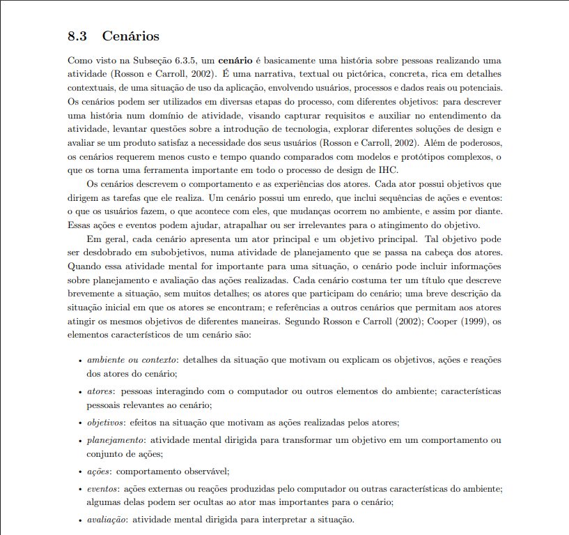

# Cenários – Antonio Carvalho

---

## Validação com tutora de animal

A validação com o usuário foi feita de forma presencial, no dia 12 de outubro.

<iframe width="560" height="315" src="https://www.youtube.com/embed/loBusGtCcjI" title="YouTube video player" frameborder="0" allow="accelerometer; autoplay; clipboard-write; encrypted-media; gyroscope; picture-in-picture; web-share" referrerpolicy="strict-origin-when-cross-origin" allowfullscreen></iframe> 

---

### Participantes da validação

| Participante | Papel |
| ------------ | ----- |
| Antonio Carvalho | Integrante do grupo, responsável por coordenar a validação com a tutora. |
| Maria Clara | Estudante de Gestão Pública de 19 anos de idade, responsável por validar o artefato de cenários. |

---

## #CNR003 - Cenário 03 — Sistema de Adoção de Animais ([RFNI016](../../../elicitacao/tecnicas_elicitacao/requisitos_elicitados.md#rfni016))

**Autor:** Antonio Carvalho

**Tabela 1 – Cenário 03: Sistema de Adoção de Animais ([RFNI016](../../../elicitacao/tecnicas_elicitacao/requisitos_elicitados.md#rfni016))**

| **Componente** | **Descrição** |
|-----------------|----------------|
| **Título** | Sistema de Adoção de Animais |
| **Código** | CNR003 |
| **Caso de uso trabalhado** | [UC001](../../../modelagem/gravacoes/antonio/caso_de_uso.md#uc001) |

**Ambiente/Contexto**  
Local: Portal do SinPatinhas acessado via navegador web ou aplicativo móvel.  
Tempo: Quando o tutor ou ONG deseja disponibilizar um animal para adoção.  
Pré-condição: Usuário autenticado (tutor ou ONG) com animal cadastrado.

**Atores**  
Douglas, 23 anos, estudante de engenharia de software na UnB, tutor de um cão, deseja adotar outro animal.

**Objetivos**  
Permitir a divulgação de animais disponíveis para adoção e facilitar o contato entre tutores/ONGs e adotantes interessados.

**Planejamento**  
O ator deseja encontrar um novo animal para adoção, com informações seguras e verificadas.

**Ações**  
1. Douglas acessa o módulo “Adoção”.  
2. Visualiza lista de animais disponíveis com fotos e informações básicas.  
3. Filtra por espécie, idade e localização.  
4. Seleciona um animal de interesse.  
5. Envia solicitação de adoção.  
6. O sistema notifica o responsável pelo animal.

**Eventos**  
- Exibição de perfis de animais disponíveis.  
- Envio de notificações entre usuários.  
- Atualização do status de “Disponível” para “Em processo de adoção”.

**Avaliação**  
O ator confirma se conseguiu visualizar e solicitar a adoção com sucesso.

**Exceção**  
Caso o animal seja adotado antes da solicitação, o sistema exibe uma mensagem informando indisponibilidade.

---

## #CNR004 - Cenário 04 — Notificação Periódica para Atualização de Dados e Fotos do Animal ([RFNI021](../../../elicitacao/tecnicas_elicitacao/requisitos_elicitados.md#rfni021))

**Autor:** Antonio Carvalho

**Tabela 2 – Cenário 04: Notificação Periódica para Atualização de Dados e Fotos do Animal ([RFNI021](../../../elicitacao/tecnicas_elicitacao/requisitos_elicitados.md#rfni021))**

| **Componente** | **Descrição** |
|-----------------|----------------|
| **Título** | Notificação Periódica para Atualização de Dados e Fotos |
| **Código** | CNR004 |
| **Caso de uso trabalhado** | [UC002](../../../modelagem/gravacoes/antonio/caso_de_uso.md#uc002) |

**Ambiente/Contexto**  
Local: Portal do tutor ou aplicativo SinPatinhas.  
Tempo: Periodicamente (a cada 6 meses, por exemplo).  
Pré-condição: Tutor autenticado com animal registrado no sistema.

**Atores**  
Douglas, 23 anos, estudante de engenharia de software na UnB, tutor de um cão.

**Objetivos**  
Manter os registros do animal atualizados, garantindo precisão das informações e fotos recentes.

**Planejamento**  
O ator deseja manter o cadastro de seu animal sempre atualizado, evitando inconsistências e facilitando sua identificação.

**Ações**  
1. O sistema envia notificação automática ao tutor.  
2. Douglas acessa o link da notificação.  
3. Verifica os dados atuais do animal.  
4. Atualiza informações ou envia nova foto.  
5. O sistema salva as alterações e confirma a atualização.

**Eventos**  
- Envio de notificações automáticas.  
- Registro da data da última atualização.  
- Atualização da base de dados do animal.

**Avaliação**  
O ator verifica se a atualização foi concluída e se as novas informações estão visíveis no perfil do animal.

**Exceção**  
Caso o tutor ignore a notificação por um longo período, o sistema envia novo lembrete ou alerta visual no perfil.

---

## #CNR013 - Cenário 13 — Acesso via Web e Mobile ([RNFNI001](../../../elicitacao/tecnicas_elicitacao/requisitos_elicitados.md#rnfni001))

**Autor:** Antonio Carvalho

**Tabela 3 – Cenário 13: Acesso via Web e Mobile ([RNFNI001](../../../elicitacao/tecnicas_elicitacao/requisitos_elicitados.md#rnfni001))**

| **Componente** | **Descrição** |
|-----------------|----------------|
| **Título** | Acesso via Web e Mobile |
| **Código** | CNR013 |
| **Requisito associado** | [RNFNI001](../../../elicitacao/tecnicas_elicitacao/requisitos_elicitados.md#rnfni001) |

**Ambiente/Contexto**  
Local: Portal SinPatinhas e aplicativo móvel.  
Tempo: Quando o usuário deseja acessar o sistema em diferentes dispositivos.  
Pré-condição: Sistema hospedado com suporte responsivo e autenticação unificada.

**Atores**  
Douglas, 23 anos, estudante de engenharia de software, deseja acessar sua conta tanto no computador quanto no celular.

**Objetivos**  
Garantir que o usuário tenha acesso total ao sistema, independentemente da plataforma utilizada.

**Planejamento**  
O ator deseja usar o SinPatinhas no celular para facilitar o acompanhamento de notificações e, em outros momentos, no computador para atualizar informações mais detalhadas.

**Ações**  
1. Douglas acessa o SinPatinhas via navegador no desktop.  
2. Faz login e utiliza as funcionalidades normalmente.  
3. Posteriormente, acessa o aplicativo no celular.  
4. Verifica que seus dados e preferências estão sincronizados.  
5. Recebe notificações push no mobile.  

**Eventos**  
- Sincronização automática de dados entre web e mobile.  
- Autenticação compartilhada via conta única.  
- Adaptação de interface responsiva.  

**Avaliação**  
O ator confirma que conseguiu acessar todas as funcionalidades tanto pelo navegador quanto pelo aplicativo.

**Exceção**  
Caso o dispositivo móvel não seja compatível, o sistema exibe instruções para instalação de versão alternativa (PWA ou web responsiva).

---

## #CNR014 - Cenário 14 — Funcionalidades Offline ([RNFNI002](../../../elicitacao/tecnicas_elicitacao/requisitos_elicitados.md#rnfni002))

**Autor:** Antonio Carvalho

**Tabela 4 – Cenário 14: Funcionalidades Offline ([RNFNI002](../../../elicitacao/tecnicas_elicitacao/requisitos_elicitados.md#rnfni002))**

| **Componente** | **Descrição** |
|-----------------|----------------|
| **Título** | Funcionalidades Offline |
| **Código** | CNR014 |
| **Requisito associado** | [RNFNI002](../../../elicitacao/tecnicas_elicitacao/requisitos_elicitados.md#rnfni002) |

**Ambiente/Contexto**  
Local: Aplicativo móvel SinPatinhas.  
Tempo: Quando o usuário não possui conexão à internet.  
Pré-condição: Dados principais sincronizados previamente com o servidor.

**Atores**  
Douglas, tutor de um cão, precisa visualizar o histórico de adoções e informações do animal mesmo sem conexão.

**Objetivos**  
Permitir acesso limitado a dados essenciais, como fichas de animais e histórico, mesmo em modo offline.

**Planejamento**  
O ator deseja consultar informações sobre seu animal durante uma viagem sem internet.

**Ações**  
1. Douglas abre o aplicativo em modo offline.  
2. O sistema exibe aviso informando o modo limitado.  
3. Ele acessa os dados sincronizados localmente.  
4. Consulta informações de contato e registros do animal.  
5. Quando a conexão é restabelecida, o sistema atualiza automaticamente as informações.

**Eventos**  
- Armazenamento temporário de dados localmente.  
- Sincronização automática pós-reconexão.  
- Indicação visual do modo offline.  

**Avaliação**  
O ator confirma que conseguiu consultar os dados mesmo sem internet e que tudo foi atualizado corretamente após reconexão.

**Exceção**  
Caso o usuário nunca tenha sincronizado antes, o sistema exibe mensagem indicando que o acesso offline não está disponível.

---

## #CNR015 - Cenário 15 — Integração Direta com Parceiros ([RNFNI003](../../../elicitacao/tecnicas_elicitacao/requisitos_elicitados.md#rnfni003))

**Autor:** Antonio Carvalho

**Tabela 5 – Cenário 15: Integração Direta com Parceiros ([RNFNI003](../../../elicitacao/tecnicas_elicitacao/requisitos_elicitados.md#rnfni003))**

| **Componente** | **Descrição** |
|-----------------|----------------|
| **Título** | Integração Direta com Parceiros |
| **Código** | CNR015 |
| **Requisito associado** | [RNFNI003](../../../elicitacao/tecnicas_elicitacao/requisitos_elicitados.md#rnfni003) |

**Ambiente/Contexto**  
Local: Portal SinPatinhas, módulo de parcerias.  
Tempo: Quando clínicas, ONGs ou pet shops integram seus dados diretamente à plataforma.  
Pré-condição: Parceiro cadastrado e autenticado via API segura.

**Atores**  
Clínica “Pet Vida”, parceira cadastrada no sistema, deseja atualizar automaticamente suas informações de serviços e horários.

**Objetivos**  
Garantir integração automatizada e segura de informações entre o sistema SinPatinhas e plataformas parceiras.

**Planejamento**  
O ator (clínica parceira) deseja reduzir retrabalho e manter as informações de contato sempre atualizadas na plataforma.

**Ações**  
1. A clínica autentica-se na API do SinPatinhas.  
2. Envia dados atualizados de serviços e disponibilidade.  
3. O sistema valida e atualiza automaticamente o cadastro da clínica.  
4. As informações ficam visíveis para os usuários.  
5. Notificações são enviadas em caso de inconsistência.  

**Eventos**  
- Comunicação via API REST segura (HTTPS).  
- Atualização automática de dados de parceiros.  
- Registro de logs de integração.  

**Avaliação**  
O parceiro confirma que as informações foram integradas corretamente e exibidas no portal.

**Exceção**  
Em caso de falha na autenticação ou envio de dados incorretos, o sistema rejeita a atualização e envia notificação de erro.

---

## Referência para elaboração desses artefatos em específico:

---

## Agradecimentos

Agradeço o apoio das ferramentas de Inteligência Artificial (IA) Generativa, em especial o uso do ChatGPT (OpenAI), que contribuiu para *formatação textual, revisão linguística, padronização e aprimoramento da clareza técnica deste documento*.
Ressalta-se que *todo o conteúdo conceitual e as decisões de modelagem aqui descritos — incluindo a definição dos cenários, requisitos e estruturas — foram elaborados por mim, Antonio*, sendo a IA utilizada como apoio redacional e organizacional no processo de documentação dos Léxicos, Especificação Suplementar e Cenários.

---

### Tabela de Contribuição

| **Nome** | **Contribuição (%)** | **Função** |
|-----------|----------------------|-------------|
| Antonio Carvalho | 100% | Autor desta página |

---

### Referências

Barbosa, S. D. J.; Silva, B. S. da; Silveira, M. S.; Gasparini, I.; Darin, T.; Barbosa, G. D. J. (2021). *Interação Humano-Computador e Experiência do Usuário.* Autopublicação. ISBN: 978-65-00-19677-1.

---

### Tabela de Versionamento

| **Versão** | **Data** | **Descrição** | **Autores** | **Revisores** |
|-------------|-----------|----------------|--------------|----------------|
| 1.0 | 11/10/2025 | Adição dos cenários referentes aos requisitos não implementados [RFNI016](../../../elicitacao/tecnicas_elicitacao/requisitos_elicitados.md#rfni016) e [RFNI021](../../../elicitacao/tecnicas_elicitacao/requisitos_elicitados.md#rfni021) | Antonio | - |
| 1.1 | 04/11/2025 | Adição dos cenários referentes aos requisitos não implementados [RNFNI001](../../../elicitacao/tecnicas_elicitacao/requisitos_elicitados.md#rnfni001), [RNFNI002](../../../elicitacao/tecnicas_elicitacao/requisitos_elicitados.md#rnfni002) e [RNFNI003](../../../elicitacao/tecnicas_elicitacao/requisitos_elicitados.md#rnfni003) | Antonio | - |
