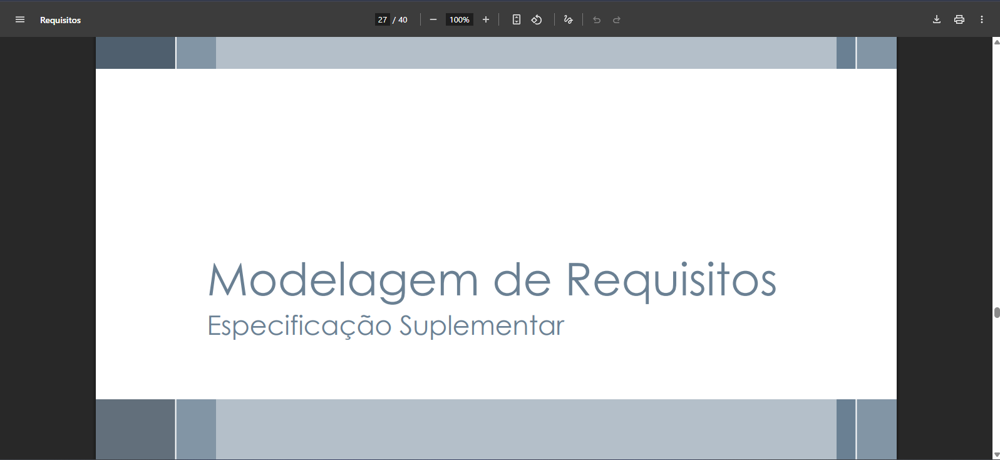

# Especificações Suplementares - Antonio Carvalho

---

## Validação com tutor de animal

A validação com o tutor foi feita de forma presencial, no dia 10 de outubro.

<iframe width="560" height="315" src="https://www.youtube.com/embed/VDm2lGHywDw" title="YouTube video player" frameborder="0" allow="accelerometer; autoplay; clipboard-write; encrypted-media; gyroscope; picture-in-picture; web-share" referrerpolicy="strict-origin-when-cross-origin" allowfullscreen></iframe> 

---

### Participantes da validação

| Participante | Papel |
| ------------ | ----- |
| Antonio Carvalho | Integrante do grupo, responsável por coordenar a validação com a tutora. |
| Douglas Wilson | Estudante de Engenharia de Software de 22 anos de idade, responsável por validar o artefato de especificação suplementar. |

---

## #ES001 - Usabilidade (U)

**Autor:** [Antonio Carvalho](https://github.com/antonioscarvalho)

Os requisitos de **Usabilidade** definem a facilidade com que o usuário final (cidadão, tutor ou profissional) consegue interagir com o sistema, sendo crucial para a adoção de um sistema de utilidade pública como o **SinPatinhas**.  
Foco em **intuitividade**, **clareza** e **eficiência da interface**.

<b>Tabela 1 - Requisitos de Usabilidade.</b>

| **ID** | **Descrição** | **Rastreamento** |
|:-------|:---------------|:-----------------|
| [RNF003](../../../elicitacao/tecnicas_elicitacao/requisitos_elicitados.md#rnf003) | A interface deve ser intuitiva para cidadãos, facilitando o uso por pessoas de diferentes níveis de afinidade tecnológica. | Análise Doc |
| [RNF13](../../../elicitacao/tecnicas_elicitacao/requisitos_elicitados.md#rnf13) | O sistema deve suportar os navegadores principais e ser responsivo em dispositivos móveis (prioridade no mobile). | Análise Doc |
| [RNF001](../../../elicitacao/tecnicas_elicitacao/requisitos_elicitados.md#rnf001) (E1) | O sistema deve ser fácil e intuitivo de operar. | Entrevista 01 |
| [RNF002](../../../elicitacao/tecnicas_elicitacao/requisitos_elicitados.md#rnf002) (E1) | O layout deve ser limpo e organizado. | Entrevista 01 |
| [RF012](../../../elicitacao/tecnicas_elicitacao/requisitos_elicitados.md#rf012) | O sistema deve permitir login integrado via Gov.br, possibilitando autenticação única e segura para tutores e profissionais. | Análise Doc |
| [RF013](../../../elicitacao/tecnicas_elicitacao/requisitos_elicitados.md#rf013) | O sistema deve habilitar preenchimento automático de dados pessoais do tutor (quando autorizado via Gov.br), reduzindo a duplicidade e agilizando a entrada de dados. | Análise Doc |

---

## #ES002 - Confiabilidade (R)

**Autor:** [Antonio Carvalho](https://github.com/antonioscarvalho)

A **Segurança** trata da proteção dos dados do sistema e prevenção de acessos não autorizados, garantindo **conformidade com a LGPD** e proteção da privacidade de tutores e animais.

<b>Tabela 2 - Requisitos de Segurança.</b>

| **ID** | **Descrição** | **Rastreamento** |
|:-------|:---------------|:-----------------|
| [RNF001](../../../elicitacao/tecnicas_elicitacao/requisitos_elicitados.md#rnf001) | O sistema deve estar em total conformidade com a Lei Geral de Proteção de Dados (LGPD). | Análise Doc |
| [RNF002](../../../elicitacao/tecnicas_elicitacao/requisitos_elicitados.md#rnf002) (E3) | O sistema deve alertar o usuário sobre tentativas de acesso não autorizado. | Entrevista 03 |
| [RNF017](../../../elicitacao/tecnicas_elicitacao/requisitos_elicitados.md#rnf017) | O sistema deve gerar alertas de acesso não autorizado e tentativas de violação. | Entrevista 03 |
| [RNF019](../../../elicitacao/tecnicas_elicitacao/requisitos_elicitados.md#rnf019) | Segurança na integração entre clínicas, ONGs e SinPatinhas. | Análise Doc |

---

## #ES011 - Confiabilidade (R)

**Autor:** [Antonio Carvalho](https://github.com/antonioscarvalho)

A **Confiabilidade** garante que o sistema funcione de forma **estável e contínua**, evitando perda de dados e mantendo integridade das informações, mesmo em falhas ou interrupções.

<b>Tabela 3 - Requisitos de Confiabilidade.</b>

| **ID** | **Descrição** | **Rastreamento** |
|:-------|:---------------|:-----------------|
| [RNF003](../../../elicitacao/tecnicas_elicitacao/requisitos_elicitados.md#rnf003) (E1) | O sistema deve garantir a fidelidade contra perda de dados. | Entrevista 01 |
| [RNF003](../../../elicitacao/tecnicas_elicitacao/requisitos_elicitados.md#rnf003) (E3) | O sistema deve evitar perda de dados e garantir cópias de segurança automáticas. | Entrevista 03 |
| [RNF009](../../../elicitacao/tecnicas_elicitacao/requisitos_elicitados.md#rnf009) | O sistema deve registrar logs detalhados de acesso e modificações nos prontuários e cadastros. | Entrevista 03 |
| [RF006](../../../elicitacao/tecnicas_elicitacao/requisitos_elicitados.md#rf006) | O acesso à consulta pública via RGA ou microchip deve ser restrito, exibindo apenas dados não sensíveis do animal. | Análise Doc |

---

## #ES012 - Performance (P) – Celeridade

**Autor:** [Antonio Carvalho](https://github.com/antonioscarvalho)

Os requisitos de **Performance (Celeridade)** garantem que o sistema **SinPatinhas** opere de forma **rápida, responsiva e estável**, mesmo sob alto volume de acessos.  
Tais requisitos asseguram **respostas em tempo hábil**, **otimização de consultas** e **eficiência no processamento**, fatores essenciais para a satisfação do usuário e confiabilidade do serviço.

<b>Tabela 12 - Requisitos de Performance (Celeridade).</b>

| **ID** | **Descrição** | **Rastreamento** |
|:-------|:---------------|:-----------------|
| [RNF004](../../../elicitacao/tecnicas_elicitacao/requisitos_elicitados.md#rnf004) | O sistema deve responder a consultas públicas em menos de 2 segundos. | Análise Doc |
| [RNF021](../../../elicitacao/tecnicas_elicitacao/requisitos_elicitados.md#rnf021) | O sistema deve garantir respostas rápidas (até 2s) em todas as interfaces. | Entrevista / Benchmark |
| [RF020](../../../elicitacao/tecnicas_elicitacao/requisitos_elicitados.md#rf020) | Garantir acesso nacional via internet com escalabilidade. | Análise Doc |
| [RF037](../../../elicitacao/tecnicas_elicitacao/requisitos_elicitados.md#rf037) | Acesso via celular para consulta fora da clínica, com resposta imediata. | Protótipo |
| [RNF011](../../../elicitacao/tecnicas_elicitacao/requisitos_elicitados.md#rnf011) | O sistema deve possuir funcionalidades offline para garantir desempenho contínuo. | Entrevista |
| [RNF022](../../../elicitacao/tecnicas_elicitacao/requisitos_elicitados.md#rnf022) | O sistema deve manter disponibilidade de 99,8% (uptime). | Análise Técnica |

---

## #ES013 - Supportability (S) – Apoio / Manutenibilidade

**Autor:** [Antonio Carvalho](https://github.com/antonioscarvalho)

Os requisitos de **Supportability (Apoio e Manutenibilidade)** estabelecem práticas que permitem a **manutenção eficiente, evolução contínua e suporte técnico simplificado** do sistema **SinPatinhas**, assegurando sua longevidade e qualidade em operação.

<b>Tabela 13 - Requisitos de Supportability (Apoio / Manutenibilidade).</b>

| **ID** | **Descrição** | **Rastreamento** |
|:-------|:---------------|:-----------------|
| [RNF006](../../../elicitacao/tecnicas_elicitacao/requisitos_elicitados.md#rnf006) | O sistema deve possuir APIs abertas para integração com clínicas e órgãos públicos. | Análise Doc |
| [RNF019](../../../elicitacao/tecnicas_elicitacao/requisitos_elicitados.md#rnf019) | O sistema deve garantir integração contínua entre clínicas, ONGs e SinPatinhas. | Entrevista / Doc |
| [RNF024](../../../elicitacao/tecnicas_elicitacao/requisitos_elicitados.md#rnf024) | O sistema deve registrar logs de acesso e modificações para auditoria. | Análise Doc |
| [RF033](../../../elicitacao/tecnicas_elicitacao/requisitos_elicitados.md#rf033) | Disponibilizar área de instruções integradas (manual digital) para suporte ao usuário. | Protótipo |
| [RNF002](../../../elicitacao/tecnicas_elicitacao/requisitos_elicitados.md#rnf002) | O sistema deve manter documentação técnica atualizada e padronizada. | Engenharia de Software |
| [RNF018](../../../elicitacao/tecnicas_elicitacao/requisitos_elicitados.md#rnf018) | Implementar cópias de segurança automáticas e testes regulares de restauração. | Análise Técnica |

---

## #ES014 - Funcionalidade (F)

**Autor:** [Antonio Carvalho](https://github.com/antonioscarvalho)

Os requisitos de **Funcionalidade (F)** definem o **conjunto de serviços, comportamentos e operações essenciais** que o sistema **SinPatinhas** deve realizar para cumprir seus objetivos.  
Eles abrangem desde o **cadastro e gerenciamento de tutores e animais** até a **emissão de documentos oficiais e integração com plataformas externas**, assegurando o correto funcionamento do sistema em todos os níveis de uso.

<b>Tabela 14 - Requisitos de Funcionalidade.</b>

| **ID** | **Descrição** | **Rastreamento** |
|:-------|:---------------|:-----------------|
| [RF001](../../../elicitacao/tecnicas_elicitacao/requisitos_elicitados.md#rf001) | Cadastro de tutores com dados pessoais. | Entrevista / Análise Doc |
| [RF002](../../../elicitacao/tecnicas_elicitacao/requisitos_elicitados.md#rf002) | Cadastro de animais vinculados ao tutor. | Entrevista / Análise Doc |
| [RF003](../../../elicitacao/tecnicas_elicitacao/requisitos_elicitados.md#rf003) | Geração de número de Registro Geral do Animal (RGA). | Análise Doc |
| [RF005](../../../elicitacao/tecnicas_elicitacao/requisitos_elicitados.md#rf005) | Emissão de documento oficial de identificação (RG Pet). | Análise Doc |
| [RF007](../../../elicitacao/tecnicas_elicitacao/requisitos_elicitados.md#rf007) | Atualização do status do animal (perdido, encontrado, óbito, transferência). | Entrevista / Protótipo |
| [RF009](../../../elicitacao/tecnicas_elicitacao/requisitos_elicitados.md#rf009) | Transferência de titularidade do animal. | Entrevista |
| [RF018](../../../elicitacao/tecnicas_elicitacao/requisitos_elicitados.md#rf018) | Envio de notificações/campanhas e publicação de materiais educativos. | Entrevista |
| [RF020](../../../elicitacao/tecnicas_elicitacao/requisitos_elicitados.md#rf020) | Garantir acesso nacional via internet, com escalabilidade. | Análise Doc |
| [RF028](../../../elicitacao/tecnicas_elicitacao/requisitos_elicitados.md#rf028) | Permitir busca e recuperação de animais perdidos ou abandonados. | Entrevista |
| [RF029](../../../elicitacao/tecnicas_elicitacao/requisitos_elicitados.md#rf029) | Prontuário digital centralizando histórico de saúde e vacinação. | Entrevista / Análise Doc |
| [RF039](../../../elicitacao/tecnicas_elicitacao/requisitos_elicitados.md#rf039) | Integração entre clínicas veterinárias, permitindo visualização do prontuário. | Análise Doc |
| [RF041](../../../elicitacao/tecnicas_elicitacao/requisitos_elicitados.md#rf041) | Rastreamento de doações e adoções, registrando doadores, adotantes e datas. | Análise Doc |

---

## Referência para elaboração desses artefatos em específico: Requisitos de Software – Aula 11: Especificação e casos de uso em Requisitos.

---

## Agradecimentos

Agradeço o apoio das ferramentas de Inteligência Artificial (IA) Generativa, em especial o uso do ChatGPT (OpenAI), que contribuiu para *formatação textual, revisão linguística, padronização e aprimoramento da clareza técnica deste documento*.
Ressalta-se que *todo o conteúdo conceitual e as decisões de modelagem aqui descritos — incluindo a definição dos cenários, requisitos e estruturas — foram elaborados por mim, Antonio*, sendo a IA utilizada como apoio redacional e organizacional no processo de documentação dos Léxicos, Especificação Suplementar e Cenários.

---

## Tabela de Contribuição

| Nome | Contribuição (%) | Função |
|------|------------------|--------|
| **Antonio Carvalho** | 100% | Autor desta página |

---

## Referências  

SERRANO, Milene; SERRANO, Maurício. *Requisitos de Software – Aula 11: Especificação e casos de uso em Requisitos.* Brasília: Universidade de Brasília, 2025.

---

## Tabela de Versionamento

| Versão | Data | Descrição | Autores | Revisores |
|:------:|:-----------|:-------------------------------------------|:--------|:-----------|
| 1.0 | 11/10/2025 | Página de **Especificações Suplementares** própria | Antonio | - |
| 1.1 | 04/11/2025 | Criação das Especificações Suplementares de Performance e Supportability | Antonio | - |
