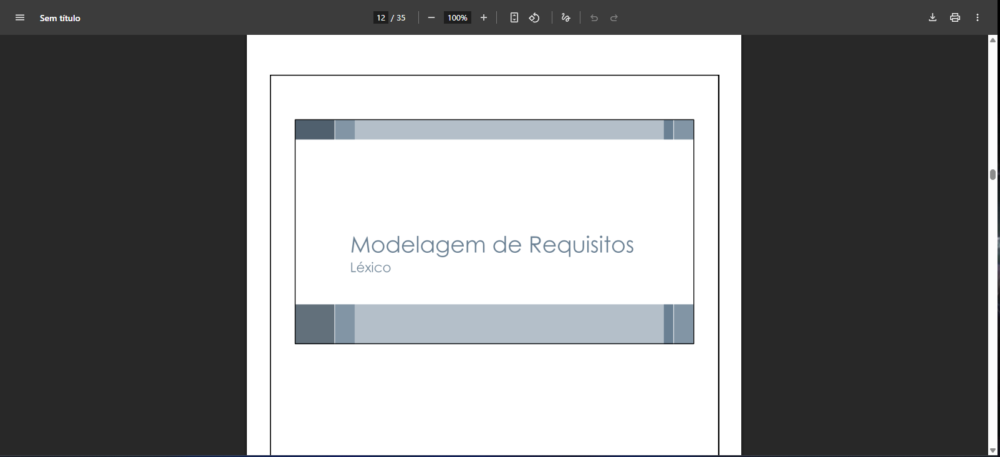

# Léxicos - Antonio Carvalho

## #LX001 - Léxico para #UC01 e #CEN03 (Cadastro de Tutor)

**Autor:** [Antonio Carvalho](https://github.com/antonioscarvalho)

| ID        | Noção    | Impacto                                                                 | Classificação | Dicionário         | Rastreamento |
| ---------- | -------- | ------------------------------------------------------------------------ | ------------- | ------------------ | ------------- |
| LX001-01   | Tutor    | Pessoa responsável pelo cadastro e cuidado do animal.                   | Sujeito       | Dono, Responsável  | [RF001](../../../elicitacao/tecnicas_elicitacao/requisitos_elicitados.md#rf001), [RF002](../../elicitacao/tecnicas_elicitacao/requisitos_elicitados.md#rf002), [UC01](/modelagem/gravacoes/antonio/casos_de_uso.md#uc002), [CEN03](/modelagem/gravacoes/antonio/cenarios.md#crn003) |
| LX001-02   | Cadastrar | Ação de inserir novas informações no sistema.                          | Verbo         | Registrar, Inserir | [RF001](../../../elicitacao/tecnicas_elicitacao/requisitos_elicitados.md#rf001), [RF002](../../elicitacao/tecnicas_elicitacao/requisitos_elicitados.md#rf002), [UC01](/modelagem/gravacoes/antonio/casos_de_uso.md#uc002), [CEN03](/modelagem/gravacoes/antonio/cenarios.md#crn003) |

---

## #LX002 - Léxico para #UC01 e #CEN03 (Consulta de Dados)

**Autor:** [Antonio Carvalho](https://github.com/antonioscarvalho)

| ID        | Noção     | Impacto                                                                 | Classificação | Dicionário             | Rastreamento |
| ---------- | ---------- | ------------------------------------------------------------------------ | ------------- | ---------------------- | ------------- |
| LX002-01   | Consultar  | Ação de buscar informações já registradas.                              | Verbo         | Pesquisar, Visualizar  | [RF006](../../../elicitacao/tecnicas_elicitacao/requisitos_elicitados.md#rf006), [UC01](/modelagem/gravacoes/antonio/casos_de_uso.md#uc001), [CEN03](/modelagem/gravacoes/antonio/cenarios.md#crn003) |
| LX002-02   | Carteirinha Digital | Documento eletrônico com informações e QR Code do animal.      | Objeto        | Identificação Digital  | [RF004](../../../elicitacao/tecnicas_elicitacao/requisitos_elicitados.md#rf014), [UC01](/modelagem/gravacoes/antonio/casos_de_uso.md#uc001), [CEN03](/modelagem/gravacoes/antonio/cenarios.md#crn003) |

---

## #LX003 - Léxico para #UC02 e #CEN04 (Gerenciamento de Adoções)

**Autor:** [Antonio Carvalho](https://github.com/antonioscarvalho)

| ID        | Noção          | Impacto                                                                 | Classificação | Dicionário           | Rastreamento |
| ---------- | --------------- | ------------------------------------------------------------------------ | ------------- | -------------------- | ------------- |
| LX003-01   | Animal Adotado  | Situação em que o animal foi vinculado a um novo tutor.                  | Estado        | Pet Adotado          | [RF009](../../../elicitacao/tecnicas_elicitacao/requisitos_elicitados.md#rf009), [UC02](/modelagem/gravacoes/antonio/casos_de_uso.md#uc002), [CEN04](/modelagem/gravacoes/antonio/cenarios.md#crn004) |
| LX003-02   | Tutor           | Pessoa responsável pelo cuidado do animal adotado.                      | Sujeito       | Dono, Responsável    | [RF009](../../../elicitacao/tecnicas_elicitacao/requisitos_elicitados.md#rf009), [UC02](/modelagem/gravacoes/antonio/casos_de_uso.md#uc002), [CEN04](/modelagem/gravacoes/antonio/cenarios.md#crn004) |

---

## #LX004 - Léxico para #UC02 e #CEN04 (Atualização Veterinária)

**Autor:** [Antonio Carvalho](https://github.com/antonioscarvalho)

| ID        | Noção         | Impacto                                                                 | Classificação | Dicionário            | Rastreamento |
| ---------- | -------------- | ------------------------------------------------------------------------ | ------------- | --------------------- | ------------- |
| LX004-01   | Veterinário    | Profissional autorizado a emitir laudos e atualizar histórico.           | Sujeito       | Médico Veterinário    | [RF008](../../../elicitacao/tecnicas_elicitacao/requisitos_elicitados.md#rf008), [RF016](../../elicitacao/tecnicas_elicitacao/requisitos_elicitados.md#rf016), [UC02](/modelagem/gravacoes/antonio/casos_de_uso.md#uc002), [CEN04](/modelagem/gravacoes/antonio/cenarios.md#crn004) |
| LX004-02   | Carteirinha Digital | Documento com histórico de vacinação e QR Code do animal.           | Objeto        | Identificação Digital | [RF014](../../../elicitacao/tecnicas_elicitacao/requisitos_elicitados.md#rf014), [RF016](../../elicitacao/tecnicas_elicitacao/requisitos_elicitados.md#rf016), [UC02](/modelagem/gravacoes/antonio/casos_de_uso.md#uc002), [CEN04](/modelagem/gravacoes/antonio/cenarios.md#crn004) |

---

## #LX005 - Léxico para #UC02 e #CEN04 (Atualização de Status do Animal)

**Autor:** [Antonio Carvalho](https://github.com/antonioscarvalho)

| ID        | Noção          | Impacto                                                                 | Classificação | Dicionário         | Rastreamento |
| ---------- | --------------- | ------------------------------------------------------------------------ | ------------- | ------------------ | ------------- |
| LX005-01   | Animal Perdido  | Situação em que o animal está desaparecido.                              | Estado        | Desaparecido       | [RF007](../../../elicitacao/tecnicas_elicitacao/requisitos_elicitados.md#rf007), [RF018](../../elicitacao/tecnicas_elicitacao/requisitos_elicitados.md#rf018), [UC02](/modelagem/gravacoes/antonio/casos_de_uso.md#uc002), [CEN04](/modelagem/gravacoes/antonio/cenarios.md#crn004) |
| LX005-02   | Animal Adotado  | Situação em que o animal foi vinculado a um novo tutor.                  | Estado        | Pet Adotado        | [RF009](../../../elicitacao/tecnicas_elicitacao/requisitos_elicitados.md#rf009), [UC02](/modelagem/gravacoes/antonio/casos_de_uso.md#uc002), [CEN04](/modelagem/gravacoes/antonio/cenarios.md#crn004) |

---

## #LX006 - Léxico para #UC01 e #CEN03 (Gerenciamento de Cadastro)

**Autor:** [Antonio Carvalho](https://github.com/antonioscarvalho)

| ID        | Noção     | Impacto                                                                 | Classificação | Dicionário        | Rastreamento |
| ---------- | ---------- | ------------------------------------------------------------------------ | ------------- | ----------------- | ------------- |
| LX006-01   | Cadastrar  | Ação de inserir novas informações no sistema.                           | Verbo         | Registrar, Inserir | [RF001](../../../elicitacao/tecnicas_elicitacao/requisitos_elicitados.md), [RF002](../../../elicitacao/tecnicas_elicitacao/requisitos_elicitados.md), [UC01](/modelagem/gravacoes/antonio/casos_de_uso.md#uc00), [CEN03](/modelagem/gravacoes/antonio/cenarios.md#crn003) |
| LX006-02   | Consultar  | Ação de buscar informações já registradas.                               | Verbo         | Pesquisar, Visualizar | [RF006](../../../elicitacao/tecnicas_elicitacao/requisitos_elicitados.md#rf006), [UC01](/modelagem/gravacoes/antonio/casos_de_uso.md#uc00), [CEN03](/modelagem/gravacoes/antonio/cenarios.md#crn003) |

---

## #LX007 - Léxico para #UC02 e #CEN04 (Monitoramento e Acompanhamento)

**Autor:** [Antonio Carvalho](https://github.com/antonioscarvalho)

| ID        | Noção          | Impacto                                                                 | Classificação | Dicionário              | Rastreamento |
| ---------- | --------------- | ------------------------------------------------------------------------ | ------------- | ----------------------- | ------------- |
| LX007-01   | Tutor           | Pessoa responsável por acompanhar o animal cadastrado ou adotado.        | Sujeito       | Dono, Responsável       | [RF001](../../../elicitacao/tecnicas_elicitacao/requisitos_elicitados.md), [RF002](../../../elicitacao/tecnicas_elicitacao/requisitos_elicitados.md), [RF009](../../../elicitacao/tecnicas_elicitacao/requisitos_elicitados.md), [UC02](/modelagem/gravacoes/antonio/casos_de_uso.md#uc002), [CEN04](/modelagem/gravacoes/antonio/cenarios.md#crn004) |
| LX007-02   | Veterinário     | Profissional que fornece dados de acompanhamento e histórico médico.     | Sujeito       | Médico Veterinário      | [RF008](../../../elicitacao/tecnicas_elicitacao/requisitos_elicitados.md), [RF016](../../../elicitacao/tecnicas_elicitacao/requisitos_elicitados.md), [UC02](/modelagem/gravacoes/antonio/casos_de_uso.md#uc002), [CEN04](/modelagem/gravacoes/antonio/cenarios.md#crn004) |

---

## Referência para elaboração desses artefatos em específico: Requisitos de Software – Aula 10: Cenários e Léxicos de Requisitos.

---

## Agradecimentos

Agradeço o apoio das ferramentas de Inteligência Artificial (IA) Generativa, em especial o uso do ChatGPT (OpenAI), que contribuiu para *formatação textual, revisão linguística, padronização e aprimoramento da clareza técnica deste documento*.
Ressalta-se que *todo o conteúdo conceitual e as decisões de modelagem aqui descritos — incluindo a definição dos cenários, requisitos e estruturas — foram elaborados por mim*, sendo a IA utilizada como apoio redacional e organizacional no processo de documentação dos Léxicos, Especificação Suplementar e Cenários.

---

## Tabela de Contribuição

| Nome | Contribuição (%) | Função |
|------|------------------|--------|
| **Antonio Carvalho** | 100% | Autor desta página |

---

## Tabela de Versionamento

| Versão | Data | Descrição | Autores | Revisores |
|:------:|:-----------|:-------------------------------------------|:--------|:-----------|
| 1.0 | 11/10/2025 | Página de **Léxicos** própria | Antonio | - |

---

## Referências

SERRANO, Milene; SERRANO, Maurício. *Requisitos de Software – Aula 10: Cenários e Léxicos de Requisitos.* Brasília: Universidade de Brasília, 2025.