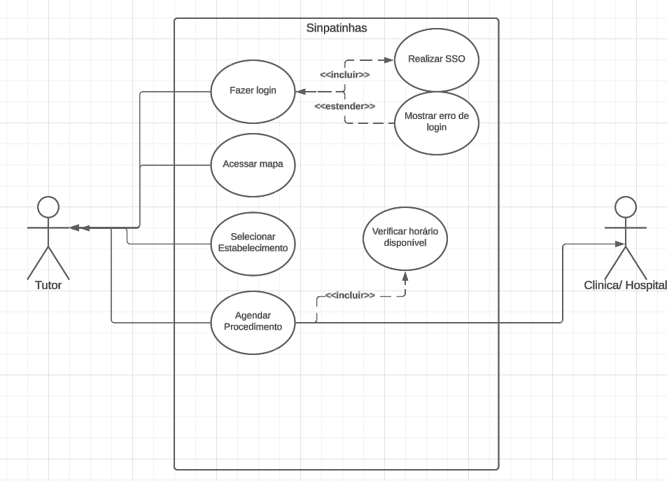
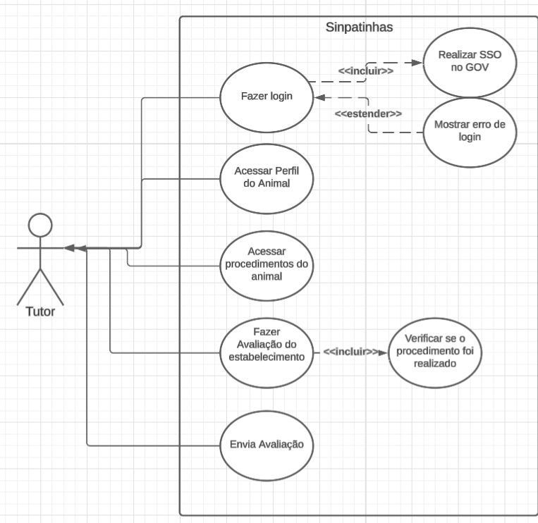

# Casos de uso - Heloisa Silva

## #UC009 – Exibir mapa interativo com a localização das clínicas e hospitais veterinários cadastrados (RFNI001)

**Autor:** Heloisa Silva

	

| **Componente** | **Descrição** |
|----------------|----------------|
| **Código** | `#UC009` |
| **Descrição** | Permitir que o tutor visualize um mapa interativo com a localização de clínicas e hospitais veterinários cadastrados, podendo filtrar por proximidade e agendar procedimentos. |
| **Ator(es)** | Tutor (exemplo: Roberto, 58 anos, tutor de duas cadelas) |
| **Pré-condições** | 1. O tutor deve estar autenticado no sistema. 2. Deve possuir um animal cadastrado. 3. A clínica ou hospital deve possuir convênio com o MMA. |
| **Ação** | Visualizar mapa, selecionar clínica/hospital, agendar procedimento. |
| **Fluxo Principal** | 1. O tutor acessa o sistema e visualiza o mapa com clínicas/hospitais próximos. 2. Seleciona o estabelecimento desejado. 3. O sistema apresenta cronograma de dias e horários disponíveis. 4. O tutor seleciona dia e horário. 5. O sistema valida os dados obrigatórios. 6. O sistema gera um ID para o agendamento e registra no perfil do tutor e do prestador. 7. Após o procedimento, o sistema marca o agendamento como realizado. |
| **Fluxos Alternativos** | - Caso a clínica não tenha horários disponíveis, o tutor é notificado. - Caso haja imprevisto, o tutor é notificado. |
| **Fluxos de Exceção** | 1. Falha na validação dos dados obrigatórios. → O sistema exibe mensagem de erro. 2. Falha no registro do agendamento. → O sistema exibe mensagem de erro e orienta o tutor a tentar novamente. |
| **Pós-condições** | O tutor tem o procedimento agendado e registrado, podendo acompanhar o status pelo sistema. |
| **Data de Criação** | 12/10/2025 |
| **Rastreabilidade** | `RFNI001` |
| **Cenário Relacionado** | `#CNR005` |
| **Léxico Relacionado** | `#LX014` |

---

**Tabela 01** – Caso de Uso 09 – Exibir mapa interativo com a localização das clínicas e hospitais veterinários cadastrados (RFNI001)

## #UC010 – Sistema de avaliação numérica para estabelecimentos (RFNI010)

**Autor:** Heloisa Silva

	

| **Componente** | **Descrição** |
|----------------|----------------|
| **Código** | `#UC010` |
| **Descrição** | Permitir que o tutor avalie, de forma numérica, a clínica ou hospital veterinário após a realização de um procedimento. |
| **Ator(es)** | Tutor (exemplo: Roberto, 58 anos, tutor de duas cadelas) |
| **Pré-condições** | 1. O tutor deve estar logado no sistema. 2. Deve possuir um animal que tenha realizado procedimento veterinário pelo sistema. |
| **Ação** | Avaliar clínica/hospital após procedimento. |
| **Fluxo Principal** | 1. O tutor acessa seu perfil e seleciona o animal que realizou o procedimento. 2. Seleciona a aba de procedimentos. 3. O sistema exibe os procedimentos realizados. 4. O tutor seleciona o procedimento e visualiza opção de avaliação. 5. O tutor insere a avaliação numérica e envia. 6. O sistema confirma o envio e registra a avaliação. |
| **Fluxos Alternativos** | - Caso o tutor tenha faltado ou cancelado o procedimento, não poderá avaliar. - Caso o tutor tente avaliar sem procedimento realizado, o sistema bloqueia a ação. |
| **Fluxos de Exceção** | 1. Falha no envio da avaliação. → O sistema exibe mensagem de erro e orienta nova tentativa. 2. Avaliação em formato inválido. → O sistema solicita correção. |
| **Pós-condições** | A avaliação é registrada e pode ser consultada pelo tutor e pelo estabelecimento. |
| **Data de Criação** | 12/10/2025 |
| **Rastreabilidade** | `RFNI010` |
| **Cenário Relacionado** | `#CNR006` |
| **Léxico Relacionado** | `#LX015` |

---

**Tabela 02** – Caso de Uso 10 – Sistema de avaliação numérica para estabelecimentos (RFNI010)

## Tabela de Contribuição

| Nome | Contribuição (%) | Função |
|------|------------------|--------|
| **Heloisa Silva** | 100% | Autor desta página |

---

## Tabela de Versionamento

| Versão | Data | Descrição | Autores | Revisores |
|:------:|:-----------|:-------------------------------------------|:--------|:-----------|
| 1.0 | 12/10/2025 | Página de **Casos de Uso** própria | Heloisa | - |

---

## Referências  

---
