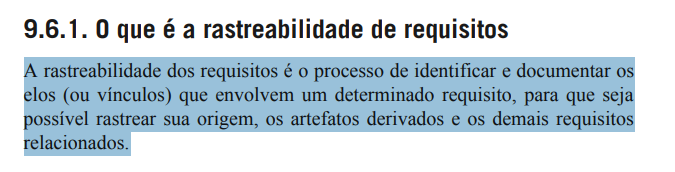

# Introdução

A rastreabilidade é um dos aspectos fundamentais da engenharia de requisitos, pois permite acompanhar a origem e o impacto de cada requisito ao longo do projeto. De acordo com Vazquez e Simões (2016, sȩc. 9.6.1), “a rastreabilidade dos requisitos é o processo de identificar e documentar os elos (ou vínculos) que envolvem um determinado requisito, para que seja possível rastrear sua origem, os artefatos derivados e os demais requisitos relacionados”
 

Segundo Serrano e Serrano a rastreabilidade pode ser dividida nos tipos: backward-from, forward-from, backward-to, forward-to.

- Rastreabilidade forward-from: liga os requisitos aos artefatos de desenho e implementação.
- Rastreabilidade backward-from: liga os requisitos às suas fontes.
- Rastreabilidade forward-to: liga os documentos do plano de negócio aos requisitos.
- Rastreabilidade backward-to: liga os artefatos de desenho e implementação aos requisitos.

# Objetivos

Realizar a análise da rastreabilidade backward-from, com o propósito de identificar e documentar a origem de cada requisito. Por meio da matriz de rastreabilidade, pretende-se fornecer aos stakeholders uma compreensão clara sobre as justificativas e motivações que embasaram a elicitação de cada requisito, promovendo maior transparência, coerência e rastreabilidade no processo de engenharia de requisitos.

# Rastreabilidade Forward-from

## Legenda da matriz

**Tabela 1** - Legenda da matriz.

| Sigla  |          Técnica de Modelagem       |                      
| ---- | --------------------------------- | 
| UCXX | Casos de uso (User case) |
| HUXX   | Histórias de Usuário |
| CNFRXX | NFR Framework |
| ESXX | Especificação Suplementar |
| CENXX | Cenário |
| LXXX | Léxico |

**Tabela 2** - Requisitos e seus artefatos.

## Matriz de rastreabilidade

| ID | Descrição | UC | HU | CNFR | ES | CN | L |
|:---|:---|:---|:---|:---|:---|:---|:---|
| RF001 | O sistema deve permitir o cadastro de usuários. | UC01 | HU01 |  |  |  | L01 |
| RF002 | O sistema deve possibilitar a recuperação de senhas. | UC02 | HU02 |  |  |  | L01 |
| RF003 | O sistema deve garantir a segurança dos dados dos usuários. | UC03 | HU03 |  |  |  | L01 |

Autor: Pedro Gomes

---

# Referência Bibliográfica

> SERRANO, Milene; SERRANO, Maurício. **Requisitos – Aula 26**. UnB, 2025. Disponível em: <https://aprender3.unb.br/pluginfile.php/3096178/mod_resource/content/1/Requisitos%20-%20Aula%20026.pdf>. Acesso em: 22 jun. 2025. [`Foto da referência`](../images/tipos-rastreabilidade/forward-from.png)

# Histórico de Versões

| Data       | Versão | Descrição                                 | Autor                                      | Revisor                                     |
| :--------: | :----: | :---------------------------------------- | :----------------------------------------: | :----------------------------------------: |
| 27/10/2025 |  1.0   |  Criação da documentação da matriz de rastreabilidade forward-from| Pedro Gomes   |   |
